# Baskets & Recommendations App – Vespa Ranking Chapter 5: Market Basket Analysis & Tensor-based Recommendations

This project is **Chapter 5** in the Vespa 101 ranking series.
This chapter introduces **market basket analysis** and **category-based product recommendations** using Vespa's grouping API and multi-dimensional tensors. You'll learn how to analyze product co-occurrence patterns and build sophisticated recommendation systems.

The goal here is to learn how to:
- Use **grouping queries** for market basket analysis
- Find **co-occurrence patterns** (what products are bought together)
- Work with **multi-dimensional tensors** for recommendations
- Build **category-based recommendation systems** using tensor operations
- Create **user profile tensors** with weighted preferences
- Implement **tensor dot product** for matching preferences to products

---

## Learning Objectives

After completing this chapter you should be able to:

- **Understand market basket analysis** and its business applications
- **Use Vespa's grouping API** for aggregation and co-occurrence analysis
- **Work with multi-dimensional tensors** `tensor<int8>(category{}, features{})`
- **Build user profile tensors** with weighted preferences across categories
- **Implement tensor-based recommendations** using dot product operations
- **Create category-specific recommendations** with filtering
- **Understand sparse tensor representations** for efficient storage and computation

**Prerequisites:**
- Basic understanding of Vespa schemas and deployment
- Understanding of tensors from previous chapters
- Familiarity with YQL queries
- Basic knowledge of recommendation systems

---

## Project Structure

From the `baskets_ranking_app` root:

```text
baskets_ranking_app/
├── app/                                                 # Part 1: Basket co-occurrence analysis
│   ├── schemas/
│   │   └── basket.sd                                    # Basket schema (array of items)
│   └── services.xml                                     # Vespa services config
├── category_recommender_app/                            # Part 2: Category-based recommendations
│   ├── schemas/
│   │   └── product.sd                                   # Product schema with multi-dim tensors (with TODO)
│   └── services.xml                                     # Vespa services config
├── dataset/
│   ├── basket_co-occurrence/
│   │   ├── groceries.csv                                # Kaggle groceries dataset
│   │   ├── groceries.jsonl                              # Converted to Vespa format
│   │   └── convert_groceries.py                         # CSV to JSONL conversion script
│   └── category_recommender/
│       ├── small_dataset.csv                            # E-commerce products dataset
│       ├── small_dataset.jsonl                          # Products without features
│       ├── small_dataset_with_features.jsonl            # Products with category features
│       ├── ecommerce_prepare_data.ipynb                 # Notebook to generate features
│       └── env.example                                  # Environment configuration
├── solutions/
│   ├── product.sd                                       # Solution for category recommender
│   └── queries.nr                                       # Example queries (Vespa notebook format)
├── queries.http                                         # Example HTTP queries
└── README.md                                            # This file
```

You will mainly work with:
- `app/` for basket co-occurrence analysis (Part 1)
- `category_recommender_app/schemas/product.sd` for recommendations (Part 2)
- `dataset/` for feeding data
- `queries.http` for testing

---

## Key Concepts

### What is Market Basket Analysis?

**Market basket analysis** (also called **association rule mining** or **affinity analysis**) discovers relationships between products that are frequently purchased together.

**Business Applications:**
- **Product recommendations**: "Customers who bought X also bought Y"
- **Store layout optimization**: Place related items near each other
- **Cross-selling**: Bundle frequently co-purchased items
- **Inventory management**: Stock related products together
- **Promotional campaigns**: Discount bundles of related items

**Example:**
```
Analyzing 10,000 grocery baskets:
- 60% of baskets with "whole milk" also contain "other vegetables"
- 40% of baskets with "whole milk" also contain "rolls/buns"
- 35% of baskets with "whole milk" also contain "yogurt"

→ Recommendation: Display vegetables near dairy section
→ Promotion: Bundle milk + vegetables discount
```

### Vespa Grouping API

**Grouping queries** allow you to aggregate and analyze data without retrieving individual documents.

**Basic grouping structure:**
```json
{
  "hits": 0,
  "select": {
    "where": {"contains": ["items", "whole milk"]},
    "grouping": [
      {
        "all": {
          "group": "items",
          "order": "-count()",
          "each": {
            "output": "count()"
          }
        }
      }
    ]
  }
}
```

**How it works:**
1. **Filter**: Find baskets containing "whole milk"
2. **Group**: Group by all items in those baskets
3. **Aggregate**: Count occurrences of each item
4. **Order**: Sort by count (most frequent first)
5. **Output**: Return item names and counts

**Result:**
```json
{
  "groups": [
    {"value": "other vegetables", "count": 1903},
    {"value": "rolls/buns", "count": 1809},
    {"value": "yogurt", "count": 1372},
    ...
  ]
}
```

### Multi-Dimensional Tensors for Recommendations

**Multi-dimensional tensors** allow modeling complex user preferences and product features across multiple categories.

**Product features tensor:**
```vespa
field features type tensor<int8>(category{}, features{}) {
    indexing: attribute | summary
}
```

**Tensor structure example:**
```json
{
  "Books": {
    "spirituality": 10,
    "meditation": 9,
    "self-help": 8
  },
  "Electronics": {
    "USB cable": 7,
    "headphones": 5
  }
}
```

**Key properties:**
- **Sparse representation**: Only non-zero values are stored
- **Two dimensions**: `category{}` (Books, Electronics) and `features{}` (spirituality, USB cable)
- **Int8 values**: Efficient storage (1 byte per value)
- **Flexible**: Different categories can have different features

### User Profile Tensors

**User profiles** are also represented as multi-dimensional tensors with the same structure as product features.

**User profile example:**
```json
{
  "ranking.features.query(user_profile)": "{
    \"Books\": {
      \"poetry\": 5,
      \"spirituality\": 2
    },
    \"Electronics\": {
      \"USB cable\": 7
    }
  }"
}
```

**Interpretation:**
- User is **very interested** in electronics USB cables (weight: 7)
- User is **moderately interested** in poetry books (weight: 5)
- User is **somewhat interested** in spirituality books (weight: 2)

### Tensor Dot Product for Recommendations

**Recommendation scoring** uses tensor dot product to match user preferences with product features:

```vespa
first-phase {
    expression: sum(sum(query(user_profile) * attribute(features), category), features)
}
```

**How it works:**
```
Product features: {Books: {spirituality: 10, meditation: 9}}
User profile:     {Books: {spirituality: 2, meditation: 5}}

Dot product:
  Books.spirituality: 10 * 2 = 20
  Books.meditation:   9 * 5 = 45

Total score: 20 + 45 = 65
```

**Higher score** = better match between user preferences and product features

**Why it works:**
- Products with features matching user interests score higher
- Weights allow expressing strength of interest
- Sparse tensors efficiently handle products/users with different feature sets

---

## Overview

This section introduces the fundamental concepts of market basket analysis and tensor-based recommendation systems in Vespa. If you're new to these topics, we recommend reading the detailed explanations in [Grouping](https://docs.vespa.ai/en/grouping.html) and [Tensor User Guide](https://docs.vespa.ai/en/tensor-user-guide.html) for a deeper understanding.

### Recommender Systems Overview

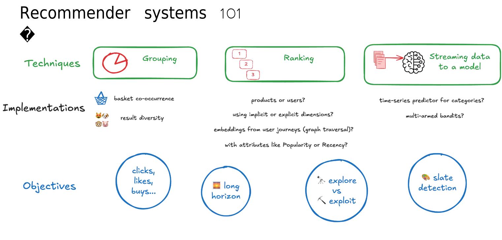

**What you're seeing:** This diagram illustrates different types of **recommender systems** and their approaches. Recommender systems are algorithms that suggest relevant items to users based on various signals like purchase history, product features, or user preferences. This chapter focuses on two specific types: market basket analysis (co-occurrence patterns) and content-based recommendations (tensor-based feature matching).

**Key Concepts:**
- **Collaborative Filtering**: Recommends items based on what similar users liked ("Users who liked X also liked Y")
- **Content-Based Filtering**: Recommends items based on product features matching user preferences
- **Market Basket Analysis**: Discovers patterns in transaction data (what items are bought together)
- **Tensor-Based Recommendations**: Uses multi-dimensional tensors to match user preferences with product features
- **Hybrid Systems**: Combines multiple recommendation approaches for better results

**Notes:** Types of recommender systems:

**1. Collaborative Filtering (User-Based)**
```
Approach: Find similar users, recommend what they liked

Example:
  User A bought: [milk, bread, butter]
  User B bought: [milk, bread, butter, cheese]
  User C bought: [milk, bread, butter, yogurt]
  
  → User A might like cheese or yogurt (similar users bought them)
```

**Pros:**
- ✅ Doesn't need item features
- ✅ Can find surprising recommendations
- ✅ Leverages wisdom of the crowd

**Cons:**
- ❌ Cold start problem (new users/items)
- ❌ Scalability challenges
- ❌ Popularity bias

**2. Content-Based Filtering (Feature-Based)**
```
Approach: Match item features to user preferences

Example:
  User profile: Likes {Books: spirituality=high, meditation=high}
  Product: Book about meditation and yoga
  
  → High match = Recommend this product
```

**Pros:**
- ✅ No cold start for new users (if we know preferences)
- ✅ Explainable recommendations
- ✅ Works with unique user tastes

**Cons:**
- ❌ Requires feature engineering
- ❌ Limited serendipity (only similar items)
- ❌ Feature extraction can be complex

**3. Market Basket Analysis (Association Rules)**
```
Approach: Find co-occurrence patterns in transactions

Example:
  60% of baskets with "whole milk" also contain "vegetables"
  40% of baskets with "whole milk" also contain "rolls/buns"
  
  → If user adds milk, suggest vegetables or rolls
```

**Pros:**
- ✅ Simple and interpretable
- ✅ Works with transaction data only
- ✅ Good for cross-selling

**Cons:**
- ❌ Only captures co-purchase patterns
- ❌ Doesn't personalize well
- ❌ Popularity bias

**4. Hybrid Systems**
```
Approach: Combine multiple methods

Example:
  - Collaborative: Find similar users
  - Content-based: Match product features
  - Market basket: Add frequently co-purchased items
  - Popularity: Boost trending items
  
  → Weighted combination of all signals
```

**This Tutorial Covers:**

**Part 1: Market Basket Analysis**
- Uses Vespa grouping API
- Analyzes grocery shopping baskets
- Finds co-occurrence patterns
- Applications: "Customers who bought X also bought Y"

**Part 2: Content-Based Recommendations**
- Uses multi-dimensional tensors
- Matches user preferences to product features
- Tensor dot product for scoring
- Applications: Personalized product recommendations

**Real-World Applications:**

**Market Basket Analysis:**
- **E-commerce**: Product bundling and cross-selling
- **Retail**: Store layout optimization
- **Marketing**: Promotional campaign design
- **Inventory**: Stock related products together

**Tensor-Based Recommendations:**
- **E-commerce**: Personalized product suggestions
- **Streaming**: Content recommendations (Netflix, Spotify)
- **News**: Article recommendations
- **Social Media**: Friend suggestions, content feeds

**Learn More:**
- Official Docs: [Grouping Guide](https://docs.vespa.ai/en/grouping.html)
- Official Docs: [Tensor User Guide](https://docs.vespa.ai/en/tensor-user-guide.html)

### Market Basket Analysis with Grouping API

**Market basket analysis** uses Vespa's powerful grouping API to aggregate transaction data and discover patterns without retrieving individual documents.

**The Analysis Process:**

**1. Input Data:**
```json
Basket 1: ["whole milk", "yogurt", "coffee"]
Basket 2: ["whole milk", "other vegetables", "rolls/buns"]
Basket 3: ["yogurt", "tropical fruit", "other vegetables"]
Basket 4: ["whole milk", "yogurt", "other vegetables"]
...
9,835 baskets total
```

**2. Query for Co-occurrence:**
```json
{
  "select": {
    "where": {"contains": ["items", "whole milk"]},
    "grouping": [{
      "all": {
        "group": "items",
        "order": "-count()",
        "each": {"output": "count()"}
      }
    }]
  }
}
```

**3. Results:**
```json
{
  "groups": [
    {"value": "whole milk", "count": 2502},
    {"value": "other vegetables", "count": 1903},
    {"value": "rolls/buns", "count": 1809},
    {"value": "yogurt", "count": 1372}
  ]
}
```

**Interpretation:**
- Out of 2,502 baskets containing "whole milk":
  - 1,903 (76%) also contain "other vegetables"
  - 1,809 (72%) also contain "rolls/buns"
  - 1,372 (55%) also contain "yogurt"

**Business Actions:**
- **Store layout**: Place vegetables near dairy section
- **Promotions**: Bundle milk + vegetables discount
- **Inventory**: Stock these items together
- **Recommendations**: "Customers who bought milk also bought..."

### Tensor-Based Recommendations

**Multi-dimensional tensors** enable sophisticated recommendation systems that match user preferences with product features across multiple categories.

**The Recommendation Process:**

**1. Product Features (Multi-dimensional Tensor):**
```json
Product: "Inner Engineering: A Yogi's Guide to Joy"
Features: {
  "Books": {
    "spirituality": 10,
    "meditation": 8,
    "self-help": 10,
    "yoga": 10
  }
}
```

**2. User Profile (Multi-dimensional Tensor):**
```json
User preferences: {
  "Books": {
    "poetry": 5,
    "spirituality": 2
  },
  "Electronics": {
    "USB cable": 7
  }
}
```

**3. Tensor Dot Product (Matching):**
```
Books.spirituality: 10 × 2 = 20
Books.meditation:   8 × 0 = 0   (user has no meditation preference)
Books.self-help:    10 × 0 = 0  (user has no self-help preference)
Books.yoga:         10 × 0 = 0  (user has no yoga preference)

Total score for Books category: 20

Electronics score: 0 (product has no electronics features)

Overall score: 20
```

**4. Ranking:**
```
Product A (spirituality book): Score 20
Product B (poetry book): Score 25
Product C (USB cable): Score 49
Product D (laptop): Score 35

Ranked results:
  1. USB cable (49) - Matches user's strong electronics preference
  2. Laptop (35) - Matches electronics preference
  3. Poetry book (25) - Matches books preference
  4. Spirituality book (20) - Matches books, but lower weight
```

**Key Advantages:**

**Sparse Representation:**
```
Instead of:
  All possible (category, feature) combinations with mostly zeros
  
Sparse tensor stores only:
  {"Books": {"spirituality": 10, "meditation": 8}}
  
Saves memory and computation!
```

**Multi-Category Support:**
```
Single user profile handles:
  - Books preferences
  - Electronics preferences
  - Home & Kitchen preferences
  - Any number of categories
  
No need for separate models per category!
```

**Flexible Features:**
```
Different products, different features:
  Books: {spirituality, meditation, self-help}
  Electronics: {USB cable, headphones, charger}
  Clothing: {casual, formal, sportswear}
  
Tensor dot product handles all automatically!
```

**Vespa Implementation:**

**Schema Definition:**
```vespa
field features type tensor<int8>(category{}, features{}) {
    indexing: attribute | summary
}
```

**Rank Profile:**
```vespa
rank-profile recommendations {
    inputs {
        query(user_profile) tensor<int8>(category{}, features{})
    }
    
    first-phase {
        expression: sum(sum(query(user_profile) * attribute(features), category), features)
    }
}
```

**Query:**
```json
{
  "yql": "select * from product where true",
  "ranking.profile": "recommendations",
  "ranking.features.query(user_profile)": "{\"Books\": {\"poetry\": 5, \"spirituality\": 2}}"
}
```

**Real-World Example:**

```
Scenario: E-commerce recommendation system

Products:
  - Book 1: Meditation guide {Books: {meditation: 10, spirituality: 8}}
  - Book 2: Poetry collection {Books: {poetry: 10, literature: 7}}
  - USB-C Cable {Electronics: {USB cable: 10, accessories: 5}}
  - Yoga Mat {Sports: {yoga: 10, fitness: 8}}

User A (Meditation enthusiast):
  Profile: {Books: {meditation: 10, spirituality: 9, yoga: 7}}
  Top recommendations:
    1. Meditation guide (score: 172)
    2. Yoga Mat (score: 70)
    3. Book 2 (score: 0) - No matching features
    4. USB-C Cable (score: 0) - No matching features

User B (Tech enthusiast):
  Profile: {Electronics: {USB cable: 8, accessories: 6}}
  Top recommendations:
    1. USB-C Cable (score: 110)
    2. Other electronics...
    3. Books (score: 0) - No matching features

User C (Mixed interests):
  Profile: {Books: {poetry: 5}, Electronics: {USB cable: 7}}
  Top recommendations:
    1. USB-C Cable (score: 70)
    2. Poetry collection (score: 50)
    3. Meditation guide (score: 0)
    4. Yoga Mat (score: 0)
```

**Benefits Over Traditional Approaches:**

| Traditional Approach | Tensor-Based Approach |
|---------------------|----------------------|
| Separate model per category | Single model for all categories |
| Manual feature engineering | Automatic feature combination |
| Hard-coded business rules | Learned from user behavior |
| Difficult to add new categories | Just add new tensor dimensions |
| Limited personalization | Rich, multi-dimensional personalization |

**Learn More:**
- Official Docs: [Tensor Examples](https://docs.vespa.ai/en/tensor-examples.html)
- Tutorial: [News search and recommendation tutorial](https://docs.vespa.ai/en/learn/tutorials/news-1-deploy-an-application)

## Steps Overview

This tutorial has two main parts:

### Part 1: Market Basket Analysis
**Goal**: Analyze product co-occurrence patterns using grouping queries

**What you'll do:**
1. Deploy basket schema (array of items)
2. Feed grocery basket data
3. Use grouping queries to find co-occurrence patterns
4. Analyze "what products are frequently bought together"

**Key Learning**: Vespa grouping API for basket analysis and co-occurrence patterns

### Part 2: Category-based Product Recommendations
**Goal**: Build recommendation system using multi-dimensional tensors

**What you'll do:**
1. Deploy product schema with multi-dimensional tensor features
2. Feed e-commerce products with category features
3. Create user profile tensors
4. Implement tensor-based recommendation ranking
5. Test global and per-category recommendations

**Key Learning**: Multi-dimensional tensors for sophisticated recommendations

---

## Part 1 – Market Basket Analysis

### Overview

Use Vespa's grouping API to analyze grocery shopping baskets and discover product co-occurrence patterns.

**Dataset**: [Kaggle Groceries Dataset](https://www.kaggle.com/datasets/irfanasrullah/groceries)
- 9,835 grocery shopping baskets
- Common items: whole milk, vegetables, yogurt, rolls/buns, etc.

### Step 1: Deploy Basket Application

```bash
cd baskets_recommender_ranking_app/baskets_app

# Verify configuration
vespa config get target        # Should show: cloud
vespa config get application   # Should show: tenant.app.instance
vespa auth show                # Should show: Success 

# Deploy
vespa deploy --wait 300

# Check status
vespa status
```

### Step 2: Feed Basket Data

**Option 1: Feed pre-converted data**

```bash
cd baskets_recommender_ranking_app/dataset/basket_co-occurrence
vespa feed groceries.jsonl
```

**Option 2: Convert CSV to JSONL first**

```bash
cd baskets_recommender_ranking_app/dataset/basket_co-occurrence

# Convert CSV to JSONL
python convert_groceries.py

# Feed to Vespa
vespa feed groceries.jsonl
```

**Data format:**
```json
{
  "put": "id:ecommerce:basket::uuid",
  "fields": {
    "items": ["whole milk", "yogurt", "coffee"]
  }
}
```

### Step 3: Basic Grouping Queries

**Query 1: What items are frequently bought with "whole milk"?**

Using REST client:

```http
POST https://<mTLS_ENDPOINT_DNS_GOES_HERE>/search/
Content-Type: application/json

{
  "hits": 1,
  "select": {
    "where": {
      "contains": ["items", "whole milk"]
    },
    "grouping": [
      {
        "all": {
          "group": "items",
          "order": "-count()",
          "each": {
            "output": "count()"
          }
        }
      }
    ]
  }
}
```
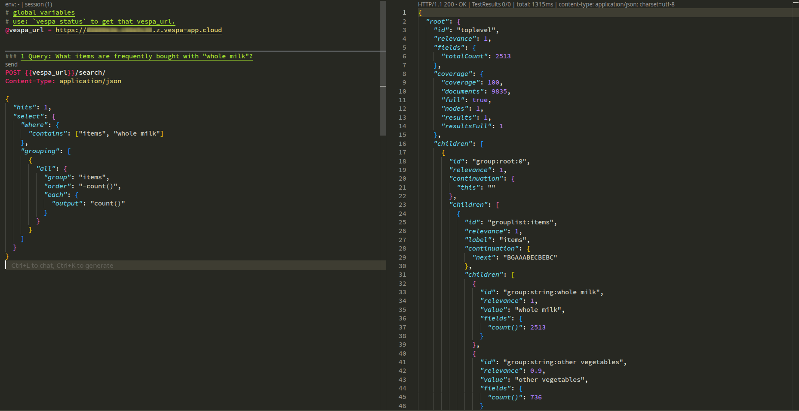


Using Vespa CLI with select parameter:
```bash
vespa query \
  'hits=1' \
  'select.where={"contains":["items","whole milk"]}' \
  'select.grouping=[{"all":{"group":"items","order":"-count()","each":{"output":"count()"}}}]'
```
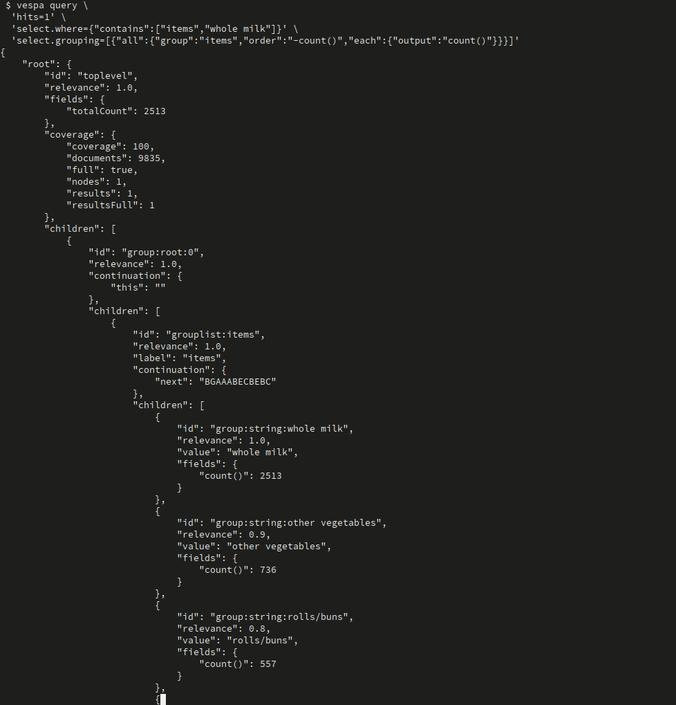

Or using Vespa CLI with YQL syntax:
```bash
vespa query \
  'hits=1' \
  'yql=select * from basket where items contains "whole milk" | all(group(items) order(-count()) each(output(count())))'
```
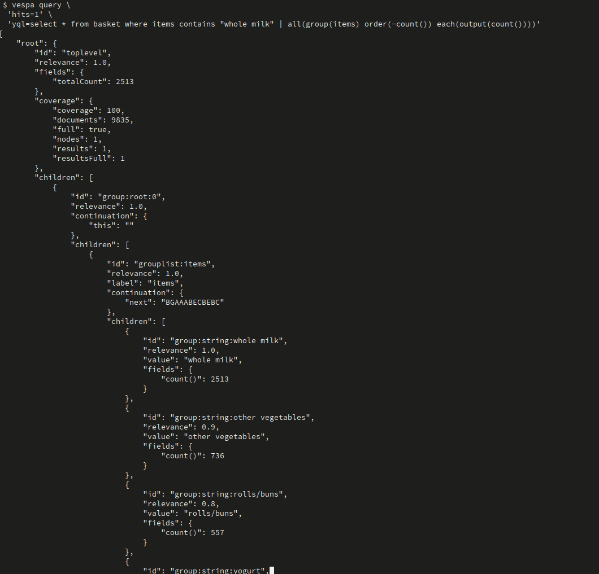

**Interpretation:**
- Out of baskets containing "whole milk":
  - 1,903 also contain "other vegetables" (76%)
  - 1,809 also contain "rolls/buns" (72%)
  - 1,372 also contain "yogurt" (55%)

**Query 2: What items are frequently bought with "yogurt"?**

Using REST client:

```http
POST https://<mTLS_ENDPOINT_DNS_GOES_HERE>/search/
Content-Type: application/json

{
  "hits": 1,
  "select": {
    "where": {
      "contains": ["items", "yogurt"]
    },
    "grouping": [
      {
        "all": {
          "group": "items",
          "order": "-count()",
          "max": 10,
          "each": {
            "output": "count()"
          }
        }
      }
    ]
  }
}
```

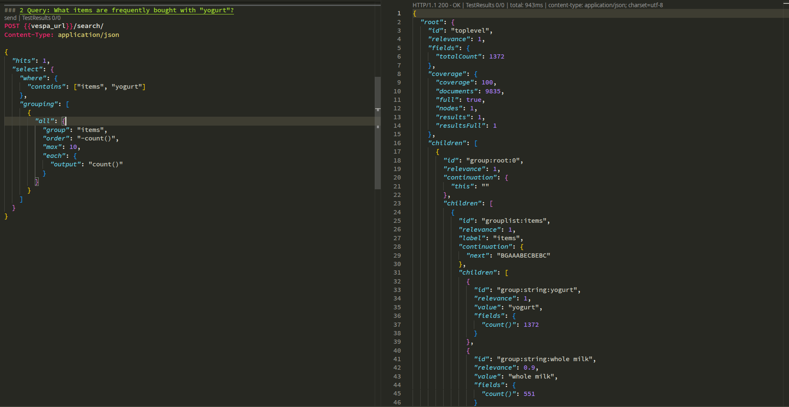

Using Vespa CLI with select parameter:
```bash
vespa query \
  'hits=1' \
  'select.where={"contains":["items","yogurt"]}' \
  'select.grouping=[{"all":{"group":"items","order":"-count()","max":10,"each":{"output":"count()"}}}]'
```
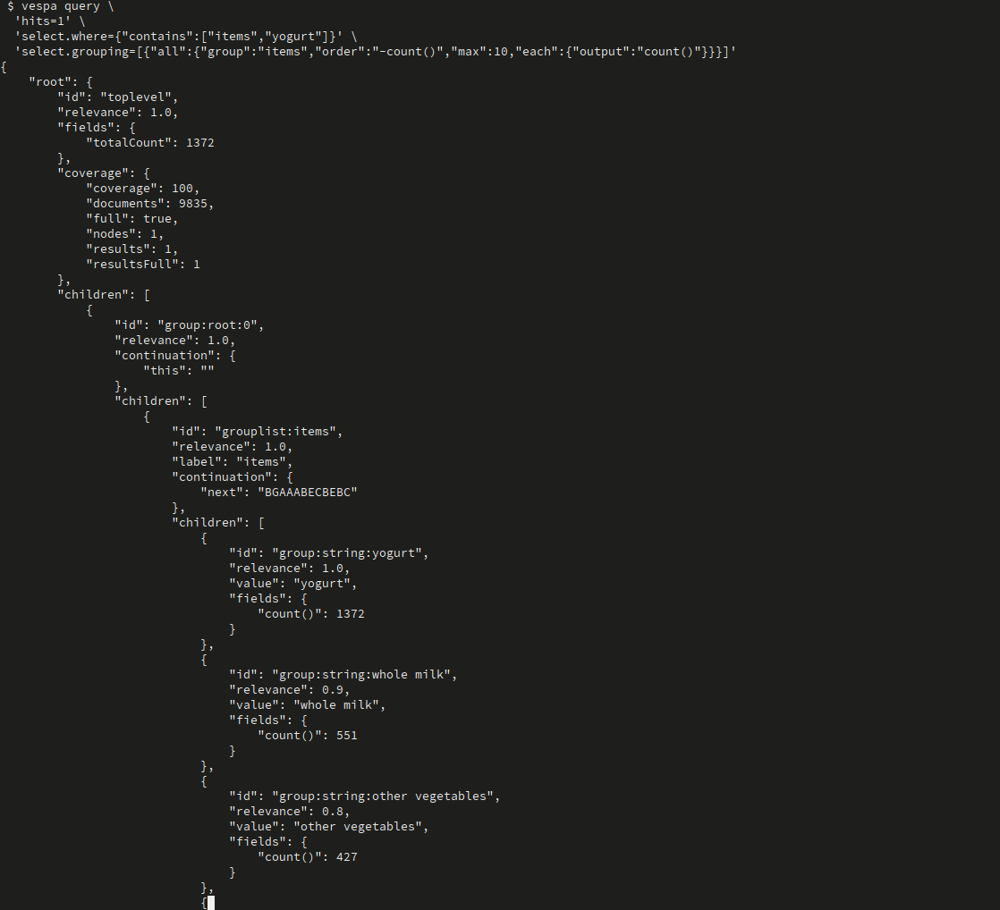

Or using Vespa CLI with YQL syntax:
```bash
vespa query \
  'hits=1' \
  'yql=select * from basket where items contains "yogurt" | all(group(items) order(-count()) max(10) each(output(count())))'
```
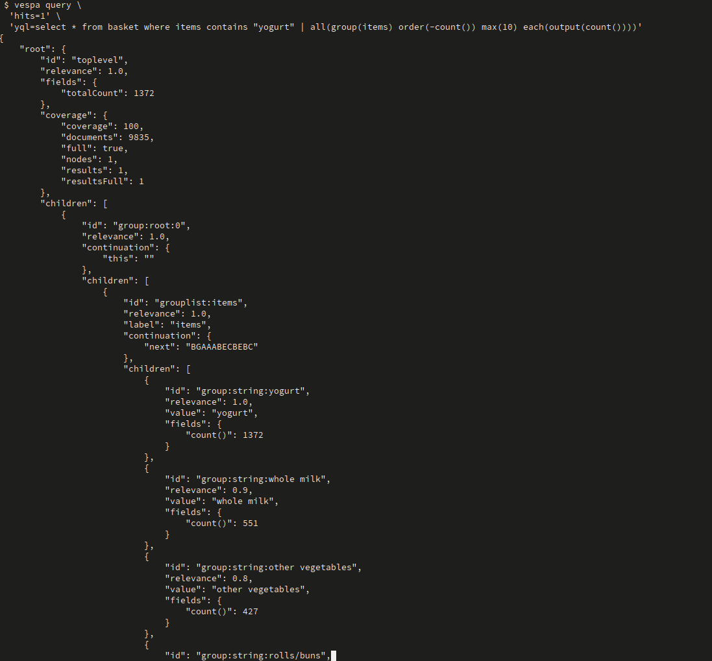

**Note**: `"max": 10` limits results to top 10 items

### Step 4: Advanced Grouping Queries

**Query 3: What categories of products exist in baskets?**

You can use grouping to discover the distribution of different product types or categories.

**Query 4: Multi-level grouping (advanced)**

Vespa supports nested grouping for multi-dimensional analysis.

### What You're Learning

- How to use Vespa's grouping API for aggregation
- How to find co-occurrence patterns in transaction data
- How to interpret market basket analysis results
- Real-world applications of basket analysis

---

## Part 2 – Category-based Product Recommendations

### Overview

Build a sophisticated recommendation system using multi-dimensional tensors to match user preferences with product features across multiple categories.

**Dataset**: E-commerce products (Books, Electronics, etc.)
- Products have categories (e.g., "Books", "Electronics")
- Each product has weighted features within its category
- Example: Books → {spirituality: 10, meditation: 9, self-help: 8}

### Step 1: Deploy Product Recommendation Application

```bash
cd baskets_recommender_ranking_app/category_recommender_app

# Verify configuration
vespa config get target        # Should show: cloud
vespa config get application   # Should show: tenant.app.instance
vespa auth show                # Should show: Success 

# Deploy
vespa deploy --wait 300

# Check status
vespa status
```

### Step 2: Implement Recommendation Rank Profile

**File**: `category_recommender_app/schemas/product.sd`

**TODO**: Implement the first-phase expression for the `recommendations` rank profile:

```vespa
rank-profile recommendations {
    inputs {
        query(user_profile) tensor<int8>(category{}, features{})
    }

    first-phase {
        expression {
            #TODO: first phase expression
        }
    }
}
```

**Hint**: Use tensor dot product to match user profile with product features:
```vespa
sum(sum(query(user_profile) * attribute(features), category), features)
```

**How it works:**
1. `query(user_profile) * attribute(features)` - Element-wise multiplication of user preferences and product features
2. First `sum(..., category)` - Sum across all categories
3. Second `sum(..., features)` - Sum across all features
4. Result: Single score representing match quality

**Example solution approach:**
```vespa
first-phase {
    expression: sum(sum(query(user_profile) * attribute(features), category), features)
}
```

### Step 3: Feed Product Data

```bash
cd baskets_recommender_ranking_app/dataset/category_recommender

# Feed products with features
vespa feed small_dataset_with_features.jsonl
```

**Sample product data:**
```json
{
  "category": "Books",
  "description": "Inner Engineering: A Yogi's Guide to Joy",
  "features": [
    {"address": {"category": "Books", "features": "self-help"}, "value": 10},
    {"address": {"category": "Books", "features": "spirituality"}, "value": 10},
    {"address": {"category": "Books", "features": "yoga"}, "value": 10},
    {"address": {"category": "Books", "features": "meditation"}, "value": 8}
  ]
}
```

### Step 4: Query for Available Categories

Before making recommendations, discover what categories are available:

```http
POST https://<mTLS_ENDPOINT_DNS_GOES_HERE>/search/
Content-Type: application/json

{
  "hits": 0,
  "select": {
    "where": true,
    "grouping": [
      {
        "all": {
          "group": "category",
          "each": {
            "output": "count()"
          }
        }
      }
    ]
  }
}
```
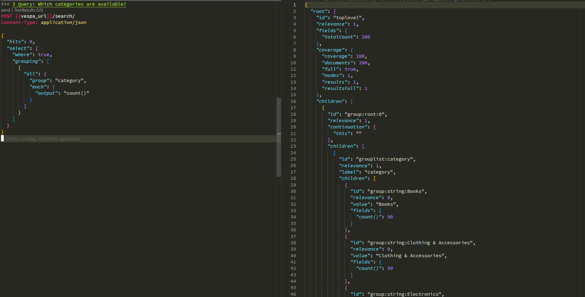


Using Vespa CLI with select parameter:
```bash
vespa query \
  'hits=0' \
  'select.where=true' \
  'select.grouping=[{"all":{"group":"category","each":{"output":"count()"}}}]'
```
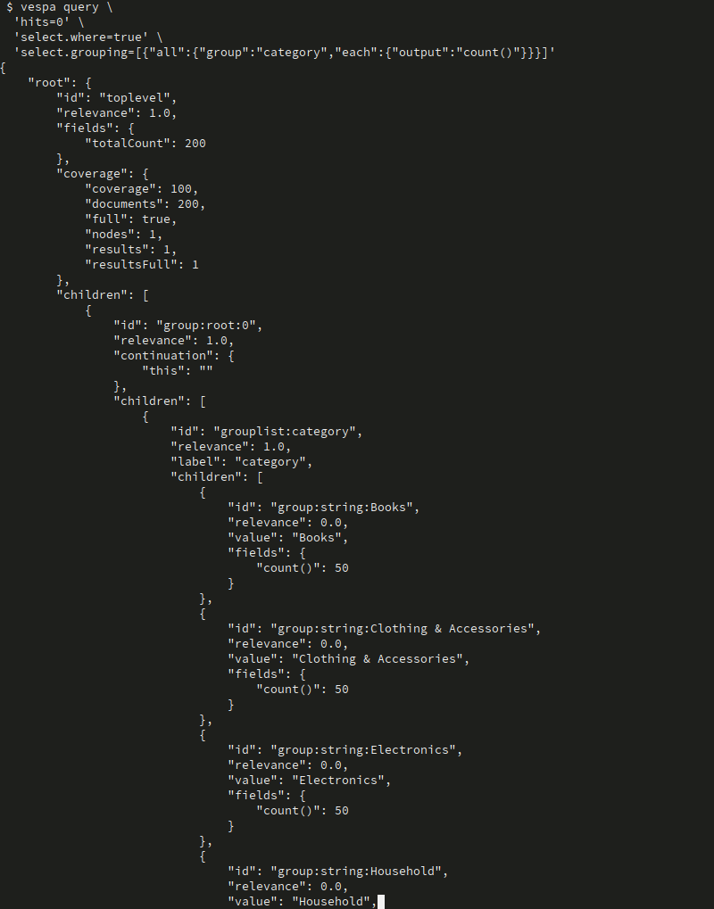

Or using Vespa CLI with YQL syntax:
```bash
vespa query \
  'hits=0' \
  'yql=select * from product where true | all(group(category) each(output(count())))'
```
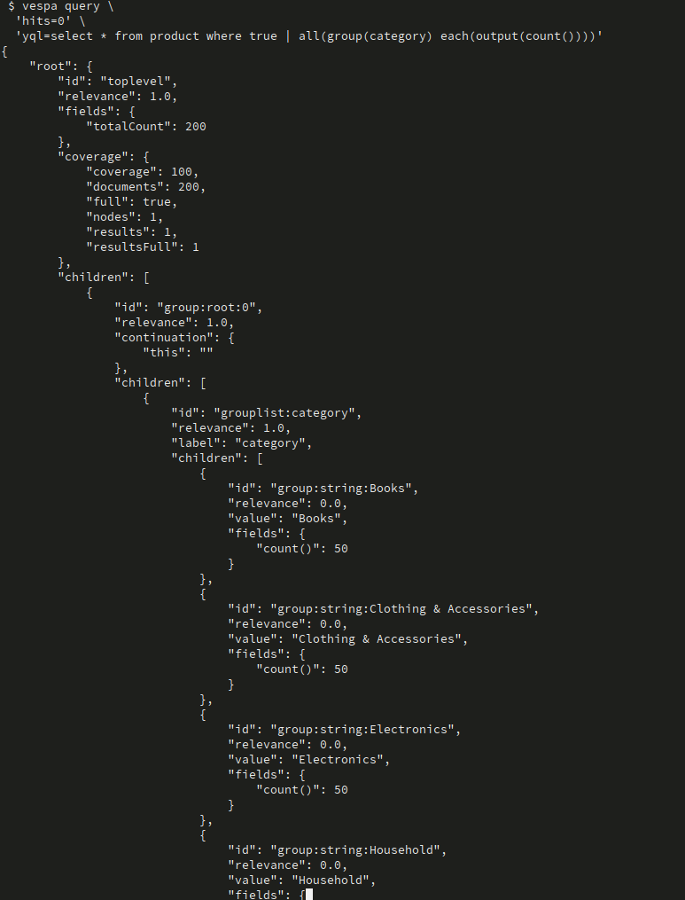

### Step 5: Global Recommendations

**Query**: Recommend products across all categories based on user profile

```http
POST https://<mTLS_ENDPOINT_DNS_GOES_HERE>/search/
Content-Type: application/json

{
  "yql": "select * from product where true",
  "ranking.features.query(user_profile)": "{\"Books\": {\"poetry\": 5, \"spirituality\": 2}, \"Electronics\":{\"USB cable\": 7}}",
  "ranking.profile": "recommendations",
  "hits": 10
}
```
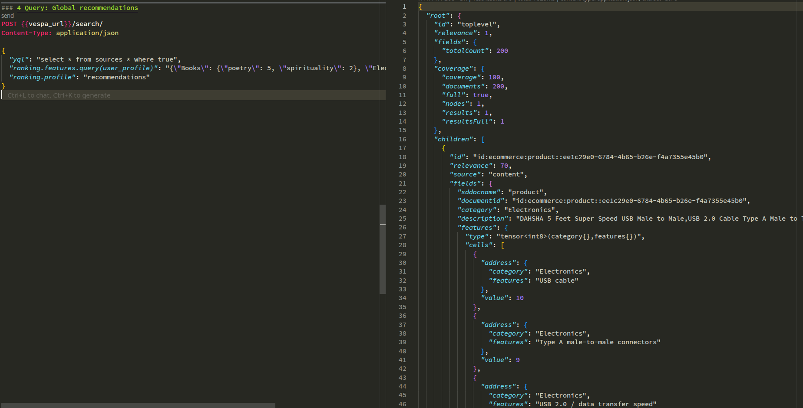

Or using Vespa CLI with YQL syntax:
```bash
vespa query \
  'hits=10' \
  'yql=select * from product where true' \
  'ranking.profile=recommendations' \
  'ranking.features.query(user_profile)={"Books":{"poetry":5,"spirituality":2},"Electronics":{"USB cable":7}}'
```
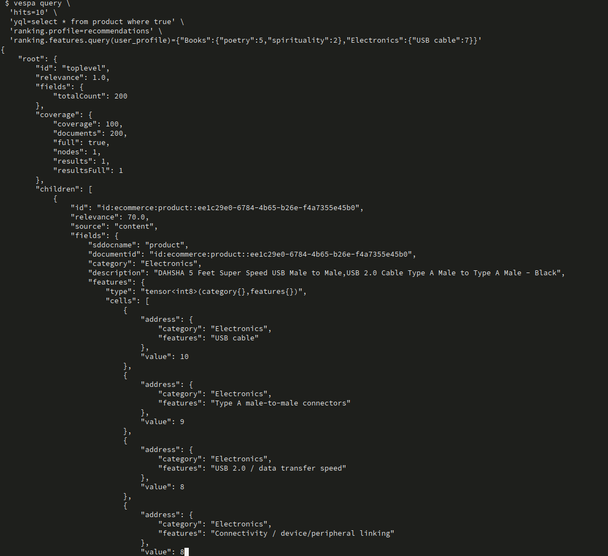

**User profile interpretation:**
- User **loves** electronics USB cables (weight: 7)
- User **likes** poetry books (weight: 5)
- User **somewhat likes** spirituality books (weight: 2)

**Expected Result:**
- Top results will be products matching these preferences
- Electronics products with "USB cable" features rank highest
- Books about poetry rank next
- Books about spirituality rank lower (lower weight)

### Step 6: Per-Category Recommendations

**Query**: Recommend books specifically, based on user profile

```http
POST https://<mTLS_ENDPOINT_DNS_GOES_HERE>/search/
Content-Type: application/json

{
  "yql": "select * from product where category contains 'Books'",
  "ranking.features.query(user_profile)": "{\"Books\": {\"poetry\": 5, \"spirituality\": 2}, \"Electronics\":{\"USB cable\": 7}}",
  "ranking.profile": "recommendations",
  "hits": 10
}
```
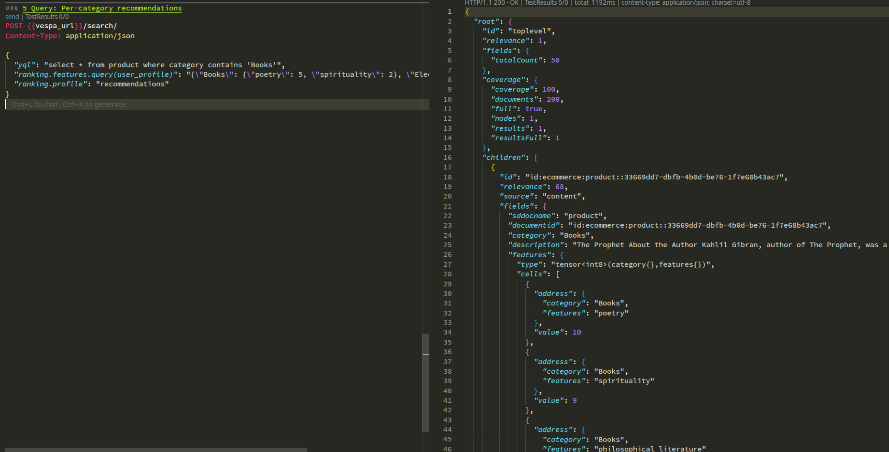

Or using Vespa CLI with YQL syntax:
```bash
vespa query \
  'hits=10' \
  'yql=select * from product where category contains "Books"' \
  'ranking.profile=recommendations' \
  'ranking.features.query(user_profile)={"Books":{"poetry":5,"spirituality":2},"Electronics":{"USB cable":7}}'
```
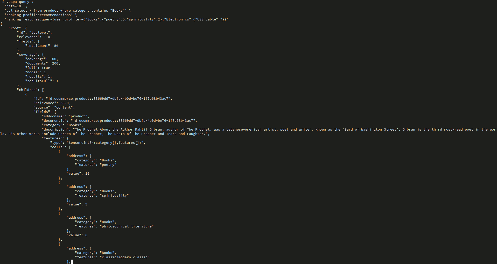

**How it differs from global:**
- `where category contains 'Books'` filters to Books only
- Electronics preferences in user profile are ignored (no Electronics products to match)
- Results contain only Books, ranked by match to Books preferences

### Step 7: Testing Different User Profiles

Try different user profiles to see how recommendations change:

**Profile 1: Meditation enthusiast**
```json
{
  "ranking.features.query(user_profile)": "{\"Books\": {\"meditation\": 10, \"spirituality\": 8, \"yoga\": 7}}"
}
```

**Profile 2: Tech enthusiast**
```json
{
  "ranking.features.query(user_profile)": "{\"Electronics\": {\"USB cable\": 10, \"headphones\": 8, \"charger\": 7}}"
}
```

**Profile 3: Mixed interests**
```json
{
  "ranking.features.query(user_profile)": "{\"Books\": {\"self-help\": 6}, \"Electronics\": {\"USB cable\": 8}, \"Home\": {\"kitchen gadgets\": 5}}"
}
```

### What You're Learning

- How to work with multi-dimensional tensors in Vespa
- How to represent user preferences as tensors
- How to use tensor dot product for recommendations
- How to implement category-specific recommendations
- How sparse tensors efficiently handle varying feature sets

---

## Deploying and Testing

### Prerequisites

> **Assumption**: You already configured **target** and **application name**
> (for example `vespa config set target cloud`, and `vespa config set application <tenant>.<app>[.<instance>]`).

If you **haven't set up Vespa yet**, do that first using the basic setup from Chapter 1.

### Part 1: Basket Co-occurrence Analysis

**Step 1: Deploy application**
```bash
cd baskets_recommender_ranking_app/baskets_app

# Verify configuration
vespa config get target        # Should show: cloud
vespa config get application   # Should show: tenant.app.instance
vespa auth show                # Should show: Success

vespa deploy --wait 300
```

**Step 2: Feed data**
```bash
cd ../dataset/basket_co-occurrence
vespa feed groceries.jsonl
```

**Step 3: Test queries**
```bash
# Use queries.http or Vespa CLI
vespa query 'select=where(contains(items,"whole milk"))' \
  'hits=0' \
  'select.grouping=[{all:{group:"items",order:"-count()",max:10,each:{output:"count()"}}}]'
```

### Part 2: Category-based Recommendations

**Step 1: Implement TODO in product.sd**
```bash
cd category_recommender_app/schemas
# Edit product.sd to add first-phase expression
```

**Step 2: Deploy application**
```bash
cd ..
vespa deploy --wait 300
```

**Step 3: Feed data**
```bash
cd ../dataset/category_recommender
vespa feed small_dataset_with_features.jsonl
```

**Step 4: Test recommendations**
```bash
vespa query \
  'yql=select * from product where true' \
  'ranking.profile=recommendations' \
  'ranking.features.query(user_profile)={\"Books\":{\"poetry\":5,\"spirituality\":2}}' \
  'hits=10'
```

---

## Exercises

Here are additional practice tasks:

### Exercise 1: Analyze Different Product Co-occurrences

1. Find what products are frequently bought with "yogurt"
2. Find what products are frequently bought with "tropical fruit"
3. Compare the patterns - are they similar or different?
4. What insights can you derive for store layout?

### Exercise 2: Build Your Own User Profile

1. Create a user profile representing your interests
2. Query for global recommendations
3. Query for category-specific recommendations
4. Analyze which products match your profile and why

### Exercise 3: Multi-Category User Profiles

1. Create user profiles with interests across multiple categories:
   - Books AND Electronics
   - Books AND Home & Kitchen
   - Three or more categories
2. See how recommendations balance across categories
3. Experiment with different weight distributions

### Exercise 4: Feature Engineering for Products

1. Open `dataset/category_recommender/ecommerce_prepare_data.ipynb`
2. Understand how product features are extracted from descriptions
3. Try adding new products with custom features
4. Test how they rank for different user profiles

### Exercise 5: Advanced Grouping Queries

1. Use grouping to find the most popular product categories
2. Find the distribution of basket sizes (number of items per basket)
3. Combine multiple grouping levels for deeper analysis
4. Visualize the results

### Exercise 6: Recommendation Quality Analysis

1. Create 5 different user profiles representing different personas
2. Get top 10 recommendations for each persona
3. Manually evaluate: Do recommendations match the persona?
4. Identify cases where recommendations are surprising or incorrect
5. Hypothesize why certain products rank unexpectedly

---

## Destroy The Deployment

**Note:** Destroy the application if needed:
   ```bash
   vespa destroy
   ```

## Troubleshooting

### Grouping Query Returns No Results

**Issue**: Grouping query returns empty groups

**Solution**:
- Ensure data is fed correctly: Check with `select * from basket where true`
- Verify item name spelling (case-sensitive)
- Check that `where` clause matches existing items
- Use `hits: 1` to see sample documents

### Tensor Type Mismatch

**Error**: `Type mismatch in tensor expression`

**Solution**:
- Ensure user profile tensor type matches product features tensor type
- Both should be `tensor<int8>(category{}, features{})`
- Check JSON syntax in `ranking.features.query(user_profile)`
- Ensure category and feature names are strings in quotes

### Recommendations All Score Zero

**Issue**: All products get score of 0

**Solution**:
- Check that products have features (not empty)
- Verify user profile has preferences that match product features
- Ensure category names match exactly (case-sensitive)
- Check tensor dimensions are correct: `(category{}, features{})`
- Use `summary-features` to debug intermediate scores

### Invalid JSON in User Profile

**Error**: Failed to parse `ranking.features.query(user_profile)`

**Solution**:
- Ensure proper JSON escaping in queries
- Category and feature names must be in double quotes
- Use online JSON validator to verify syntax
- Example: `{\"Books\":{\"poetry\":5}}` not `{Books:{poetry:5}}`

### Features Not Loading from Dataset

**Issue**: Products feed successfully but have no features

**Solution**:
- Check you're feeding `small_dataset_with_features.jsonl` not `small_dataset.jsonl`
- Verify features array format in JSONL
- Use notebook `ecommerce_prepare_data.ipynb` to regenerate features
- Check Vespa logs for indexing warnings

---

## What You've Learned

By completing this tutorial, you have:

- ✅ **Understood market basket analysis** and its business applications
- ✅ **Used Vespa's grouping API** for co-occurrence analysis
- ✅ **Worked with multi-dimensional tensors** for recommendations
- ✅ **Built user profile tensors** with weighted preferences
- ✅ **Implemented tensor dot product** for recommendation scoring
- ✅ **Created category-specific recommendations** with filtering
- ✅ **Understood sparse tensor representations** for efficiency

**Key Takeaways:**
- Grouping queries enable powerful aggregation without retrieving documents
- Market basket analysis reveals valuable product co-occurrence patterns
- Multi-dimensional tensors efficiently model complex preferences
- Tensor dot product naturally matches preferences to product features
- Sparse tensors handle varying feature sets across categories
- Recommendations can be global or category-specific

---

## Next Steps

From here, you're ready for:

- **Advanced recommendation techniques**:
  - Collaborative filtering (user-user similarity)
  - Content-based filtering (item-item similarity)
  - Hybrid recommendation systems
  - Neural recommendation models

- **Production recommendation systems**:
  - Implicit feedback (clicks, views, purchases)
  - Real-time personalization
  - A/B testing recommendation strategies
  - Diversity and exploration in recommendations
  - Cold start problem handling

- **Advanced tensor operations**:
  - Multi-dimensional tensor joins
  - Tensor reshaping and slicing
  - Complex aggregation patterns
  - Learned tensor representations (embeddings)

**Related Tutorials:**
- `ecommerce_app` - Basic schema and queries
- `ecommerce_ranking_app` - Lexical ranking (Chapter 1)
- `semantic_ecommerce_ranking_app` - Semantic search (Chapter 2)
- `hybrid_ecommerce_ranking_app` - Hybrid search + learned reranking (Chapter 3)
- `wiki_ranking_app` - Chunked document ranking (Chapter 4)

---

## Additional Resources

**Vespa Documentation:**
- [Grouping API](https://docs.vespa.ai/en/grouping.html)
- [Grouping Reference](https://docs.vespa.ai/en/reference/grouping-syntax.html)
- [Tensor Guide](https://docs.vespa.ai/en/tensor-user-guide.html)
- [Multi-dimensional Tensors](https://docs.vespa.ai/en/reference/tensor.html#tensor-type-spec)
- [Recommendation Systems](https://docs.vespa.ai/en/tutorials/news-4-embeddings.html)

**Market Basket Analysis:**
- [Association Rule Learning](https://en.wikipedia.org/wiki/Association_rule_learning)
- [Apriori Algorithm](https://en.wikipedia.org/wiki/Apriori_algorithm)
- [Market Basket Analysis Guide](https://www.investopedia.com/terms/m/market-basket.asp)

**Recommendation Systems:**
- [Collaborative Filtering](https://en.wikipedia.org/wiki/Collaborative_filtering)
- [Content-based Filtering](https://en.wikipedia.org/wiki/Recommender_system#Content-based_filtering)
- [Matrix Factorization](https://developers.google.com/machine-learning/recommendation/collaborative/matrix)

**Datasets:**
- [Kaggle Groceries Dataset](https://www.kaggle.com/datasets/irfanasrullah/groceries)
- [Amazon Product Data](http://jmcauley.ucsd.edu/data/amazon/)
- [MovieLens Dataset](https://grouplens.org/datasets/movielens/)

---

## Solution Files

If you get stuck, reference solutions are available:

- `solutions/product.sd` - Complete recommendation rank profile implementation
- `solutions/queries.nr` - Example queries in Vespa notebook format

**How to use solutions:**
1. Try to implement yourself first (learning happens through struggle!)
2. If stuck on the TODO, peek at the solution for hints
3. Compare your implementation with the solution
4. Understand *why* the solution works that way

**Remember**: The goal is learning, not just completing the exercises. Take time to understand each concept:
- Why grouping is useful for basket analysis
- How multi-dimensional tensors model complex preferences
- Why dot product works well for matching preferences to features
- How sparse tensors provide efficiency

Experiment with different queries and user profiles to build intuition!
