# E-commerce Ranking App – Vespa Ranking Chapter 1: Basic Lexical Ranking

This project is **Chapter 1** in the Vespa 101 ranking series.  
This chapter introduces **Vespa ranking** with text/lexical search, focusing on how to write rank profiles and combine text relevance with business signals.

The goal here is to learn how to:
- Write and configure **rank profiles** in Vespa
- Use **BM25** and **nativeRank** for text relevance
- Combine multiple ranking signals (text + business logic)
- Implement **two-phase ranking** with user preferences

---

## Learning Objectives

After completing this chapter you should be able to:

- **Understand rank profiles** and how they control document scoring
- **Implement BM25 ranking** for industry-standard text relevance
- **Combine ranking signals** (text relevance + business attributes)
- **Use functions** to organize ranking expressions
- **Implement two-phase ranking** for performance optimization
- **Apply user preferences** via tensor operations

**Prerequisites:**
- Basic understanding of Vespa schemas and deployment (from [`simple_ecommerce_app`](https://github.com/vespauniversity/vespaworkshop101/tree/main/simple_ecommerce_app) and [`ecommerce_app`](https://github.com/vespauniversity/vespaworkshop101/tree/main/ecommerce_app))
- Familiarity with YQL queries
- Understanding of text search concepts (term frequency, relevance scoring)

---

## Project Structure

From the `ecommerce_ranking_app` root:

```text
ecommerce_ranking_app/
├── app/
│   ├── schemas/
│   │   ├── product.sd                 # Product document schema
│   │   └── product/
│   │       ├── default.profile        # Step 1: Basic nativeRank (your implementation)
│   │       ├── bm25.profile           # Step 2: BM25 ranking (your implementation)
│   │       ├── nativeRankBM25.profile # Step 3: Combining signals (your implementation)
│   │       ├── ratingboost.profile    # Step 4: Business logic (your implementation)
│   │       └── preferences.profile    # Step 5: User preferences (your implementation)
│   └── services.xml                   # Vespa services config
├── solutions/                         # Solution files (reference only, completed profiles)
│   ├── bm25.profile                   # Reference BM25 rank profile
│   ├── nativeRankBM25.profile         # Reference combined signals profile
│   ├── ratingboost.profile            # Reference business logic profile
│   └── preferences.profile            # Reference user preferences profile
├── dataset/
│   ├── products.jsonl                 # Product data with ratings and features
│   └── enhance_data.py                # Script to add ratings and ProductFeatures
├── docs/                              # Additional documentation
│   ├── RANKING.md                     # Ranking concepts and rank profiles
│   ├── QUERIES.md                     # Query examples and patterns
│   └── SCHEMA.md                      # Schema design for ranking
├── img/
│   └── rank_profile_files.png         # Diagram of rank profile structure
├── queries.http                       # Example HTTP queries for each step
├── queries-original.http              # Original example queries
└── README.md                          # This file
```

You will mainly work with:
- `app/schemas/product/*.profile` files (rank profiles)
- `queries.http` (testing queries)

---

## Key Concepts

### What is Ranking?

**Ranking** determines how relevant each document is to a query and sorts results by relevance score. It's the "scoring system" that decides which documents appear first in search results.

**Example:**
- Query: "blue jeans"
- **Matching**: Finds all documents containing "blue" and "jeans"
- **Ranking**: Scores each match based on:
  - How well the text matches (term frequency, field importance)
  - Business signals (rating, price, user preferences)
- **Sorting**: Results ordered by score (highest first)

### Rank Profiles

A **rank profile** defines how documents are scored. You can have multiple rank profiles in one schema for different use cases or A/B testing.

**Basic Structure:**
```vespa
rank-profile default {
    first-phase {
        expression: nativeRank(ProductName, Description)
    }
}
```

**Key Components:**
- **Rank Profile Name**: Identifies the profile (e.g., `default`, `bm25`, `preferences`)
- **First-Phase**: Fast ranking that runs on all matching documents
- **Second-Phase**: Optional expensive ranking on top N documents (for performance)
- **Functions**: Reusable expressions for complex ranking logic
- **Summary-Features**: Expose intermediate scores for debugging


### Ranking Algorithms

This chapter introduces two text ranking algorithms:

- **`nativeRank`**: Vespa's default ranking algorithm, optimized for general text search with term proximity
- **`BM25`**: Industry-standard ranking algorithm (Best Matching 25), widely used in search systems


### Business Logic Integration

Ranking isn't just about text relevance. Real-world search systems combine:
- **Text relevance**: How well documents match query terms
- **Business signals**: Ratings, popularity, price, recency
- **User preferences**: Personalized ranking based on user behavior

This tutorial shows how to combine these signals.

### Two-Phase Ranking

**Two-phase ranking** optimizes performance by:
1. **First-phase**: Fast ranking on all matching documents (cheap features)
2. **Second-phase**: Expensive ranking on top N documents (expensive features)

**Example:**
```vespa
rank-profile preferences {
    first-phase {
        expression: bm25(ProductName) * attribute(AverageRating)
    }
    second-phase {
        rerank-count: 10
        expression: sum(query(user_preferences) * attribute(ProductFeatures))
    }
}
```

---

## Overview

This section introduces the fundamental concepts of ranking in Vespa. If you're new to Vespa ranking, we recommend reading the detailed explanations in [Ranking](https://docs.vespa.ai/en/ranking.html) and [Ranking Intro](https://docs.vespa.ai/en/ranking/ranking-intro.html) for a deeper understanding.

### Rank Profiles Overview

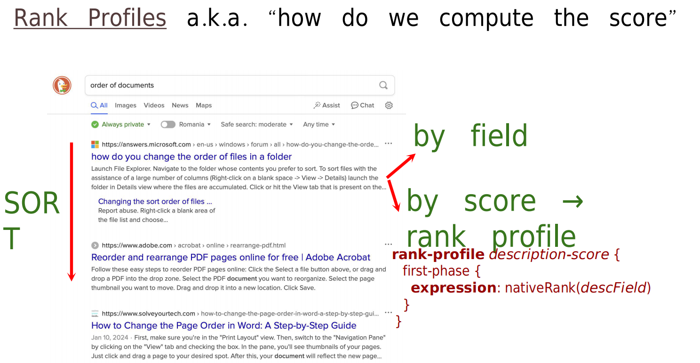

**What you're seeing:** This diagram illustrates how **rank profiles** work in Vespa. A rank profile defines how documents are scored and sorted based on relevance to a query. It's like a "scoring formula" that determines which documents appear first in search results.

**Key Concepts:**
- **Rank Profile**: A named configuration that defines how to calculate relevance scores for documents
- **First-Phase Ranking**: Fast, efficient ranking that runs on all matching documents
- **Ranking Expression**: The formula used to calculate relevance (e.g., `nativeRank`, `bm25`)
- **Multiple Profiles**: You can define multiple rank profiles in one schema for different use cases or A/B testing

**Notes:** Think of it like this:
- **Rank Profile** = A scoring system (like a grading rubric)
- **First-Phase** = Quick initial scoring of all matches
- **Ranking Expression** = The formula that calculates the score (e.g., "how well does the title match the query?")

The product schema in this tutorial uses rank profiles like:

```vespa
rank-profile default {
    first-phase {
        expression: nativeRank(ProductName, Description)
    }
}
```

**What it does:**
- Scores documents based on how well `ProductName` and `Description` match the query terms
- Higher scores = more relevant documents
- Results are automatically sorted by score (highest first)

**Learn More:**
- See [Rank profiles](https://docs.vespa.ai/en/basics/ranking.html#rank-profiles) for detailed explanation of rank profiles
- See [Rank phases](https://docs.vespa.ai/en/basics/ranking.html#phased-ranking) for information about ranking phases

### Ranking Algorithms Overview

This chapter introduces two powerful text ranking algorithms that form the foundation of search relevance. Understanding when and how to use each algorithm is critical for building effective search applications.

**Why multiple algorithms?**
- Different algorithms excel at different tasks
- BM25 is industry-standard and well-studied
- nativeRank offers term proximity features
- You can combine multiple algorithms for best results

#### BM25 Overview

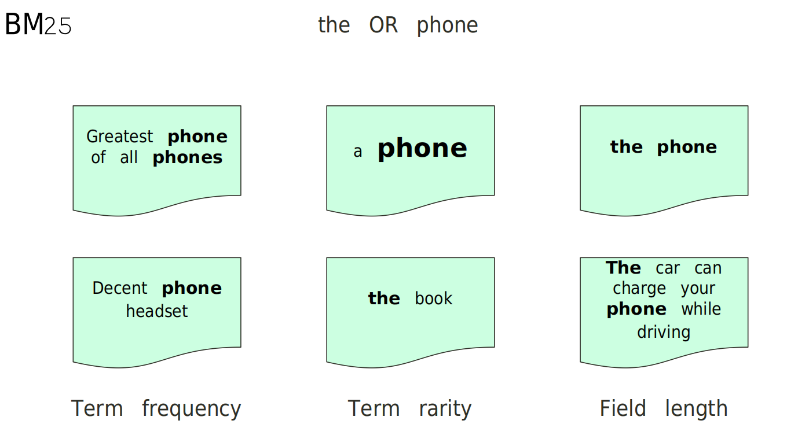

**What you're seeing:** This diagram explains the **BM25** (Best Matching 25) ranking algorithm. BM25 is an industry-standard text ranking function that scores documents based on term frequency, inverse document frequency, and field length normalization.

**Key Concepts:**
- **BM25**: A probabilistic ranking function widely used in information retrieval
- **Term Frequency (TF)**: How often query terms appear in the document
- **Inverse Document Frequency (IDF)**: How rare/common the terms are across all documents
- **Field Length Normalization**: Adjusts scores based on field length (longer fields get slight penalty)

**Notes:** BM25 is like a sophisticated scoring system:
- **More term matches** = Higher score
- **Rare terms** (like "laptop") = Higher weight than common terms (like "the")
- **Field length** = Longer fields get slightly penalized to favor concise matches

**Example Usage:**

```vespa
rank-profile bm25 {
    first-phase {
        expression: bm25(ProductName)
    }
}
```

**When to Use BM25:**
- ✅ Want industry-standard text ranking
- ✅ Need proven, well-tested algorithm
- ✅ Comparing with other search systems
- ✅ Standard text search requirements

**Learn More:**
- Official Docs: [BM25](https://docs.vespa.ai/en/ranking/bm25.html)

#### nativeRank Overview

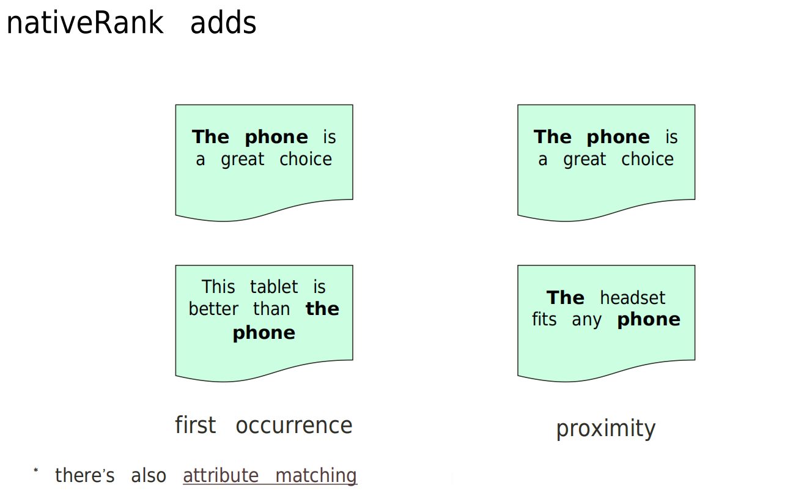

**What you're seeing:** This diagram explains **nativeRank**, Vespa's default text ranking function. Unlike BM25, nativeRank considers term proximity (how close query terms are to each other) in addition to term frequency and field importance.

**Key Concepts:**
- **nativeRank**: Vespa's proprietary text ranking algorithm
- **Term Proximity**: Rewards documents where query terms appear close together
- **Field Importance**: Can weight different fields differently
- **Document Length Normalization**: Adjusts for document size

**Notes:** nativeRank is like BM25 but with extra features:
- **Term proximity** = "laptop computer" scores higher when words appear together
- **Field weighting** = Title matches can be weighted more than description matches
- **Vespa-optimized** = Built specifically for Vespa's architecture

**Example Usage:**

```vespa
rank-profile default {
    first-phase {
        expression: nativeRank(ProductName, Description)
    }
}
```

**When to Use nativeRank:**
- ✅ Need term proximity (phrases score higher)
- ✅ Want Vespa's optimized default
- ✅ Simple use cases
- ✅ Fast ranking is priority

**Learn More:**
- Official Docs: [nativeRank](https://docs.vespa.ai/en/ranking/nativerank.html)

### Rank Profile Files Overview

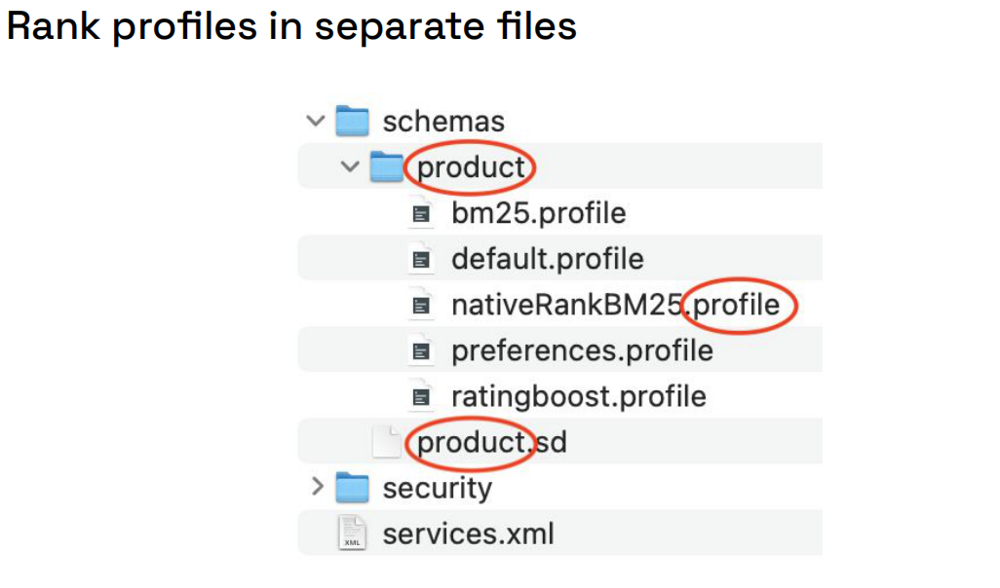

**What you're seeing:** This diagram shows how **rank profiles can be organized into separate files** within your schema directory. Instead of cramming all rank profiles into one large schema file, Vespa allows you to split them into modular `.profile` files for better organization.

**Key Concepts:**
- **Separate Profile Files**: Each rank profile can live in its own `.profile` file
- **Schema Directory Structure**: Profiles are stored in `schemas/<schema-name>/` directory
- **Modular Organization**: Easier to maintain and version control
- **Reusability**: Profiles can inherit from each other

**Notes:** File organization:
- **Main schema**: `app/schemas/product.sd` - Defines document structure
- **Profile files**: `app/schemas/product/*.profile` - Individual rank profiles
- **Naming convention**: File name should match rank profile name (e.g., `bm25.profile` contains `rank-profile bm25 {...}`)

**Example Structure:**
```text
app/schemas/product/
├── default.profile           # rank-profile default {...}
├── bm25.profile              # rank-profile bm25 {...}
├── nativeRankBM25.profile    # rank-profile nativeRankBM25 {...}
├── ratingboost.profile       # rank-profile ratingboost {...}
└── preferences.profile       # rank-profile preferences {...}
```

**Benefits:**
- ✅ **Cleaner code**: Each profile is in its own file
- ✅ **Easier to navigate**: Find profiles by filename
- ✅ **Better version control**: Track changes to individual profiles
- ✅ **Team collaboration**: Multiple people can work on different profiles

**Learn More:**
- See [Schema modularization](https://docs.vespa.ai/en/reference/schemas/schemas.html#rank-profile)  and [Application packages](https://docs.vespa.ai/en/reference/applications/application-packages.html) for details on splitting schemas

### Functions Overview

**Functions** in rank profiles allow you to organize complex ranking expressions into reusable, named components. They make your ranking logic cleaner, easier to understand, and maintainable.

**Why use functions?**
- **Reusability**: Define once, use multiple times
- **Readability**: Give meaningful names to complex expressions
- **Debugging**: Expose via `summary-features` to see intermediate scores
- **Modularity**: Build complex rankings from simple building blocks

**Example:**

```vespa
rank-profile nativeRankBM25 {
    function my_bm25() {
        expression: bm25(ProductName)
    }

    function my_nativeRank() {
        expression: nativeRank(Description) * 1.7
    }

    summary-features: my_bm25 my_nativeRank

    first-phase {
        expression: my_bm25() + my_nativeRank()
    }
}
```

**What it does:**
- **`my_bm25()`**: Computes BM25 score for ProductName
- **`my_nativeRank()`**: Computes nativeRank for Description with 1.7x weight
- **`summary-features`**: Exposes both function outputs in results
- **`first-phase`**: Combines both scores

**Benefits:**
- Clear separation of concerns (each function has one job)
- Easy to debug (see each score separately)
- Simple to adjust weights (change `1.7` without touching other code)
- Can be reused in multiple ranking expressions

**Learn More:**
- See [Rank profile functions](https://docs.vespa.ai/en/reference/schemas/schemas.html#function-rank) for syntax and examples

### Summary Features Overview

**Summary features** allow you to expose intermediate ranking scores in query results. This is incredibly useful for debugging ranking logic, understanding why documents are scored the way they are, and tuning your ranking expressions.

**Why use summary-features?**
- **Debugging**: See exactly how each part of your ranking formula contributes to the final score
- **Transparency**: Understand why document A ranks higher than document B
- **Tuning**: Experiment with weights and see immediate impact
- **Analysis**: Export scores for offline analysis and A/B testing

**Example:**

```vespa
rank-profile nativeRankBM25 {
    function my_bm25() {
        expression: bm25(ProductName)
    }

    function my_nativeRank() {
        expression: nativeRank(Description) * 1.7
    }

    first-phase {
        expression: my_bm25() + my_nativeRank()
    }
    
    summary-features: my_bm25 my_nativeRank
}
```

**Query Result with Summary Features:**
```json
{
  "fields": {
    "ProductName": "Blue Cotton T-Shirt",
    "relevance": 15.3
  },
  "summaryfeatures": {
    "my_bm25": 8.5,
    "my_nativeRank": 6.8,
    "relevance": 15.3
  }
}
```

**What you see:**
- **`relevance`**: Final score (15.3 = 8.5 + 6.8)
- **`my_bm25`**: BM25 contribution (8.5)
- **`my_nativeRank`**: nativeRank contribution (6.8)

**Use Cases:**
- **Debug**: "Why did this product rank so low?" → Check if `my_bm25` or `my_nativeRank` is 0
- **Tune**: "Should I increase the weight?" → Compare scores across queries
- **Validate**: "Is my formula working correctly?" → Verify math adds up

**Learn More:**
- See [Summary features](https://docs.vespa.ai/en/reference/schemas/schemas.html#summary-features) for syntax and built-in features

### Two-Phase Ranking Overview

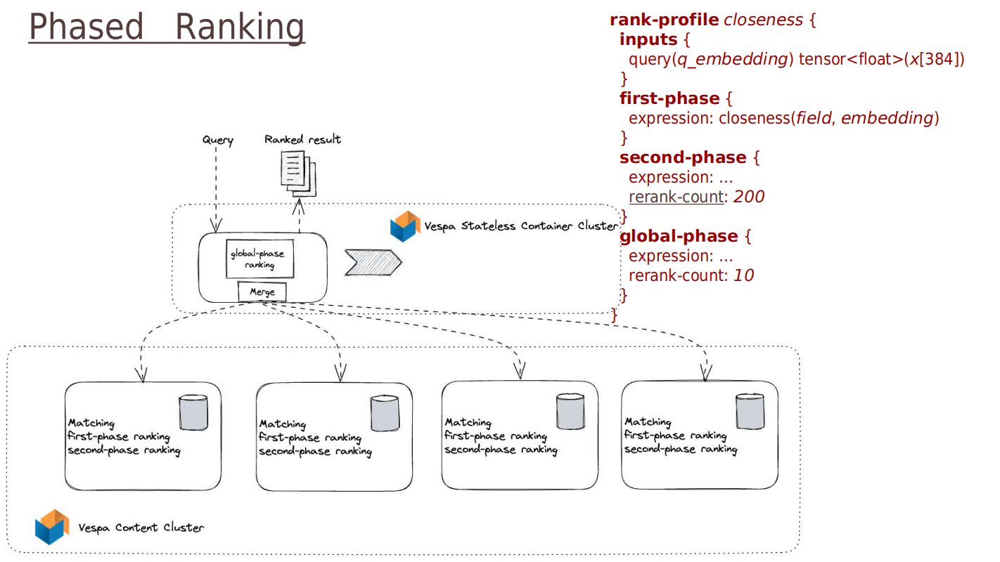

**What you're seeing:** This diagram illustrates **two-phase ranking** (also called **phased ranking**), a performance optimization technique that runs fast ranking on all matches and expensive ranking only on top candidates.

**Key Concepts:**
- **First-Phase Ranking**: Fast, cheap scoring runs on ALL matching documents (e.g., 10,000 matches)
- **Second-Phase Ranking**: Slow, expensive scoring runs only on top N documents (e.g., top 20 from first phase)
- **Rerank Count**: Controls how many documents enter second phase
- **Performance Optimization**: Avoids running expensive computations on documents that won't make top results

**Notes:** Two-phase ranking is like a two-round competition:
- **First round (first-phase)**: Quick preliminary scoring of everyone
- **Second round (second-phase)**: Detailed scoring of only the finalists
- **Winner**: Top results after second-phase scoring

**Why use two-phase ranking?**
- **Performance**: Expensive operations (ML models, complex tensors) only run on top candidates
- **Scalability**: Handle millions of documents with complex ranking
- **Quality**: Use sophisticated ranking where it matters most (top results)

**Example:**

```vespa
rank-profile preferences {
    # Fast first-phase: runs on all matches (cheap features)
    first-phase {
        expression: bm25(ProductName) * attribute(AverageRating)
    }

    # Expensive second-phase: runs on top 10 only (expensive features)
    second-phase {
        rerank-count: 10
        expression: sum(query(user_preferences) * attribute(ProductFeatures))
    }
}
```

**How it works:**
1. **Match Phase**: Find all documents matching query (e.g., 10,000 products)
2. **First-Phase**: Score all 10,000 products using fast formula (BM25 × Rating)
3. **Sort**: Sort by first-phase score
4. **Second-Phase**: Take top 10, rescore using expensive formula (tensor dot product)
5. **Final Sort**: Return top 10 in final order

**Performance Impact:**
```
Without two-phase:
  10,000 products × expensive formula = SLOW

With two-phase:
  10,000 products × cheap formula = FAST
  +    10 products × expensive formula = FAST
  = Overall: FAST
```

**When to Use:**
- ✅ Complex ranking with multiple signals
- ✅ Expensive operations (ML models, large tensors)
- ✅ Need to scale to millions of documents
- ✅ Want to optimize query latency

**Typical rerank-count values:**
- **10-20**: For most use cases
- **50-100**: If second-phase is not too expensive
- **1000+**: Rarely needed (defeats the purpose)

**Learn More:**
- See [Phased ranking](https://docs.vespa.ai/en/phased-ranking.html) for detailed explanation and examples

## Steps Overview

This tutorial progresses through 5 steps, each building on the previous:

### Step 1: Default nativeRank
**Goal**: Understand basic rank profiles

- Start with `default.profile` using `nativeRank`
- Learn how rank profiles control scoring
- Test with simple queries

**Key Learning**: How rank profiles work and how to use them in queries

### Step 2: BM25 Ranking
**Goal**: Implement industry-standard BM25 ranking

- Create `bm25.profile` using `bm25()` function
- Compare BM25 vs nativeRank results
- Understand when to use each algorithm

**Key Learning**: BM25 algorithm and when to use it

### Step 3: Combining Signals
**Goal**: Combine multiple ranking signals

- Create `nativeRankBM25.profile` combining both algorithms
- Use functions to organize ranking expressions
- Learn about `summary-features` for debugging

**Key Learning**: How to combine multiple ranking signals using functions

### Step 4: Business Logic (Rating Boost)
**Goal**: Integrate business signals into ranking

- Create `ratingboost.profile` that multiplies text relevance by rating
- Understand how to use document attributes in ranking
- See how business logic affects result ordering

**Key Learning**: Combining text relevance with business attributes

### Step 5: User Preferences (Two-Phase Ranking)
**Goal**: Implement personalized ranking with two-phase ranking

- Create `preferences.profile` with two-phase ranking
- Use query inputs for dynamic ranking
- Implement tensor operations for user preferences

**Key Learning**: Two-phase ranking, query inputs, and tensor operations

---

## Step 1 – Default nativeRank

**File**: `app/schemas/product/default.profile`

### Task

Update the `default.profile` to use `nativeRank` on both `ProductName` and `Description`:

```vespa
rank-profile default {
    first-phase {
        expression: nativeRank(ProductName, Description)  # TODO: adjust here for this lab
    }
}
```

**What to do:**
1. Remove the `# TODO` comment
2. Ensure the expression uses `nativeRank(ProductName, Description)`
3. Deploy the app: `vespa deploy --wait 900`

**Notes:**
- For detailed deployment instructions and setup, see the [Deploying and Testing](#deploying-and-testing) section below
- If you're new to Vespa deployment, refer to [`simple_ecommerce_app/README.md`](https://github.com/vespauniversity/vespaworkshop101/blob/main/simple_ecommerce_app/README.md#lab-prerequisites-add-basic-query) for prerequisites and initial setup
- You can test queries using the HTTP REST client (VS Code REST Client extension) with `queries.http` - see [`ecommerce_app/README.md`](https://github.com/vespauniversity/vespaworkshop101/blob/main/ecommerce_app/README.md#53-using-the-http-rest-api-examplehttp-or-python-java-client) section "5.3 Using the HTTP REST API" for setup instructions

### Testing

Use the query from REST client `queries.http`:

```http
### step 1) search for shirt, default rank profile
POST https://<mTLS_ENDPOINT_DNS_GOES_HERE>/search/
Content-Type: application/json

{
  "yql": "select * from product where ProductName contains 'shirt'"
}
```
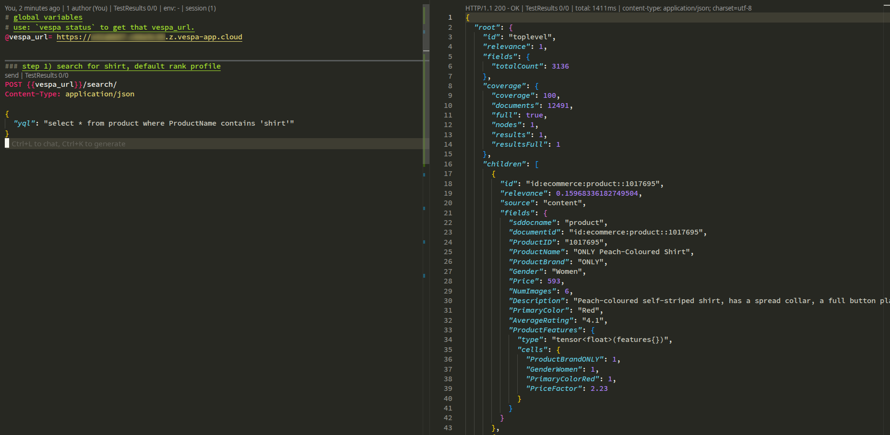

Use the query from Vespa cli: 
```bash
vespa query 'yql=select * from product where ProductName contains "shirt"'
```
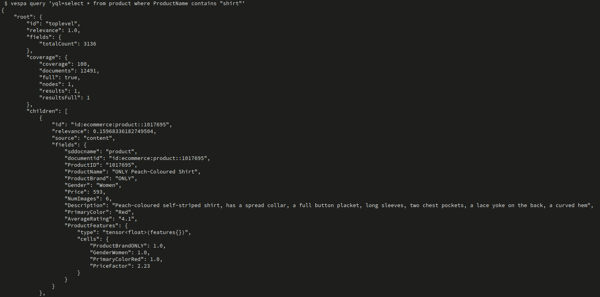

**Expected Result:**
- Documents containing "shirt" in ProductName are returned
- Results are sorted by `nativeRank` score (highest first)
- Check the `relevance` field in results to see scores

### What You're Learning

- **Rank profiles** define how documents are scored
- **nativeRank** is Vespa's default text ranking algorithm
- **First-phase** ranking runs on all matching documents
- Results are automatically sorted by relevance score

---

## Step 2 – BM25 Ranking

**File**: `app/schemas/product/bm25.profile`

### Task

Create a new rank profile that uses BM25 instead of nativeRank:

```vespa
rank-profile bm25 {
    first-phase {
        expression: bm25(ProductName)  # TODO: implement BM25 ranking
    }
}
```

**What to do:**
1. Replace the `# TODO` with `bm25(ProductName)`
2. Deploy the app: `vespa deploy --wait 900`

### Testing

Use the query from REST client `queries.http`:

```http
### step 2) search for shirt, custom rank profile
POST https://<mTLS_ENDPOINT_DNS_GOES_HERE>/search/
Content-Type: application/json

{
  "yql": "select * from product where ProductName contains 'shirt'",
  "ranking.profile": "bm25"
}
```
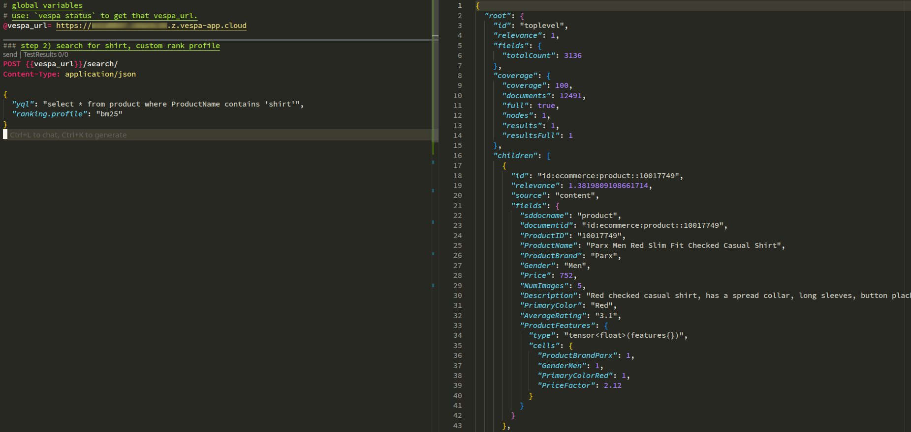

Use the query from Vespa cli: 
```bash
vespa query \
  'yql=select * from product where ProductName contains "shirt"' \
  'ranking.profile=bm25'
```

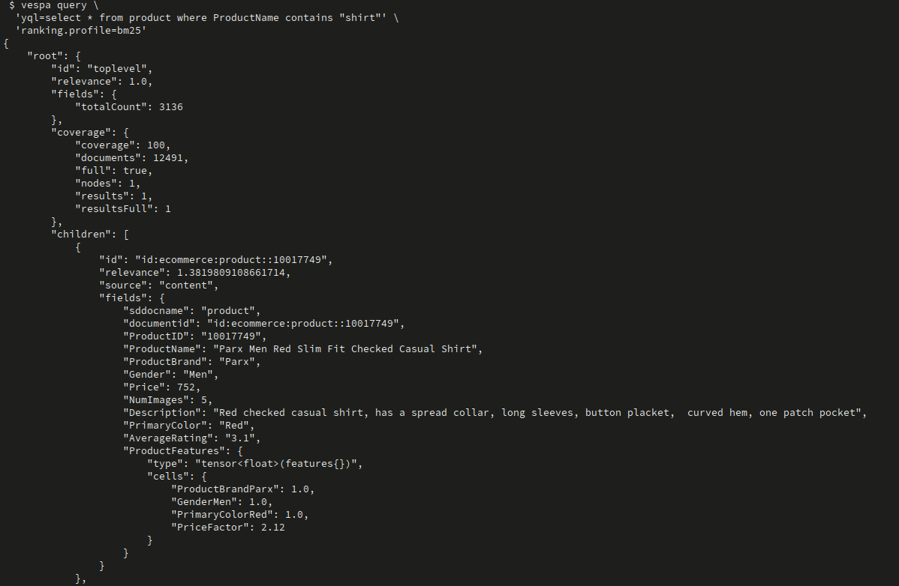

**Compare Results:**
- Run the same query with `default` profile and `bm25` profile
- Notice differences in result ordering
- BM25 may rank documents differently than nativeRank

### What You're Learning

- **BM25** is an industry-standard ranking algorithm
- Different rank profiles can produce different result orderings
- You can switch profiles per query using `ranking.profile` parameter


---

## Step 3 – Combining Signals (nativeRank + BM25)

**File**: `app/schemas/product/nativeRankBM25.profile`

### Task

Create a rank profile that combines both nativeRank and BM25:

```vespa
rank-profile nativeRankBM25 {
    function my_bm25() {
        expression: bm25(ProductName)  # TODO: implement
    }

    function my_nativeRank() {
        expression: nativeRank(Description) * 1.7  # TODO: implement
    }

    summary-features: my_bm25 my_nativeRank  # TODO: add summary features

    first-phase {
        expression: my_bm25() + my_nativeRank()  # TODO: combine signals
    }
}
```

**What to do:**
1. Implement `my_bm25()` function using `bm25(ProductName)`
2. Implement `my_nativeRank()` function using `nativeRank(Description) * 1.7`
3. Add both functions to `summary-features` (for debugging)
4. Combine them in `first-phase` expression
5. Deploy the app: `vespa deploy --wait 900`

### Testing

Use the query from REST client `queries.http`:

```http
### step 3) search for shirt in both title and description, combining signals
POST https://<mTLS_ENDPOINT_DNS_GOES_HERE>/search/
Content-Type: application/json

{
  "yql": "select * from product where ProductName contains 'shirt' OR Description contains 'shirt'",
  "ranking.profile": "nativeRankBM25"
}
```
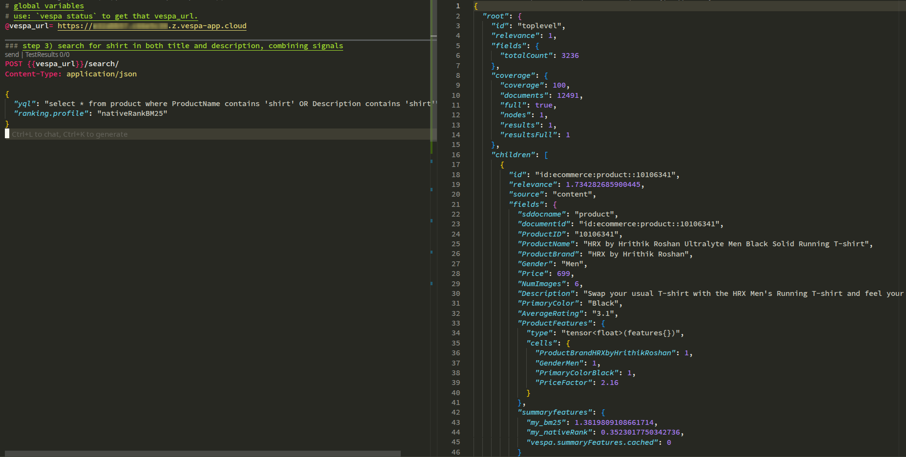

Use the query from Vespa cli: 
```bash
vespa query \
  'yql=select * from product where ProductName contains "shirt" OR Description contains "shirt"' \
  'ranking.profile=nativeRankBM25'
```
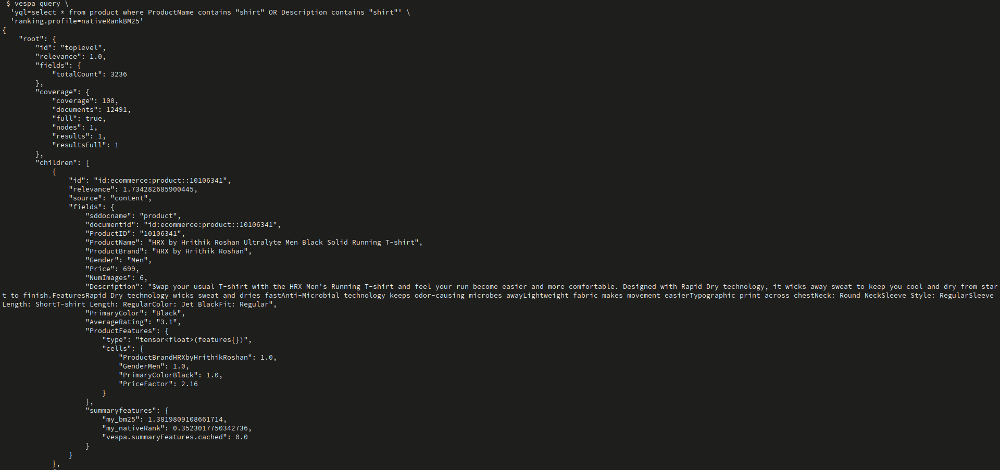

**What to Check:**
- Results combine scores from both algorithms
- `summary-features` in results show individual scores
- Description matches get 1.7x weight (higher importance)

### What You're Learning

- **Functions** organize ranking expressions for reusability
- **summary-features** expose intermediate scores for debugging
- You can **combine multiple ranking signals** by adding scores
- **Field weighting** (1.7x for Description) emphasizes certain fields

---

## Step 4 – Business Logic (Rating Boost)

**File**: `app/schemas/product/ratingboost.profile`

### Task

Create a rank profile that boosts results by their average rating:

```vespa
rank-profile ratingboost {
    function my_bm25() {
        expression: bm25(ProductName)  # TODO: implement
    }

    function my_nativeRank() {
        expression: nativeRank(Description) * 1.7  # TODO: implement
    }

    summary-features: my_bm25 my_nativeRank  # TODO: add summary features

    first-phase {
        expression: (my_bm25() + my_nativeRank()) * attribute(AverageRating)  # TODO: multiply by rating
    }
}
```

**What to do:**
1. Implement the functions (same as Step 3)
2. Multiply the combined text relevance by `attribute(AverageRating)`
3. This boosts highly-rated products
4. Deploy the app: `vespa deploy --wait 900`

### Testing

Use the query from REST client `queries.http`:

```http
### step 4) search for shirt in both title and description, with rating boost
POST https://<mTLS_ENDPOINT_DNS_GOES_HERE>/search/
Content-Type: application/json

{
  "yql": "select * from product where ProductName contains 'shirt' OR Description contains 'shirt'",
  "ranking.profile": "ratingboost"
}
```
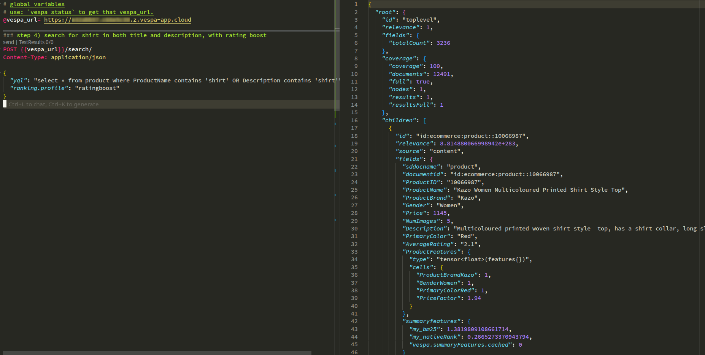

Use the query from Vespa cli: 

```bash
vespa query \
  'yql=select * from product where ProductName contains "shirt" OR Description contains "shirt"' \
  'ranking.profile=ratingboost'
```
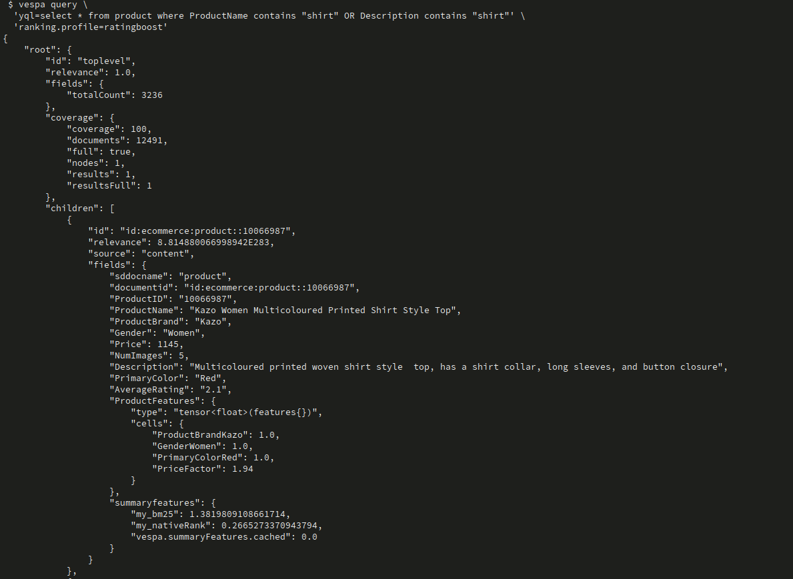

**What to Check:**
- Highly-rated products (4.5+) should rank higher
- Products with same text relevance but higher ratings rank above lower-rated ones
- Compare with `nativeRankBM25` profile to see the difference

### What You're Learning

- **Business signals** (ratings) can be integrated into ranking
- **attribute()** function accesses document attributes in ranking
- **Multiplication** boosts results (vs addition which adds signals)
- Real-world ranking combines relevance + business logic

---

## Step 5 – User Preferences (Two-Phase Ranking)

**File**: `app/schemas/product/preferences.profile`

### Task

Create a rank profile with two-phase ranking that uses user preferences:

```vespa
rank-profile preferences {
    inputs {
        query(user_preferences) tensor<float>(features{})  # TODO: define query input
    }

    function my_bm25() {
        expression: bm25(ProductName)  # TODO: implement
    }

    function my_nativeRank() {
        expression: nativeRank(Description) * 1.7  # TODO: implement
    }

    summary-features: my_bm25 my_nativeRank  # TODO: add summary features

    first-phase {
        expression: (my_bm25() + my_nativeRank()) * attribute(AverageRating)  # TODO: same as ratingboost
    }

    second-phase {
        rerank-count: 10  # TODO: rerank top 10 from first phase
        expression: sum(query(user_preferences) * attribute(ProductFeatures))  # TODO: tensor dot product
    }
}
```

**What to do:**
1. Define `query(user_preferences)` input tensor
2. Implement first-phase (same as `ratingboost`)
3. Add second-phase that:
   - Reranks top 10 documents from first phase
   - Computes tensor dot product: `sum(query(user_preferences) * attribute(ProductFeatures))`
4. Deploy the app: `vespa deploy --wait 900`

### Understanding ProductFeatures Tensor

The `ProductFeatures` tensor is a sparse tensor with features like:
```json
{
  "ProductBrandDKNY": 1,
  "GenderUnisex": 1,
  "PrimaryColorBlack": 1,
  "PriceFactor": 0.93
}
```

The `PriceFactor` is calculated as `5 - log10(price)`, so lower prices get higher factors.

### Testing

Use the query from REST client `queries.http`:

```http
### step 5) add user preferences
POST https://<mTLS_ENDPOINT_DNS_GOES_HERE>/search/
Content-Type: application/json

{
  "yql": "select * from product where ProductName contains 'shirt' OR Description contains 'shirt'",
  "ranking.features.query(user_preferences)": "{{features:GenderWomen}:1,{features:GenderUnisex}:0.7,{features:PriceFactor}:3}",
  "ranking.profile": "preferences"
}
```
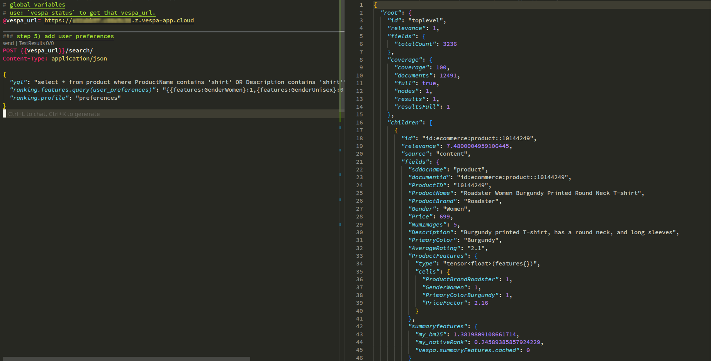

Use the query from Vespa cli: 
```bash
vespa query \
  'yql=select * from product where ProductName contains "shirt" OR Description contains "shirt"' \
  'ranking.profile=preferences' \
  'ranking.features.query(user_preferences)={{features:GenderWomen}:1,{features:GenderUnisex}:0.7,{features:PriceFactor}:3}'
```
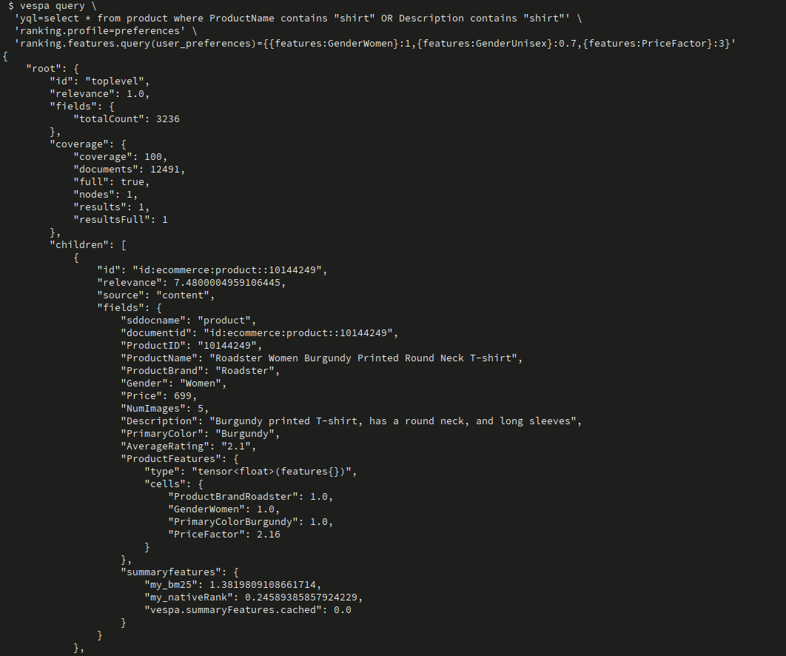

**What the query input means:**
- `GenderWomen: 1` - User prefers women's products (weight: 1.0)
- `GenderUnisex: 0.7` - User likes unisex products (weight: 0.7)
- `PriceFactor: 3` - User strongly prefers lower prices (weight: 3.0)

**What to Check:**
- First phase: Fast ranking on all matches (text + rating)
- Second phase: Top 10 reranked by user preferences
- Products matching user preferences rank higher
- Check `relevance` scores to see the difference

### What You're Learning

- **Two-phase ranking** optimizes performance (cheap first, expensive second)
- **Query inputs** allow dynamic ranking per query
- **Tensor operations** enable complex feature matching
- **Personalization** can be implemented via tensor dot products
- **rerank-count** controls how many documents enter second phase


---

## Deploying and Testing

### Prerequisites

> **Assumption**: You already configured **target** and **application name**  
> (for example `vespa config set target local` or `cloud`, and `vespa config set application <tenant>.<app>[.<instance>]`).

If you **haven't set up Vespa yet**, do that first using [`simple_ecommerce_app/README.md`](https://github.com/vespauniversity/vespaworkshop101/blob/main/simple_ecommerce_app/README.md#lab-prerequisites-add-basic-query) (Prerequisites + Setup).

### Step 1: Deploy the Application

```bash
cd ecommerce_ranking_app/app

# Verify configuration
vespa config get target        # Should show: cloud or local
vespa config get application   # Should show: tenant.app.instance
vespa auth show                # Should show: Success

# Deploy
vespa deploy --wait 900

# Check status
vespa status
```
**More details:** 
- [Vespa cli](https://docs.vespa.ai/en/clients/vespa-cli.html#deployment)


### Step 2: Feed Data

```bash
# From app directory
vespa feed --progress 3 ../dataset/products.jsonl
```
**Learn More:**
- [Reads and writes](https://docs.vespa.ai/en/writing/reads-and-writes.html)
- [Vespa cli](https://docs.vespa.ai/en/clients/vespa-cli.html#documents)


### Step 3: Test Queries

Use the Vespa CLI:

```bash
# Step 1: Test default profile
vespa query 'yql=select * from product where ProductName contains "shirt"'

# Step 2: Test BM25 profile
vespa query \
  'yql=select * from product where ProductName contains "shirt"' \
  'ranking.profile=bm25'

# Step 3: Test nativeRankBM25 profile (combining signals)
vespa query \
  'yql=select * from product where ProductName contains "shirt" OR Description contains "shirt"' \
  'ranking.profile=nativeRankBM25'

# Step 4: Test ratingboost profile (with rating boost)
vespa query \
  'yql=select * from product where ProductName contains "shirt" OR Description contains "shirt"' \
  'ranking.profile=ratingboost'

# Step 5: Test preferences profile (with user preferences)
vespa query \
  'yql=select * from product where ProductName contains "shirt" OR Description contains "shirt"' \
  'ranking.profile=preferences' \
  'ranking.features.query(user_preferences)={{features:GenderWomen}:1,{features:GenderUnisex}:0.7,{features:PriceFactor}:3}'
```
**More details:** 
- [Vespa cli](https://docs.vespa.ai/en/clients/vespa-cli.html#queries)


---

## Exercises

Here are additional practice tasks:

### Exercise 1: Compare Ranking Algorithms

1. Run the same query with `default`, `bm25`, and `nativeRankBM25` profiles
2. Compare the top 5 results from each
3. Note which algorithm ranks which products higher and why

### Exercise 2: Tune Field Weights

1. In `nativeRankBM25.profile`, experiment with different weights:
   - Try `nativeRank(Description) * 2.0` (higher weight)
   - Try `nativeRank(Description) * 1.0` (equal weight)
2. Compare results and see how field importance affects ranking

### Exercise 3: Adjust Rating Boost

1. In `ratingboost.profile`, try different boost strategies:
   - `* attribute(AverageRating)` (linear)
   - `* pow(attribute(AverageRating), 2)` (quadratic - stronger boost)
   - `+ attribute(AverageRating) * 0.5` (additive instead of multiplicative)
2. See how different boost strategies affect results

### Exercise 4: Custom User Preferences

1. Create different user preference profiles:
   - Price-conscious user: `{PriceFactor: 5}`
   - Brand-loyal user: `{ProductBrandNike: 2, ProductBrandAdidas: 1.5}`
   - Color-picky user: `{PrimaryColorBlue: 2, PrimaryColorBlack: 1.5}`
2. Compare how different preferences affect ranking

### Exercise 5: Debug with Summary Features

1. Add more `summary-features` to see intermediate scores:
   ```vespa
   summary-features: my_bm25 my_nativeRank AverageRating
   ```
2. Inspect the `summary-features` in query results
3. Understand how each component contributes to final score

---

## Destroy The Deployment

**Note:** Destroy the application if needed:
   ```bash
   vespa destroy
   ```

## Troubleshooting

### Rank Profile Not Found

**Error**: `Unknown rank profile: bm25`

**Solution**:
- Ensure the profile file exists in `app/schemas/product/`
- Redeploy: `vespa deploy --wait 900`
- Check profile name matches exactly (case-sensitive)

### No Results or Wrong Ordering

**Issue**: Results don't match expected ranking

**Solution**:
- Check that fields used in ranking are indexed/attribute as needed
- Verify `summary-features` to see intermediate scores
- Compare with `solutions/` reference files
- Ensure data is fed correctly: `vespa query 'yql=select * from product where true'`

### Tensor Operation Errors

**Error**: Issues with `ProductFeatures` tensor operations

**Solution**:
- Verify `ProductFeatures` field exists in schema
- Check tensor structure matches query input format
- Ensure data includes `ProductFeatures` (run `enhance_data.py` if needed)

### Query Input Not Working

**Error**: `user_preferences` not recognized

**Solution**:
- Ensure `inputs` section is defined in rank profile
- Check tensor type matches: `tensor<float>(features{})`
- Verify query parameter format: `ranking.features.query(user_preferences)=...`

---

## What You've Learned

By completing this tutorial, you have:

- ✅ **Understood rank profiles** and how they control document scoring
- ✅ **Implemented BM25 ranking** for industry-standard text relevance
- ✅ **Combined multiple ranking signals** using functions
- ✅ **Integrated business logic** (ratings) into ranking
- ✅ **Implemented two-phase ranking** for performance optimization
- ✅ **Applied user preferences** via tensor operations

**Key Takeaways:**
- Ranking is about combining multiple signals (text + business + user)
- Functions organize complex ranking expressions
- Two-phase ranking balances performance and accuracy
- Tensor operations enable powerful personalization

---

## Next Steps

From here, you're ready for:

- **Chapter 2**: Semantic/vector search with embeddings
- **Chapter 3**: Hybrid search (lexical + semantic) + learned reranking
- **Chapter 4**: Chunked document ranking (RAG scenarios)
- **Chapter 5**: Recommender Systems

**Related Tutorials:**
- `ecommerce_app` - Basic schema and queries
- `semantic_ecommerce_app` - Vector search and embeddings
- `hybrid_ecommerce_app` - Combining lexical and semantic search

---

## Additional Resources

- [Vespa Ranking Documentation](https://docs.vespa.ai/en/ranking.html)
- [Rank Profiles Reference](https://docs.vespa.ai/en/reference/schema-reference.html#rank-profile)
- [BM25 Reference](https://docs.vespa.ai/en/ranking/bm25.html)
- [nativeRank Reference](https://docs.vespa.ai/en/reference/nativerank.html)
- [Tensor Operations](https://docs.vespa.ai/en/reference/tensor.html)

**Solution Files:**
- `solutions/` directory contains completed rank profiles for reference
- Compare your implementations with solutions to verify correctness
