# E-commerce Ranking App – Vespa Ranking Chapter 3: Hybrid Search

This project is **Chapter 3** in the Vespa 101 ranking series.
This chapter introduces **hybrid search** (combining lexical + semantic search) and **learned reranking** using machine learning models (LightGBM), focusing on how to combine multiple search strategies and train rerankers to optimize result quality.

The goal here is to learn how to:
- Combine **lexical (BM25/nativeRank) and semantic (vector) search** in a single query
- Build a **hybrid ranking function** that leverages both search paradigms
- Collect **ranking features** from search results for training data
- Train a **LightGBM reranker** using relevance judgements
- Deploy and use **learned ranking models** in production
- **Evaluate ranking quality** using NDCG and other metrics

---

## Learning Objectives

After completing this chapter you should be able to:

- **Understand hybrid search** and why it outperforms pure lexical or semantic search
- **Write hybrid queries** combining `userQuery()` and `nearestNeighbor` operators
- **Create hybrid rank profiles** that combine lexical and semantic signals
- **Collect training data** by extracting rank features from search results
- **Train LightGBM models** for learned reranking
- **Deploy ML models** to Vespa for second-phase ranking
- **Evaluate reranker performance** using offline metrics

**Prerequisites:**
- Understanding of lexical ranking from Chapter 1 (`ecommerce_ranking_app`)
- Understanding of semantic/vector search from Chapter 2 (`semantic_ecommerce_ranking_app`)
- Familiarity with rank profiles, YQL queries, and embeddings
- Basic understanding of machine learning (training, evaluation, overfitting)

---

## Project Structure

From the `hybrid_ecommerce_ranking_app` root:

```text
hybrid_ecommerce_ranking_app/
├── app/
│   ├── schemas/
│   │   ├── product.sd                                    # Product schema with embeddings
│   │   └── product/
│   │       ├── default.profile                           # Lexical baseline (nativeRank)
│   │       ├── closeness_productname_description.profile # Semantic baseline (vector only)
│   │       └── hybrid.profile                            # Hybrid ranking (your implementation)
│   ├── models/
│   │   └── lightgbm_model.json                          # Trained LightGBM model (generated)
│   └── services.xml                                      # Vespa services config with Arctic embedder
├── train_reranker/
│   ├── create_prediction_data.py                         # Extract rank features from search results
│   ├── split_judgements.py                               # Split judgements into train/test sets
│   ├── train_lightgbm.py                                 # Train LightGBM reranker
│   ├── evaluate_model.py                                 # Evaluate trained model
│   ├── 0.visualize_data.ipynb                           # Notebook for data exploration
│   ├── env.example                                       # Environment configuration template
│   ├── prepare_env.sh                                    # Helper script to set up env variables
│   └── requirements.txt                                  # Python dependencies
├── solutions/
│   └── rerank.profile                                    # Reference solution with second-phase reranking
├── docs/                                                 # Additional documentation
│   ├── RANKING.md                                        # Hybrid ranking concepts
│   ├── QUERIES.md                                        # Hybrid query patterns
│   ├── SCHEMA.md                                         # Schema design for hybrid search
│   └── RERANKING.md                                      # LightGBM reranking guide
├── queries.http                                          # Example HTTP queries
└── README.md                                             # This file
```

You will mainly work with:
- `app/schemas/product/hybrid.profile` (hybrid ranking implementation)
- `train_reranker/` (scripts for training and evaluating rerankers)
- `queries.http` (testing hybrid queries)

---

## Key Concepts

### What is Hybrid Search?

**Hybrid search** combines multiple search paradigms to leverage their complementary strengths:

- **Lexical search** (BM25, nativeRank): Excels at exact keyword matches, handles proper nouns, brand names
- **Semantic search** (embeddings): Captures meaning, handles synonyms, natural language queries

**Why hybrid?**
- Lexical: "Nike Air Max 270" → Finds exact product matches
- Semantic: "comfortable running shoes" → Finds relevant products even without exact keywords
- **Hybrid**: Combines both for best overall performance

**Example:**
```
Query: "red shoes"
- Lexical matches: Documents with "red" AND "shoes" (exact keywords)
- Semantic matches: Documents about "crimson sneakers", "scarlet footwear" (semantically similar)
- Hybrid: Combines both using OR operator, ranks using both signals
```

### Hybrid Query Structure

A **hybrid query** uses `OR` to combine lexical and semantic search:

```yql
select * from product where
  ({targetHits:100}nearestNeighbor(ProductName_embedding, q_embedding)) OR
  ({targetHits:100}nearestNeighbor(Description_embedding, q_embedding)) OR
  userQuery()
```

**How it works:**
1. **nearestNeighbor** retrieves semantically similar documents (vector search)
2. **userQuery** retrieves keyword-matching documents (lexical search)
3. **OR** combines both result sets (union)
4. **Ranking** scores all results using hybrid rank profile

### Hybrid Ranking

A **hybrid rank profile** combines signals from both search paradigms:

```vespa
rank-profile hybrid {
    function native_rank_name() {
        expression: nativeRank(ProductName)
    }

    function closeness_productname() {
        expression: closeness(field, ProductName_embedding)
    }

    first-phase {
        expression: native_rank_name() + closeness_productname()
    }
}
```

**Key insight**: Each document gets scored by both lexical AND semantic features, even if it was retrieved by only one method.

### Learned Reranking

**Learned reranking** uses machine learning to optimize ranking based on historical relevance data:

**The Pipeline:**
1. **Collect training data**: Extract rank features from search results
2. **Label data**: Use relevance judgements (manual or LLM-as-a-judge)
3. **Train model**: LightGBM learns optimal feature weights
4. **Deploy model**: Export to Vespa for second-phase ranking
5. **Evaluate**: Measure improvement using NDCG, MRR, etc.

**Why it works:**
- Learns complex, non-linear combinations of features
- Optimizes directly for ranking metrics (NDCG)
- Handles feature interactions automatically
- Adapts to your specific domain and users


### Two-Phase Ranking with ML Models

**Two-phase ranking** balances performance and quality:

1. **First-phase** (cheap, fast): Hybrid ranking on all matched documents
2. **Second-phase** (expensive, accurate): ML model on top N documents

```vespa
rank-profile rerank {
    first-phase {
        expression: native_rank_name() + closeness_productname() + ...
    }

    second-phase {
        rerank-count: 20
        expression: lightgbm("lightgbm_model.json")
    }
}
```

**Performance benefit:**
- First-phase evaluates ~1000s of documents quickly
- Second-phase evaluates only top 20 with expensive ML model
- Maintains quality while keeping latency low

---

## Overview

This section introduces the fundamental concepts of hybrid search and machine learning-based reranking in Vespa. If you're new to hybrid search and learning to rank, we recommend reading the detailed explanations in [Ranking with LightGBM](https://docs.vespa.ai/en/lightgbm.html) and [Hybrid search tutorial](https://docs.vespa.ai/en/learn/tutorials/hybrid-search) for a deeper understanding.

### Machine Learning for Ranking Overview

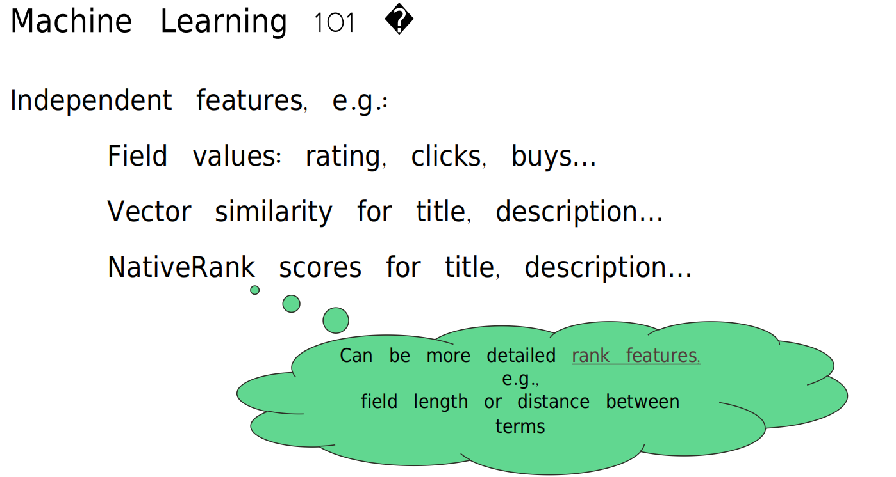

**What you're seeing:** This diagram illustrates how **machine learning** is applied to search ranking. Instead of manually tuning ranking formulas, ML models learn optimal ranking functions from data - automatically discovering which features matter most and how to combine them.

**Key Concepts:**
- **Traditional Ranking**: Manually crafted formulas (e.g., `0.3 * BM25 + 0.7 * closeness`)
- **Machine Learning Ranking**: Model learns weights from training data
- **Features**: Input signals (BM25, closeness, ratings, etc.)
- **Labels**: Relevance judgements (0-3 scale)
- **Training**: Model learns feature → relevance mapping

**Notes:** Why ML for ranking?

**Manual Ranking Challenges:**
```
Problem: How to weight these features?
  - BM25(ProductName): 8.5
  - closeness(ProductName_embedding): 0.82
  - nativeRank(Description): 4.2
  - AverageRating: 4.5

Manual attempt:
  score = BM25 * 0.3 + closeness * 0.5 + nativeRank * 0.2

Issues:
  ❌ Weights are guesses
  ❌ No feature interactions
  ❌ Same weights for all queries
  ❌ Hard to tune at scale
```

**ML Ranking Solution:**
```
Approach: Learn from data
  1. Collect query-document pairs with relevance labels
  2. Extract features for each pair
  3. Train model to predict relevance from features
  4. Model learns optimal weights automatically

Benefits:
  ✅ Data-driven weights
  ✅ Handles feature interactions
  ✅ Can learn query-specific patterns
  ✅ Scales to many features
```

**The ML Ranking Workflow:**
```
1. Historical Data:
   Query: "running shoes"
   Doc A: Relevant (3)    → Features: [BM25=8.5, closeness=0.9, rating=4.5]
   Doc B: Not Relevant (0) → Features: [BM25=2.1, closeness=0.3, rating=3.0]
   ...

2. Training:
   Model learns: High BM25 + High closeness + High rating → Relevant

3. Prediction (New Query):
   Query: "athletic footwear"
   Doc C: Features [BM25=7.2, closeness=0.85, rating=4.8]
   Model predicts: Highly relevant (score: 0.92)
```

**Models for Ranking:**
- **Linear Models**: Simple, fast, interpretable (Logistic Regression)
- **Tree-based Models**: Handle interactions, non-linear (LightGBM, XGBoost)
- **Neural Networks**: Most powerful, expensive (RankNet, LambdaRank)

**This Tutorial Uses:**
- **LightGBM**: Gradient Boosted Decision Trees
- **Why**: Fast, accurate, handles interactions, works well with limited data

**Learn More:**
- Official Docs: [LightGBM in Vespa](https://docs.vespa.ai/en/lightgbm.html)
- Paper: [Learning to Rank Overview](https://arxiv.org/abs/1812.01844)

### Extracting Features Overview

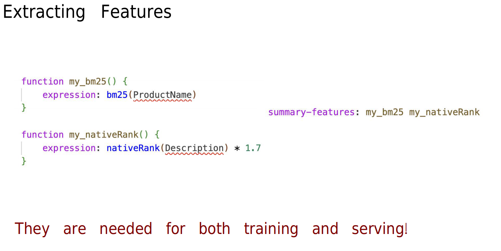

**What you're seeing:** This diagram shows the **feature extraction** process - how to collect ranking signals from search results to create training data for machine learning models.

**Key Concepts:**
- **Features**: Numeric signals describing query-document relevance
- **Feature Vector**: Array of feature values for one query-document pair
- **Rank Features**: Available in Vespa via `summary-features`
- **Training Data**: Features + Labels (relevance judgements)

**Notes:** Feature extraction workflow:

**Step 1: Define Features in Rank Profile**
```vespa
rank-profile collect_features {
    function my_bm25() {
        expression: bm25(ProductName)
    }

    function my_closeness() {
        expression: closeness(field, ProductName_embedding)
    }

    function my_nativerank() {
        expression: nativeRank(Description)
    }

    # Expose features for extraction
    summary-features {
        my_bm25
        my_closeness
        my_nativerank
        attribute(AverageRating)
    }

    first-phase {
        expression: my_bm25() + my_closeness()
    }
}
```

**Step 2: Query with Feature Collection**
```bash
vespa query \
  'yql=select * from product where userQuery()' \
  'query=running shoes' \
  'ranking.profile=collect_features' \
  'hits=100'
```

**Step 3: Extract Features from Results**
```json
{
  "fields": {
    "ProductName": "Nike Air Max 270",
    "relevance": 12.5
  },
  "summaryfeatures": {
    "my_bm25": 8.5,
    "my_closeness": 0.82,
    "my_nativerank": 4.2,
    "attribute(AverageRating)": 4.5
  }
}
```

**Step 4: Create Training Data**
```csv
query_id,doc_id,label,my_bm25,my_closeness,my_nativerank,AverageRating
q1,doc123,3,8.5,0.82,4.2,4.5
q1,doc456,1,2.1,0.35,1.8,3.0
q2,doc789,2,6.3,0.71,3.5,4.2
...
```

**Feature Types:**

**1. Lexical Features:**
- `bm25(field)`: BM25 text relevance
- `nativeRank(field)`: Vespa's text ranking
- `fieldMatch(field)`: Term coverage and proximity

**2. Semantic Features:**
- `closeness(field, embedding)`: Vector similarity
- `distance(field, embedding)`: Vector distance

**3. Document Features:**
- `attribute(AverageRating)`: Static document quality
- `attribute(Price)`: Document attribute
- `freshness(timestamp)`: Time-based signals

**4. Query Features:**
- `query(user_profile)`: User-specific signals
- Query length, query type, etc.

**This Tutorial's Feature Extraction:**
```bash
cd train_reranker

# Extract features from search results
python create_prediction_data.py \
  --queries ../evaluation/queries.csv \
  --ranking-profile collect_features \
  --output features.csv
```

**Common Features:**
```
Lexical:
  - bm25(ProductName)
  - bm25(Description)
  - nativeRank(ProductName)
  - nativeRank(Description)

Semantic:
  - closeness(ProductName_embedding)
  - closeness(Description_embedding)

Document Quality:
  - AverageRating
  - ReviewCount
  - Price (normalized)

Hybrid:
  - bm25 * closeness (interaction)
  - bm25 + closeness (sum)
```


### Training a Reranker Overview

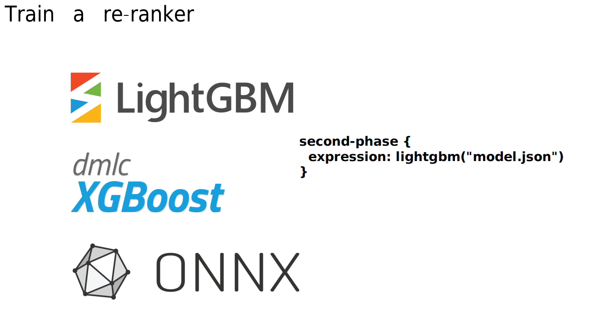

**What you're seeing:** This diagram illustrates the **training process** for a learned reranker. You take features and relevance labels, train a machine learning model (LightGBM), and export it to Vespa for deployment.

**Key Concepts:**
- **Training Data**: Features + Labels (query-document pairs with relevance)
- **LightGBM**: Gradient Boosted Decision Trees algorithm
- **Model Training**: Learning optimal feature weights and interactions
- **Model Export**: Converting model to Vespa-compatible format
- **Deployment**: Using model in Vespa second-phase ranking

**Notes:** The training pipeline:

**Step 1: Prepare Training Data**
```csv
# features_train.csv
query_id,doc_id,label,bm25_name,closeness_name,nativerank_desc,rating
q1,doc123,3,8.5,0.82,4.2,4.5
q1,doc456,0,2.1,0.35,1.8,3.0
q2,doc789,2,6.3,0.71,3.5,4.2
...
```

**Labels (Graded Relevance):**
- **3**: Highly relevant (perfect match)
- **2**: Relevant (good match)
- **1**: Marginally relevant (somewhat related)
- **0**: Not relevant (irrelevant)

**Step 2: Train LightGBM Model**
```python
# train_lightgbm.py
import lightgbm as lgb
import pandas as pd

# Load data
df = pd.read_csv('features_train.csv')

# Define features and labels
features = ['bm25_name', 'closeness_name', 'nativerank_desc', 'rating']
X = df[features]
y = df['label']

# Train model
model = lgb.LGBMRanker(
    objective='lambdarank',  # Learning-to-rank objective
    metric='ndcg',           # Optimize for NDCG
    num_leaves=31,
    learning_rate=0.05,
    n_estimators=100
)

model.fit(X, y, group=df.groupby('query_id').size())
```

**Step 3: Export Model**
```python
# Export to Vespa JSON format
import json

def export_lightgbm_to_vespa(model, feature_names, output_file):
    # Convert LightGBM model to Vespa JSON format
    vespa_model = {
        'trees': [],  # Tree structures
        'feature_names': feature_names
    }

    # ... conversion logic ...

    with open(output_file, 'w') as f:
        json.dump(vespa_model, f)

export_lightgbm_to_vespa(model, features, 'lightgbm_model.json')
```

**Step 4: Deploy to Vespa**
```bash
# Copy model to app directory
cp lightgbm_model.json ../app/models/

# Deploy application
cd ../app
vespa deploy --wait 300
```

**Step 5: Use in Rank Profile**
```vespa
rank-profile rerank {
    first-phase {
        expression: bm25(ProductName) + closeness(field, ProductName_embedding)
    }

    second-phase {
        rerank-count: 20
        expression: lightgbm("lightgbm_model.json")
    }
}
```

**Training Configuration:**

**LightGBM Parameters:**
- **objective**: `lambdarank` (learning-to-rank)
- **metric**: `ndcg` (optimize NDCG@K)
- **num_leaves**: Tree complexity (31 = moderate)
- **learning_rate**: Step size (0.05 = conservative)
- **n_estimators**: Number of trees (100 = good starting point)

**Preventing Overfitting:**
```python
# Split data
train_data, test_data = split_data(df, test_size=0.2)

# Early stopping
model.fit(
    X_train, y_train,
    eval_set=[(X_test, y_test)],
    early_stopping_rounds=10,
    verbose=10
)
```

**This Tutorial:**
```bash
cd train_reranker

# 1. Split judgements into train/test
python split_judgements.py

# 2. Extract features for both sets
python create_prediction_data.py --split train
python create_prediction_data.py --split test

# 3. Train model
python train_lightgbm.py --input features_train.csv

# 4. Evaluate model
python evaluate_model.py --model lightgbm_model.json
```

**Expected Improvements:**
```
Baseline (manual hybrid):
  NDCG@10: 0.65

After LightGBM reranking:
  NDCG@10: 0.78 (20% improvement!)
```

**Learn More:**
- Official Docs: [LightGBM Models](https://docs.vespa.ai/en/lightgbm.html)
- LightGBM: [Documentation](https://lightgbm.readthedocs.io/)

### Ranking Objectives Overview

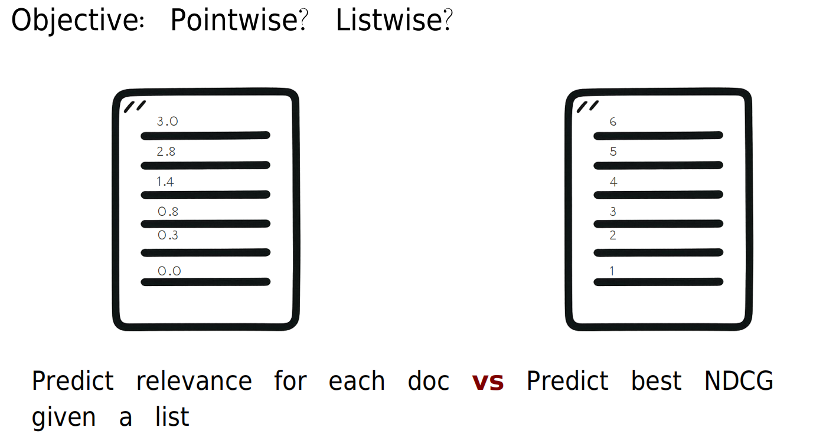

**What you're seeing:** This diagram explains different **learning-to-rank objectives** - how machine learning models are trained to optimize ranking quality. The choice of objective significantly impacts model performance.

**Key Concepts:**
- **Pointwise**: Predict relevance score for each document independently
- **Pairwise**: Learn relative ordering between document pairs
- **Listwise**: Optimize the entire ranked list directly
- **Objective Function**: What the model tries to minimize/maximize during training

**Notes:** Comparing ranking objectives:

### **1. Pointwise Approach**

**Idea:** Treat ranking as regression or classification
- Predict relevance score for each document independently
- Model learns: Features → Relevance Score

**Example:**
```
Query: "running shoes"

Doc A: Features → Predict: 0.9 (highly relevant)
Doc B: Features → Predict: 0.3 (not relevant)
Doc C: Features → Predict: 0.7 (relevant)

Ranking: A > C > B (sort by predicted scores)
```

**Pros:**
- ✅ Simple to implement
- ✅ Fast training
- ✅ Well-understood algorithms (logistic regression, neural nets)

**Cons:**
- ❌ Ignores relative ordering
- ❌ Doesn't optimize ranking metrics (NDCG)
- ❌ Position-independent

**Use When:**
- Simple baseline
- Limited training data
- Need interpretability

### **2. Pairwise Approach**

**Idea:** Learn relative ordering between document pairs
- For each query, create pairs of documents
- Model learns: Which document should rank higher?

**Example:**
```
Query: "running shoes"

Pairs:
  (Doc A [label=3], Doc B [label=0]) → A should rank higher
  (Doc A [label=3], Doc C [label=2]) → A should rank higher
  (Doc C [label=2], Doc B [label=0]) → C should rank higher

Model learns to predict: P(DocA > DocB) for any pair
```

**Pros:**
- ✅ Directly optimizes pairwise ordering
- ✅ Better than pointwise for ranking
- ✅ Handles label noise better

**Cons:**
- ❌ Doesn't directly optimize list-level metrics
- ❌ More training examples (all pairs)
- ❌ Can be slow

**Algorithms:**
- RankNet, LambdaRank

**Use When:**
- Have pairwise preference data
- Want better ranking than pointwise
- Moderate-size dataset

### **3. Listwise Approach**

**Idea:** Optimize the entire ranked list directly
- Consider all documents for a query together
- Model learns to directly maximize ranking metric (NDCG)

**Example:**
```
Query: "running shoes"

Ground Truth Ranking: [A(3), C(2), B(0)]
Model Prediction: [A, B, C]

Loss = how far predicted ranking is from ideal
     = 1 - NDCG(predicted, ground_truth)

Model adjusts to maximize NDCG directly!
```

**Pros:**
- ✅ Directly optimizes ranking metrics (NDCG, MRR)
- ✅ Best performance for ranking
- ✅ Position-aware

**Cons:**
- ❌ More complex to implement
- ❌ Requires grouped training data (all docs per query)
- ❌ Slower training

**Algorithms:**
- LambdaMART (LightGBM's `lambdarank`)
- ListNet
- SoftRank

**Use When:**
- Want best ranking performance
- Have sufficient training data
- Can afford training cost

### **Comparison Table:**

| Approach | Training Unit | Optimization | Complexity | Performance |
|----------|---------------|--------------|------------|-------------|
| **Pointwise** | Individual documents | Relevance scores | Low | Good |
| **Pairwise** | Document pairs | Pairwise ordering | Medium | Better |
| **Listwise** | Entire ranked list | Ranking metrics (NDCG) | High | Best |

### **This Tutorial:**

**Uses LightGBM with LambdaRank (Listwise):**
```python
model = lgb.LGBMRanker(
    objective='lambdarank',  # Listwise objective
    metric='ndcg',           # Optimize NDCG directly
    ndcg_eval_at=[10],      # Evaluate NDCG@10
)
```

**Why LambdaRank?**
1. **Direct NDCG optimization**: Model learns to maximize NDCG@K
2. **Position-aware**: Knows top positions matter more
3. **State-of-the-art**: Used in production at Microsoft Bing, etc.
4. **Handles graded relevance**: Works with 0-3 labels naturally

**Training Data Format:**
```python
# Grouped by query (required for listwise)
model.fit(
    X,  # Features
    y,  # Labels (0-3)
    group=df.groupby('query_id').size()  # Documents per query
)
```

**Other Objectives in LightGBM:**
- `regression`: Pointwise (not recommended for ranking)
- `binary`: Pointwise binary classification
- `lambdarank`: Listwise (recommended!)
- `rank_xendcg`: Listwise with position bias

**Performance Comparison:**
```
Pointwise (regression):     NDCG@10: 0.68
Pairwise (custom loss):     NDCG@10: 0.72
Listwise (lambdarank):      NDCG@10: 0.78  ← Best!
```

**Learn More:**
- Paper: [From RankNet to LambdaRank to LambdaMART](https://www.microsoft.com/en-us/research/wp-content/uploads/2016/02/MSR-TR-2010-82.pdf)
- LightGBM: [Ranking Objectives](https://lightgbm.readthedocs.io/en/latest/Parameters.html#objective)

## Steps Overview

This tutorial progresses through understanding and implementing hybrid search with learned reranking:

### Step 1: Understanding Hybrid Search
**Goal**: Learn why hybrid search outperforms single-paradigm search

- Understand strengths/weaknesses of lexical vs. semantic search
- See how hybrid search combines both paradigms
- Learn the trade-offs and when to use hybrid

**Key Learning**: Hybrid search provides the best of both worlds

### Step 2: Create Hybrid Rank Profile
**Goal**: Build a ranking function that uses both lexical and semantic features

- Combine `nativeRank()` and `closeness()` functions
- Add document attributes (rating, price) to ranking
- Expose features via `summary-features` for debugging

**Key Learning**: How to combine multiple ranking signals effectively

### Step 3: Write Hybrid Queries
**Goal**: Combine lexical and semantic search in queries

- Use `OR` operator to combine `userQuery()` and `nearestNeighbor`
- Understand how Vespa merges result sets
- Learn about `targetHits` and query performance

**Key Learning**: How to structure hybrid queries in YQL

### Step 4: Collect Training Data
**Goal**: Extract rank features from search results for ML training

- Query Vespa to retrieve search results with features
- Extract features from `summary-features`
- Join with relevance judgements
- Prepare data for LightGBM training

**Key Learning**: How to build training datasets from search logs

### Step 5: Train LightGBM Reranker
**Goal**: Train a machine learning model to optimize ranking

- Use LightGBM to learn from relevance judgements
- Perform cross-validation to prevent overfitting
- Export model to JSON for Vespa deployment
- Analyze feature importance

**Key Learning**: How to train ranking models from relevance data

### Step 6: Deploy and Evaluate Reranker
**Goal**: Use the trained model in production and measure improvement

- Add model to Vespa application (`app/models/`)
- Create rank profile with second-phase reranking
- Deploy and test the model
- Evaluate using NDCG and compare to baseline

**Key Learning**: Complete ML ranking pipeline from training to production

---

## Step 1 – Understanding Hybrid Search

### Why Hybrid Search?

**Lexical search strengths:**
- Exact keyword matching (brand names: "Nike", "Adidas")
- Handles acronyms and technical terms
- Fast and predictable
- Works well for navigational queries

**Lexical search weaknesses:**
- Misses synonyms ("shoes" vs "footwear")
- Can't handle semantic relationships ("running" vs "jogging")
- Struggles with natural language queries
- Keyword matching can be too strict

**Semantic search strengths:**
- Captures meaning and intent
- Handles synonyms and paraphrases
- Better for natural language queries
- Finds semantically relevant results

**Semantic search weaknesses:**
- May miss exact matches
- Can be less predictable
- Embedding quality dependent on training data
- May struggle with rare terms or proper nouns

**Hybrid search solution:**
- Combines both paradigms using OR operator
- Ranks using features from both lexical and semantic search
- Achieves better overall performance than either alone
- Adapts to different query types automatically

### Research Evidence

Multiple studies show hybrid search outperforms single-paradigm approaches:

- **MS MARCO Passage Ranking**: Hybrid approaches dominate leaderboard
- **Vespa Blog Studies**: Hybrid improves NDCG by 10-20% over lexical or semantic alone
- **Your evaluation**: You'll measure this improvement yourself in Step 6


---

## Step 2 – Create Hybrid Rank Profile

**File**: `app/schemas/product/hybrid.profile`

### Task

The `hybrid.profile` is already provided with a basic implementation. Review and understand it:

```vespa
rank-profile hybrid {
    ## Lexical search features
    function native_rank_name() {
        expression: nativeRank(ProductName)
    }
    function native_rank_description() {
        expression: nativeRank(Description)
    }

    ## Semantic search features
    inputs {
        query(q_embedding) tensor<float>(x[384])
    }

    function closeness_productname() {
        expression: closeness(field, ProductName_embedding)
    }
    function closeness_description() {
        expression: closeness(field, Description_embedding)
    }

    ## Document attributes (for reranking)
    function AverageRating() {
        expression: attribute(AverageRating)
    }
    function Price() {
        expression: attribute(Price)
    }

    ## Expose features for training data collection
    summary-features: native_rank_name native_rank_description closeness_productname closeness_description

    ## Basic hybrid ranking
    first-phase {
        expression: native_rank_name() + native_rank_description() + closeness_productname() + closeness_description()
    }
}
```

**What to do:**
1. Review the profile structure
2. Understand how lexical and semantic features are combined
3. Note the `summary-features` - these will be used for training data
4. Deploy the app: `vespa deploy --wait 900`

**Notes:**
- For detailed deployment instructions and setup, see the [Deploying and Testing](#deploying-and-testing) section below
- If you're new to Vespa deployment, refer to [`simple_ecommerce_app/README.md`](https://github.com/vespauniversity/vespaworkshop101/blob/main/simple_ecommerce_app/README.md#lab-prerequisites-add-basic-query) for prerequisites and initial setup
- You can test queries using the HTTP REST client (VS Code REST Client extension) with `queries.http` - see [`ecommerce_app/README.md`](https://github.com/vespauniversity/vespaworkshop101/blob/main/ecommerce_app/README.md#53-using-the-http-rest-api-examplehttp-or-python-java-client) section "5.3 Using the HTTP REST API" for setup instructions


**Profile Components:**
- **Functions**: Organize ranking expressions for reusability
- **Lexical features**: `nativeRank(ProductName)`, `nativeRank(Description)`
- **Semantic features**: `closeness(field, ProductName_embedding)`, `closeness(field, Description_embedding)`
- **Document attributes**: `AverageRating`, `Price` (exposed for model training)
- **summary-features**: Expose intermediate scores for debugging and training data
- **first-phase**: Simple additive combination (baseline before learned reranking)

**Key insight**: The first-phase expression is a simple sum. The LightGBM model will learn a much more sophisticated combination of these features.


---


## Step 3 – Write Hybrid Queries

**File**: `queries.http`

### Task

Write the hybrid query with the `hybrid` profile that combines lexical and semantic search:

```http
### Hybrid query
POST https://<mTLS_ENDPOINT_DNS_GOES_HERE>/search/
Content-Type: application/json

{
  "yql": "select * from product where ({targetHits:100}nearestNeighbor(ProductName_embedding,q_embedding)) OR ({targetHits:100}nearestNeighbor(Description_embedding,q_embedding)) OR userQuery()",
  "query": "comfortable running shoes",
  "input.query(q_embedding)": "embed(@query)",
  "ranking.profile": "hybrid",
  "hits": 20
}
```
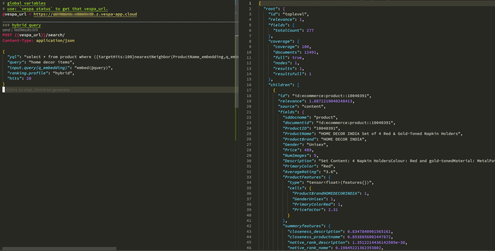

```bash
vespa query \
  'yql=select * from product where ({targetHits:100}nearestNeighbor(ProductName_embedding,q_embedding)) OR ({targetHits:100}nearestNeighbor(Description_embedding,q_embedding)) OR userQuery()' \
  'query=comfortable running shoes' \
  'input.query(q_embedding)=embed(@query)' \
  'ranking.profile=hybrid' \
  'hits=20'
```
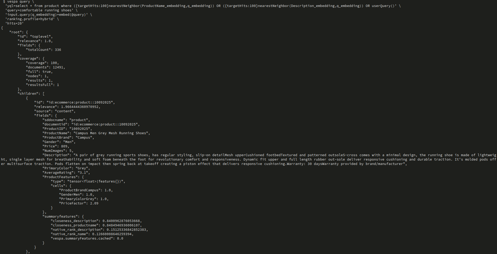

**What to do:**
1. Use `OR` to combine three search methods:
   - `nearestNeighbor(ProductName_embedding, q_embedding)` - Semantic search on product names
   - `nearestNeighbor(Description_embedding, q_embedding)` - Semantic search on descriptions
   - `userQuery()` - Lexical search on default fieldset
2. Set `targetHits:100` for approximate nearest neighbor search
3. Embed query text using `embed(@query)`
4. Use `hybrid` rank profile for scoring

**Query Components:**
- **`{targetHits:100}nearestNeighbor(...)`**: Retrieve ~100 candidates from vector search
- **`userQuery()`**: Search default fieldset (ProductName, Description) with lexical matching
- **`OR`**: Combine all result sets (union)
- **`embed(@query)`**: Convert query text to embedding using Arctic model
- **`ranking.profile: hybrid`**: Score results using hybrid rank profile

**How it works:**
1. Query is processed by three search methods simultaneously
2. Vector search finds semantically similar documents
3. Lexical search finds keyword-matching documents
4. Results are merged (deduplicated)
5. All results are scored by hybrid rank profile
6. Top N results returned


---

## Step 4 – Collect Training Data

**Directory**: `train_reranker/`

### Overview

To train a reranker, you need:
1. **Queries**: Test queries representing user intent
2. **Relevance judgements**: Labels indicating document relevance (0-3 scale)
3. **Rank features**: Feature vectors extracted from search results

### Step 4a: Set Up Environment

**File**: `train_reranker/env.example`

```bash
# Asume in train_reranker otherwise change directory by:
#cd hybrid_ecommerce_ranking_app/train_reranker

# Copy and configure environment variables
cp env.example .env

# Edit .env with your values:
export VESPA_ENDPOINT=https://your-endpoint.vespa-app.cloud
export VESPA_CERT_PATH=/path/to/cert.pem
export VESPA_KEY_PATH=/path/to/key.pem
export OPENAI_API_KEY=your-api-key  # Only needed for creating judgements
```

Or use the helper script:
```bash
# In hybrid_ecommerce_ranking_app/train_reranker directory
# source prepare_env.sh
```

**Install dependencies:**
```bash
cd hybrid_ecommerce_ranking_app/train_reranker

# Creating virtual environment and installing requirements
python3 -m venv reranker_venv
source reranker_venv/bin/activate
pip install -r requirements.txt

# Adding Jupyter + IPyKernel to the venv 
#pip install jupyter ipykernel

# Register this venv as a Jupyter kernel so code-server can pick it
#python -m ipykernel install --user \
#  --name "reranker_venv" \
#  --display-name "Python (reranker_venv)"

# Installing code-server extensions for Jupyter
#code-server --install-extension ms-toolsai.jupyter
#code-server --install-extension ms-python.python
```

### Step 4b: Obtain Relevance Judgements

You need relevance judgements (query-document pairs with relevance labels).

**Option 1: Use provided judgements** (if available)
- Check if `judgements.csv` exists in the evaluation directory from Chapter 2

**Option 2: Generate judgements using LLM-as-a-judge**
- Use the evaluation framework from Chapter 2 (`semantic_ecommerce_ranking_app/evaluation/create_judgements.py`)

**Judgement format:**
```csv
query_id,query_text,document_id,relevance
1,comfortable running shoes,prod_123,3
1,comfortable running shoes,prod_456,2
1,comfortable running shoes,prod_789,0
```

**Relevance scale:**
- 3: Highly relevant (perfect match)
- 2: Relevant (good match)
- 1: Marginally relevant (somewhat related)
- 0: Not relevant (unrelated)

### Step 4c: Split Judgements into Train/Test Sets

**File**: `train_reranker/split_judgements.py`

```bash
cd hybrid_ecommerce_ranking_app/train_reranker

python split_judgements.py \
  --input_file judgements.csv \
  --train_output judgements_train.csv \
  --test_output judgements_test.csv \
  --test_ratio 0.2
```
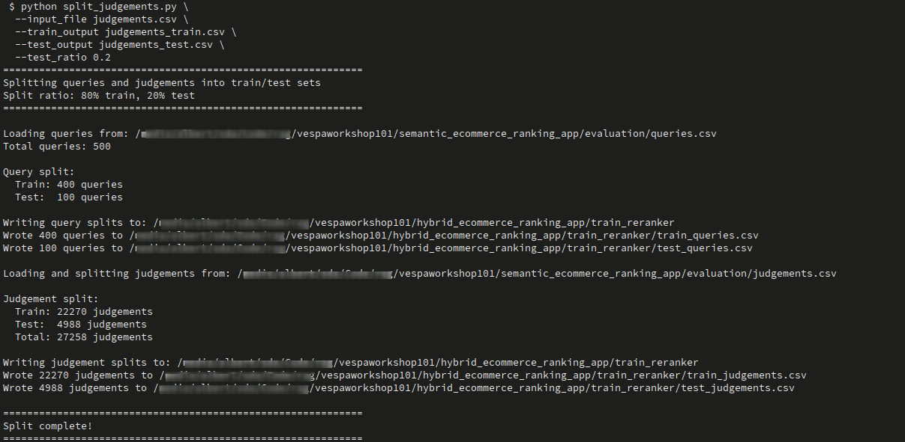

**What it does:**
- Splits judgements into training (80%) and test (20%) sets
- Uses stratified splitting to ensure balanced query distribution
- Prevents data leakage (same query never in both train and test)

### Step 4d: Extract Rank Features

**File**: `train_reranker/create_prediction_data.py`

```bash
cd hybrid_ecommerce_ranking_app/train_reranker

python create_prediction_data.py \
--queries train_queries.csv \
--judgements train_judgements.csv \
--output training_data.csv
```

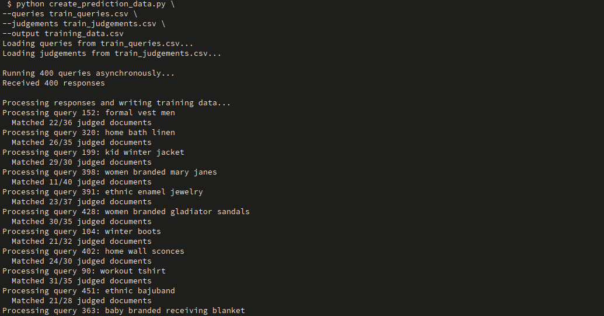

**What it does:**
1. For each query in judgements, queries Vespa with `hybrid` rank profile
2. Retrieves search results with `summary-features`
3. Extracts feature vectors (native_rank_name, closeness_productname, etc.)
4. Joins with relevance labels
5. Saves to CSV for model training

**Output format:**
```csv
query_id,document_id,relevance,native_rank_name,native_rank_description,closeness_productname,closeness_description,AverageRating,Price
1,prod_123,3,0.85,0.72,0.91,0.68,4.5,2999
1,prod_456,2,0.65,0.58,0.75,0.62,4.2,1999
```


---

## Step 5 – Train LightGBM Reranker

**File**: `train_reranker/train_lightgbm.py`

### Task

Train a LightGBM model using the collected training data:

```bash
cd hybrid_ecommerce_ranking_app/train_reranker

python train_lightgbm.py \
--input_file training_data.csv \
--output_model_file ../app/models/lightgbm_model.json \
--target relevance_label \
--folds 5 \
--learning_rate 0.05 \
--max_rounds 1000 \
--early_stop 50
```
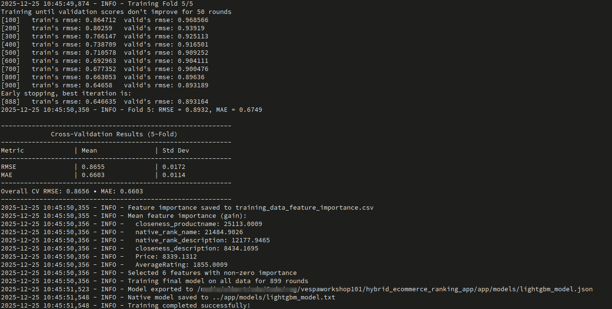

**Parameters:**
- `--input_file`: Training data CSV (from Step 4d)
- `--output_model`: Output path for trained model (JSON format for Vespa)
- `--target_col`: Target column name (relevance)
- `--folds`: Number of cross-validation folds (5 recommended)
- `--learning_rate`: Learning rate (0.05 is a good starting point)
- `--max_rounds`: Maximum boosting rounds (1000)
- `--early_stop`: Early stopping rounds (50)

**What the script does:**
1. Loads training data
2. Performs stratified k-fold cross-validation
3. Trains LightGBM model on each fold
4. Evaluates on validation set (NDCG, MSE, MAE)
5. Trains final model on full dataset
6. Exports model to JSON format compatible with Vespa
7. Saves feature importance analysis

**Understanding the training output:**

```
Fold 1/5: NDCG@10=0.8234, MSE=0.4521, MAE=0.5123
Fold 2/5: NDCG@10=0.8156, MSE=0.4687, MAE=0.5234
...
Mean NDCG@10: 0.8195 (±0.0089)

Feature importance (top 10):
  closeness_productname: 0.3245
  native_rank_name: 0.2156
  closeness_description: 0.1876
  AverageRating: 0.1234
  ...
```

**Interpreting results:**
- **NDCG@10**: Primary ranking metric (higher is better)
- **MSE/MAE**: Regression error metrics (lower is better)
- **Feature importance**: Shows which features the model relies on most
- **Cross-validation variance**: Low variance indicates stable model (less overfitting)


---

## Step 6 – Deploy and Evaluate Reranker

### Step 6a: Create Rerank Profile

**File**: `app/schemas/product/rerank.profile` (create this file)

Create a new rank profile that uses the trained model for second-phase ranking:

```vespa
rank-profile rerank inherits hybrid {
    ## Inherit all functions and features from hybrid profile

    ## Second-phase reranking with LightGBM
    second-phase {
        rerank-count: 20
        expression: lightgbm("lightgbm_model.json")
    }
}
```

**What to do:**
1. Create the file `app/schemas/product/rerank.profile`
2. Use `inherits hybrid` to reuse first-phase ranking and features
3. Add second-phase with `lightgbm()` function
4. Set `rerank-count: 20` to rerank top 20 documents from first phase

**Alternatively**, use the provided solution:
```bash
cp hybrid_ecommerce_ranking_app/solutions/rerank.profile hybrid_ecommerce_ranking_app/app/schemas/product/
```

**Profile components:**
- **`inherits hybrid`**: Reuses all functions and first-phase from hybrid profile
- **`second-phase`**: Applies after first-phase ranking
- **`rerank-count: 20`**: Only rerank top 20 documents (performance optimization)
- **`lightgbm("lightgbm_model.json")`**: Load and execute LightGBM model from `app/models/`

### Step 6b: Deploy Model and Profile

```bash
# Ensure model exists
ls -lh app/models/lightgbm_model.json

# Deploy application
cd hybrid_ecommerce_ranking_app/app

vespa deploy --wait 900

# Verify deployment
vespa status
```

**Note**: The model file must exist in `app/models/` before deployment. Vespa will bundle it with the application.

### Step 6c: Test Reranker

Use queries.http:

```http
### Hybrid query with rerank profile
POST https://<mTLS_ENDPOINT_DNS_GOES_HERE>/search/
Content-Type: application/json

{
  "yql": "select * from product where ({targetHits:100}nearestNeighbor(ProductName_embedding,q_embedding)) OR ({targetHits:100}nearestNeighbor(Description_embedding,q_embedding)) OR userQuery()",
  "query": "comfortable running shoes",
  "input.query(q_embedding)": "embed(@query)",
  "ranking.profile": "rerank",
  "hits": 20
}
```
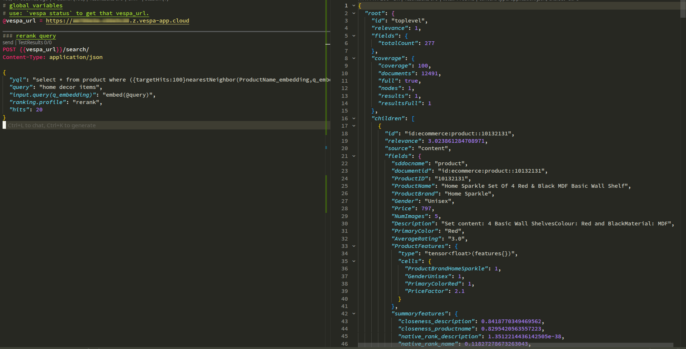

Or using the hybrid query with the `rerank` profile:

```bash
vespa query \
  'yql=select * from product where ({targetHits:100}nearestNeighbor(ProductName_embedding,q_embedding)) OR ({targetHits:100}nearestNeighbor(Description_embedding,q_embedding)) OR userQuery()' \
  'query=comfortable running shoes' \
  'input.query(q_embedding)=embed(@query)' \
  'ranking.profile=rerank' \
  'hits=20'
```
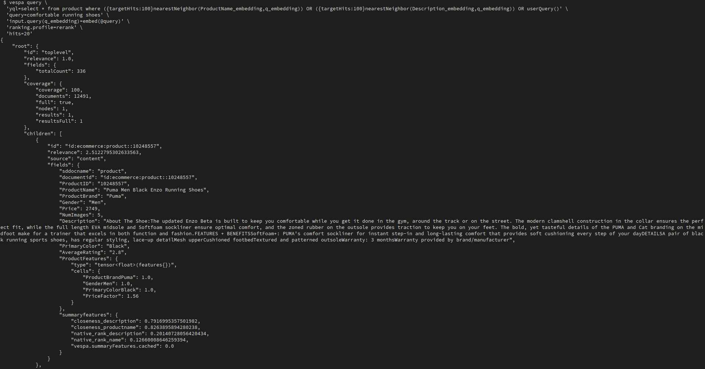


**Compare results:**
- Run same query with `ranking.profile: hybrid` (baseline)
- Run same query with `ranking.profile: rerank` (learned reranking)
- Compare result ordering - reranked results should be more relevant

### Step 6d: Evaluate Model Performance

**File**: `train_reranker/evaluate_model.py`

```bash
cd hybrid_ecommerce_ranking_app/train_reranker

python evaluate_model.py \
--test_csv test_data.csv \
--model ../app/models/lightgbm_model.txt
```
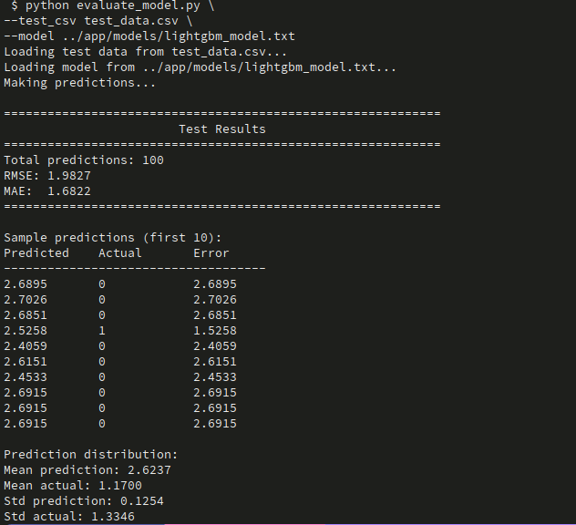

**What it does:**
1. Loads test set data with features and relevance labels
2. Loads the trained LightGBM model
3. Makes predictions on test data
4. Computes regression metrics (RMSE, MAE) to evaluate model accuracy


**Interpreting results:**
- **RMSE (Root Mean Squared Error)**: Lower is better - measures prediction error magnitude
- **MAE (Mean Absolute Error)**: Lower is better - average absolute prediction error
- **Prediction distribution**: Compare mean and std to check if model predictions match actual label distribution

**Typical values:**
- RMSE < 0.5 indicates good model performance for relevance prediction
- Check for overfitting if test RMSE >> training RMSE
- Mean prediction close to mean actual suggests good calibration

---

## Deploying and Testing

### Prerequisites

> **Assumption**: You already configured **target** and **application name**
> (for example `vespa config set target local` or `cloud`, and `vespa config set application <tenant>.<app>[.<instance>]`).

If you **haven't set up Vespa yet**, do that first using `ecommerce_app/README.md` (Prerequisites + Setup).

### Step 1: Deploy the Application

```bash
cd hybrid_ecommerce_ranking_app/app

# Verify configuration
vespa config get target        # Should show: cloud or local
vespa config get application   # Should show: tenant.app.instance
vespa auth show                # Should show: Success

# Deploy
vespa deploy --wait 900

# Check status
vespa status
```

**Note**: First deployment will download the embedder model (~50MB), which may take a few minutes.

### Step 2: Feed Data

```bash
# From app directory
# Use the same products.jsonl from previous chapters
vespa feed --progress 3 ../dataset/products.jsonl
```

**Note**: Embeddings are generated automatically during indexing. This may take longer than lexical-only indexing.

### Step 3: Test Queries

```bash
# Test hybrid search (baseline)
vespa query \
  'yql=select * from product where ({targetHits:100}nearestNeighbor(ProductName_embedding,q_embedding)) OR userQuery()' \
  'query=blue t-shirt' \
  'input.query(q_embedding)=embed(@query)' \
  'ranking.profile=hybrid'

# Test with reranking (after training and deploying model)
vespa query \
  'yql=select * from product where ({targetHits:100}nearestNeighbor(ProductName_embedding,q_embedding)) OR userQuery()' \
  'query=blue t-shirt' \
  'input.query(q_embedding)=embed(@query)' \
  'ranking.profile=rerank'
```


---

## Exercises

Here are additional practice tasks:

### Exercise 1: Compare Search Paradigms

1. Run the same query with three different profiles:
   - `default` (lexical only)
   - `closeness_productname_description` (semantic only)
   - `hybrid` (combined)
2. Compare top 10 results from each
3. Note which approach works best for different query types

### Exercise 2: Tune Hybrid Ranking

1. Modify `hybrid.profile` to weight features differently:
   ```vespa
   first-phase {
       expression: native_rank_name() * 2.0 + closeness_productname() * 1.5 + ...
   }
   ```
2. Deploy and compare results
3. Find the optimal weights for your use case

### Exercise 3: Feature Engineering

1. Add new features to the rank profile:
   - `fieldMatch(ProductName)` for term proximity
   - `bm25(ProductName)` for BM25 scoring
   - Custom functions combining multiple signals
2. Collect new training data with expanded features
3. Retrain model and compare performance

### Exercise 4: Hyperparameter Tuning

1. Experiment with LightGBM hyperparameters:
   - `learning_rate`: Try 0.01, 0.05, 0.1
   - `num_leaves`: Try 16, 31, 64
   - `max_depth`: Try 3, 5, 7
2. Compare cross-validation NDCG
3. Select best hyperparameters for your data

### Exercise 5: Analyze Feature Importance

1. Review feature importance output from training
2. Remove low-importance features
3. Retrain and see if simpler model performs as well
4. This can improve inference speed and reduce overfitting

---

## Destroy The Deployment

**Note:** Destroy the application if needed:
   ```bash
   vespa destroy
   ```

## Troubleshooting

### LightGBM Model Not Found

**Error**: `Could not load LightGBM model: lightgbm_model.json`

**Solution**:
- Ensure model file exists in `app/models/lightgbm_model.json`
- Check file was created by training script
- Redeploy application after adding model: `vespa deploy --wait 900`

### Training Data Collection Fails

**Error**: Connection errors or empty features

**Solution**:
- Verify Vespa endpoint and certificates in environment variables
- Ensure `hybrid` rank profile is deployed and working
- Check that `summary-features` are exposed in rank profile
- Verify queries return results before collecting features

### Poor Model Performance

**Issue**: Model doesn't improve over baseline

**Solution**:
- Check training data quality - need diverse queries and accurate labels
- Ensure sufficient training examples (100+ query-document pairs minimum)
- Review feature importance - are meaningful features being used?
- Check for overfitting - compare train vs. test NDCG
- Try different hyperparameters or more training data

### Rerank Profile Not Working

**Error**: Second-phase ranking not being applied

**Solution**:
- Verify `rerank.profile` inherits from `hybrid` correctly
- Check model file path matches: `lightgbm("lightgbm_model.json")`
- Ensure model is in correct location: `app/models/lightgbm_model.json`
- Redeploy after adding model and profile

### Cross-Validation Errors

**Error**: Stratified split fails or folds have no samples

**Solution**:
- Ensure sufficient data per relevance grade (10+ examples per grade)
- Check for missing or invalid relevance values
- Try fewer folds if dataset is small (e.g., `--folds 3`)
- Review data distribution using `0.visualize_data.ipynb`

---

## What You've Learned

By completing this tutorial, you have:

- ✅ **Understood hybrid search** and why it outperforms single-paradigm approaches
- ✅ **Written hybrid queries** combining lexical and semantic search
- ✅ **Created hybrid rank profiles** that leverage multiple signals
- ✅ **Collected training data** from search results with rank features
- ✅ **Trained LightGBM models** for learned reranking
- ✅ **Deployed ML models** to Vespa for production use
- ✅ **Evaluated reranker performance** using offline metrics

**Key Takeaways:**
- Hybrid search combines strengths of lexical and semantic search
- Learned reranking optimizes ranking using machine learning
- LightGBM can learn complex, non-linear feature combinations
- Two-phase ranking balances performance and quality
- Evaluation is critical to measure and improve search quality

---

## Next Steps

From here, you're ready for:

- **Chapter 4**: Chunked document ranking (RAG scenarios)
- **Chapter 5**: Recommender Systems
- **Advanced topics**:
  - Neural rerankers (BERT, cross-encoders)
  - Multi-stage ranking pipelines
  - Online learning and A/B testing
  - Production monitoring and evaluation

**Related Tutorials:**
- `ecommerce_app` - Basic schema and queries
- `ecommerce_ranking_app` - Lexical ranking (Chapter 1)
- `semantic_ecommerce_ranking_app` - Semantic search (Chapter 2)

---

## Additional Resources

- [Vespa Ranking Documentation](https://docs.vespa.ai/en/ranking.html)
- [LightGBM in Vespa](https://docs.vespa.ai/en/lightgbm.html)
- [Learning to Rank](https://docs.vespa.ai/en/learning-to-rank.html)
- [Hybrid Search Blog Post](https://blog.vespa.ai/improving-zero-shot-ranking-with-vespa/)
- [Evaluation Metrics](https://docs.vespa.ai/en/reference/metric-set.html)

**LightGBM Resources:**
- [LightGBM Documentation](https://lightgbm.readthedocs.io/)
- [LightGBM Parameters](https://lightgbm.readthedocs.io/en/latest/Parameters.html)
- [Learning to Rank with LightGBM](https://lightgbm.readthedocs.io/en/latest/Experiments.html#learning-to-rank)
