# E-commerce Ranking App – Vespa Ranking Chapter 2: Semantic/Vector Search

This project is **Chapter 2** in the Vespa 101 ranking series.  
This chapter introduces **semantic/vector search** with embeddings, focusing on how to set up embedders, create embedding fields, and perform similarity search using vector embeddings.

The goal here is to learn how to:
- Configure **embedder components** in Vespa services
- Create **embedding fields** that automatically generate vectors from text
- Use **nearestNeighbor** queries for approximate nearest neighbor (ANN) search
- Implement **closeness()** ranking for vector similarity
- Build an **evaluation framework** to measure search quality

---

## Learning Objectives

After completing this chapter you should be able to:

- **Understand embeddings** and how they enable semantic search
- **Configure embedder components** (Hugging Face models) in Vespa
- **Create embedding fields** with automatic vector generation
- **Write nearestNeighbor queries** for vector similarity search
- **Use closeness() function** for ranking by vector similarity
- **Set up evaluation frameworks** to measure search quality
- **Compare lexical vs. semantic search** results

**Prerequisites:**
- Basic understanding of Vespa schemas and deployment (from `ecommerce_app`)
- Understanding of rank profiles (from `ecommerce_ranking_app` Chapter 1)
- Familiarity with YQL queries
- Basic understanding of vector embeddings and semantic search

---

## Project Structure

From the `semantic_ecommerce_ranking_app` root:

```text
semantic_ecommerce_ranking_app/
├── app/
│   ├── schemas/
│   │   ├── product.sd                          # Product schema with embedding fields
│   │   └── product/
│   │       ├── default.profile                 # Default lexical ranking (lexical baseline)
│   │       └── closeness_productname_description.profile  # Vector similarity ranking
│   └── services.xml                            # Vespa services config with embedder (Arctic model)
├── dataset/
│   ├── products.jsonl                          # Product data (same base data as Chapter 1)
│   └── enhance_data.py                         # Script to enrich products (if needed)
├── evaluation/
│   ├── queries.csv                             # Test queries for evaluation
│   ├── judgements.csv                          # Relevance judgements (generated by LLM-as-a-judge)
│   ├── create_judgements.py                    # Generate judgements using LLM-as-a-judge
│   ├── evaluate.py                             # Evaluate search quality metrics (NDCG, MRR, Recall)
│   ├── env.example                             # Environment configuration template
│   ├── prepare_env.sh                          # Helper script to set up env variables
│   └── requirements.txt                        # Python dependencies for evaluation tools
├── docs/                                       # Additional documentation
│   ├── RANKING.md                              # Semantic ranking concepts and vector ranking
│   ├── QUERIES.md                              # Vector and hybrid search query patterns + evaluation
│   ├── SCHEMA.md                               # Embedding fields, schema design, embedders
│   ├── EMBEDDINGS.md                           # Embedding models and deployment notes
│   └── LLM_AS_JUDGE.md                         # LLM-as-a-judge evaluation guide
├── solutions/                                  # Reference solutions (config variants)
│   ├── services-original.xml                   # Original services config (before embedder)
│   └── services.xml                            # Example solution services config
├── queries.http                                # Example HTTP queries (lexical + ANN)
└── README.md                                   # This file
```

You will mainly work with:
- `app/schemas/product.sd` (embedding field definitions)
- `app/services.xml` (embedder component configuration)
- `app/schemas/product/closeness_productname_description.profile` (vector ranking)
- `queries.http` (testing queries)
- `evaluation/` (evaluation framework)

---

## Key Concepts

### What is Semantic/Vector Search?

**Semantic search** finds documents based on **meaning** rather than exact keyword matches. It uses **embeddings** (dense vector representations) to capture semantic similarity.

**Example:**
- **Lexical search**: Query "blue jeans" only matches documents containing "blue" AND "jeans"
- **Semantic search**: Query "blue jeans" can match "denim pants in navy color" (no exact keywords, but semantically similar)

### Embeddings

**Embeddings** are dense vector representations of text that capture semantic meaning. Similar texts have similar vectors (close in vector space).

**How it works:**
1. Text → Embedding Model → Vector (e.g., 384 dimensions)
2. Similar texts → Similar vectors → High similarity score
3. Search finds nearest vectors → Most semantically similar documents

**Example:**
```
"blue jeans"     → [0.1, 0.3, 0.7, ...] (384 numbers)
"denim pants"    → [0.12, 0.28, 0.72, ...] (very similar vector)
"red shirt"      → [0.8, 0.2, 0.1, ...] (different vector)
```

### Embedder Components

An **embedder** is a Vespa component that converts text to embeddings. This tutorial uses the **Snowflake Arctic Embed** model via Hugging Face.

**Configuration:**
```xml
<component id="arctic" type="hugging-face-embedder">
    <transformer-model url="https://huggingface.co/Snowflake/snowflake-arctic-embed-xs/..."/>
    <tokenizer-model url="https://huggingface.co/Snowflake/snowflake-arctic-embed-xs/..."/>
    <normalize>true</normalize>
    <pooling-strategy>cls</pooling-strategy>
</component>
```

### Embedding Fields

**Embedding fields** automatically generate vectors from source text fields during indexing.

**Example:**
```vespa
field ProductName_embedding type tensor<float>(x[384]) {
    indexing: input ProductName | embed arctic | attribute | index
    attribute {
        distance-metric: prenormalized-angular
    }
}
```

**How it works:**
- `input ProductName`: Source field
- `embed arctic`: Use the "arctic" embedder component
- `attribute | index`: Store as attribute and index for ANN search
- `distance-metric`: How to measure similarity (prenormalized-angular = cosine similarity)

### nearestNeighbor Queries

**nearestNeighbor** is a YQL operator for approximate nearest neighbor (ANN) search.

**Example:**
```yql
select * from product where 
  {targetHits:100}nearestNeighbor(ProductName_embedding, q_embedding)
```

**How it works:**
1. Query text is embedded: `"blue t-shirt"` → query vector
2. Finds documents with nearest vectors to query vector
3. Returns top N most similar documents

### closeness() Ranking

**closeness()** is a ranking function that computes vector similarity between query and document embeddings.

**Example:**
```vespa
function closeness_productname() {
    expression: closeness(field, ProductName_embedding)
}
```

**Returns:** Similarity score (higher = more similar)


### Evaluation Framework

This tutorial includes an evaluation framework to measure search quality:

- **create_judgements.py**: Generates relevance judgements using LLM-as-a-judge
- **evaluate.py**: Computes metrics (NDCG, MRR, etc.) to compare search strategies


---

## Overview

This section introduces the fundamental concepts of semantic search and vector embeddings in Vespa. If you're new to embeddings and semantic search, we recommend reading the detailed explanations in [Embeddings](https://docs.vespa.ai/en/embedding.html) and [Nearest Neighbor Search](https://docs.vespa.ai/en/nearest-neighbor-search.html) for a deeper understanding.

### What is a Tensor?

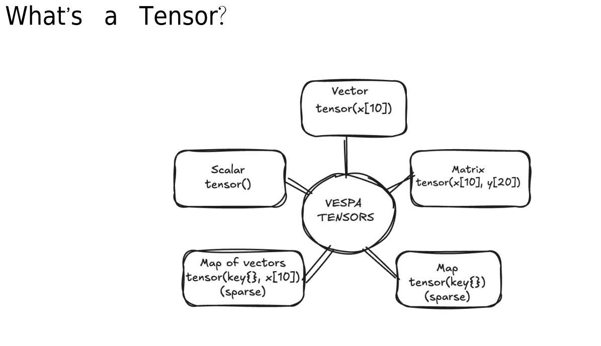

**What you're seeing:** This diagram explains what **tensors** are in Vespa. Tensors are multi-dimensional arrays of numbers used to represent embeddings, features, and other numerical data. Understanding tensors is fundamental to working with semantic search and machine learning features in Vespa.

**Key Concepts:**
- **Tensor**: A multi-dimensional array of numbers (scalars, vectors, matrices, or higher dimensions)
- **Dimensions**: Can be indexed (fixed size, e.g., `x[384]`) or mapped (variable keys, e.g., `{category}`)
- **Embedding Vector**: A 1-dimensional tensor representing text as numbers (e.g., `tensor<float>(x[384])`)
- **Dense Tensor**: All values are stored (typical for embeddings)
- **Sparse Tensor**: Only non-zero values are stored (efficient for features)

**Notes:** Think of tensors like this:
- **Scalar** = Single number (0-dimensional tensor)
- **Vector** = Array of numbers (1-dimensional tensor): `[0.1, 0.3, 0.7, ...]`
- **Matrix** = 2D grid of numbers (2-dimensional tensor)
- **Embedding** = Special vector representing semantic meaning

**Example in Vespa:**
```vespa
field ProductName_embedding type tensor<float>(x[384]) {
    indexing: input ProductName | embed arctic | attribute | index
}
```

**What it means:**
- `tensor<float>`: Tensor with floating-point numbers
- `x[384]`: One indexed dimension named "x" with 384 elements
- Result: A 384-dimensional vector representing ProductName

**Learn More:**
- Official Docs: [Tensor User Guide](https://docs.vespa.ai/en/tensor-user-guide.html)
- Official Docs: [Tensor Reference](https://docs.vespa.ai/en/reference/tensor.html)

### Tensor Semantic Search Overview

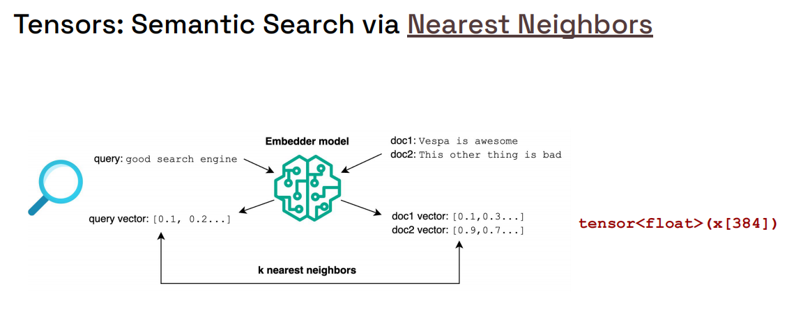

**What you're seeing:** This diagram illustrates how **semantic search** works using tensor embeddings. Unlike traditional keyword search, semantic search understands meaning by comparing vectors in high-dimensional space.

**Key Concepts:**
- **Text to Vector**: Text is converted to a numerical vector using an embedding model
- **Vector Space**: Similar meanings cluster together in vector space
- **Similarity Search**: Finding documents with vectors close to the query vector
- **Distance Metrics**: Measuring how "close" vectors are (cosine similarity, dot product, etc.)

**Notes:** The semantic search process:
1. **Index time**: Product descriptions are converted to embeddings (vectors)
2. **Query time**: User query is converted to an embedding (vector)
3. **Search**: Find product vectors nearest to query vector
4. **Return**: Most semantically similar products

**How it differs from lexical search:**

| Lexical Search | Semantic Search |
|----------------|-----------------|
| Matches exact keywords | Matches semantic meaning |
| "blue jeans" → must contain "blue" AND "jeans" | "blue jeans" → can match "navy denim pants" |
| Fast, simple | Slightly slower, more sophisticated |
| Misses synonyms and paraphrases | Catches synonyms and paraphrases |

**Example:**
```
Query: "comfortable running shoes"

Lexical results:
  ✅ "Running shoes with comfort fit"  (contains all keywords)
  ❌ "Athletic sneakers for jogging"   (synonyms, but no exact keywords)

Semantic results:
  ✅ "Running shoes with comfort fit"  (high similarity)
  ✅ "Athletic sneakers for jogging"   (high similarity - same meaning!)
```

**Learn More:**
- Official Docs: [Embeddings](https://docs.vespa.ai/en/embedding.html)

### Approximate Nearest Neighbors (ANN) Overview

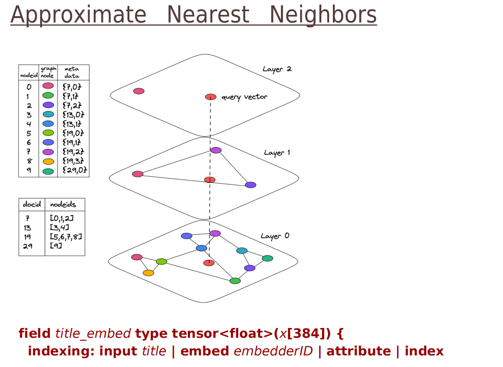

**What you're seeing:** This diagram explains **Approximate Nearest Neighbor (ANN)** search, the technology that makes semantic search fast and scalable. Instead of comparing the query vector to every document vector (slow!), ANN algorithms use clever data structures to find similar vectors quickly.

**Key Concepts:**
- **Exact NN**: Compare query to ALL documents (100% accurate but SLOW for millions of docs)
- **Approximate NN**: Use smart indexing to find "good enough" neighbors FAST
- **HNSW (Hierarchical Navigable Small World)**: The ANN algorithm Vespa uses
- **Trade-off**: Slight accuracy loss for massive speed gain

**Notes:** Why ANN matters:
- **Scalability**: Searching 1 million embeddings takes milliseconds (not hours)
- **Accuracy**: Modern ANN algorithms find >95% of true nearest neighbors
- **Performance**: Enables real-time semantic search at scale

**How HNSW works (simplified):**
1. **Build graph structure** during indexing (documents connected by similarity)
2. **Navigate graph** at query time (jump from node to nearest node)
3. **Find approximate nearest neighbors** quickly (no need to check all documents)

**Vespa's Implementation:**
```vespa
field ProductName_embedding type tensor<float>(x[384]) {
    indexing: input ProductName | embed arctic | attribute | index
    attribute {
        distance-metric: prenormalized-angular
    }
    index {
        hnsw {
            max-links-per-node: 16
            neighbors-to-explore-at-insert: 200
        }
    }
}
```

**Configuration parameters:**
- **max-links-per-node**: Graph connectivity (higher = better accuracy, more memory)
- **neighbors-to-explore-at-insert**: Build-time quality (higher = better graph, slower indexing)

**Query performance:**
```yql
{targetHits:100}nearestNeighbor(ProductName_embedding, q_embedding)
```
- **targetHits**: How many approximate neighbors to find (100 is typical)

**Learn More:**
- Official Docs: [Nearest Neighbor Search](https://docs.vespa.ai/en/nearest-neighbor-search.html)
- Official Docs: [HNSW Index](https://docs.vespa.ai/en/reference/schema-reference.html#index-hnsw)

### Vespa Embedders Overview

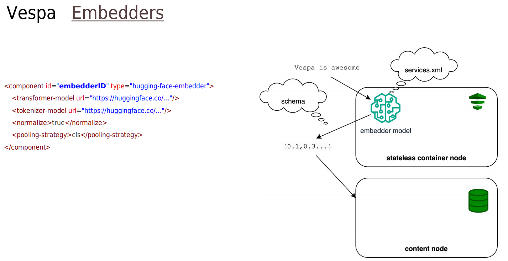

**What you're seeing:** This diagram shows how **embedder components** work in Vespa. Embedders are components that convert text to vectors (embeddings) automatically during indexing and query processing.

**Key Concepts:**
- **Embedder Component**: Configured in `services.xml`, converts text to vectors
- **Automatic Embedding**: Text fields are automatically embedded during indexing
- **Query Embedding**: Query text is automatically embedded during search
- **Model Types**: Hugging Face models, ONNX models, or custom embedders

**Notes:** Embedder workflow:
1. **Configuration** (`services.xml`): Define embedder with model URL
2. **Schema** (`product.sd`): Reference embedder in embedding fields
3. **Indexing**: Text → Embedder → Vector (stored in Vespa)
4. **Querying**: Query text → Embedder → Query vector (used for search)

**Example Configuration:**

```xml
<!-- services.xml -->
<component id="arctic" type="hugging-face-embedder">
    <transformer-model url="https://huggingface.co/Snowflake/snowflake-arctic-embed-xs/resolve/main/onnx/model.onnx"/>
    <tokenizer-model url="https://huggingface.co/Snowflake/snowflake-arctic-embed-xs/raw/main/tokenizer.json"/>
    <normalize>true</normalize>
    <pooling-strategy>cls</pooling-strategy>
</component>
```

```vespa
/* product.sd */
field ProductName_embedding type tensor<float>(x[384]) {
    indexing: input ProductName | embed arctic | attribute | index
}
```

**Configuration options:**
- **transformer-model**: The ONNX model file URL
- **tokenizer-model**: Tokenizer configuration file URL
- **normalize**: Normalize embeddings to unit length (enables cosine similarity)
- **pooling-strategy**: How to pool token embeddings (cls, mean, max)

**Query usage:**
```json
{
  "yql": "select * from product where nearestNeighbor(ProductName_embedding, q_embedding)",
  "input.query(q_embedding)": "embed(arctic, 'blue t-shirt')"
}
```

**Learn More:**
- Official Docs: [Embedding Reference](https://docs.vespa.ai/en/embedding.html#embedding-a-query-text)
- Official Docs: [Hugging Face Embedder](https://docs.vespa.ai/en/embedding.html#huggingface-embedder)

### Choosing Embedding Models Overview

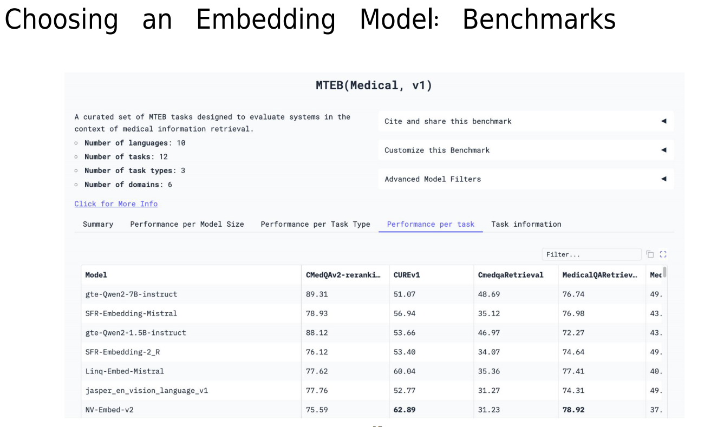

**What you're seeing:** This diagram helps you choose the right **embedding model** for your use case. Different models have different strengths, sizes, and performance characteristics.

**Key Concepts:**
- **Model Size**: Larger models (e.g., 768 dimensions) = better accuracy, more resources
- **Model Quality**: Measured by performance on benchmark datasets (e.g., MTEB)
- **Latency**: Embedding generation time (affects indexing and query speed)
- **Domain Specificity**: Some models trained on specific domains (e.g., code, medical, e-commerce)

**Notes:** Choosing a model:

**Small Models (384 dimensions or less):**
- ✅ Fast embedding generation
- ✅ Lower memory usage
- ✅ Good for real-time applications
- ❌ Slightly lower accuracy
- **Example**: `snowflake-arctic-embed-xs` (384 dims) - Used in this tutorial

**Medium Models (512-768 dimensions):**
- ✅ Balanced accuracy and performance
- ✅ Good general-purpose choice
- ⚠️ Moderate memory and latency
- **Example**: `all-MiniLM-L6-v2` (384 dims), `e5-base-v2` (768 dims)

**Large Models (1024+ dimensions):**
- ✅ Best accuracy
- ❌ High memory usage
- ❌ Slower embedding generation
- ❌ Not recommended for real-time search
- **Example**: `e5-large-v2` (1024 dims)

**Domain-Specific Considerations:**
- **E-commerce**: Models trained on product data perform better
- **Code search**: Use code-specific models (e.g., `CodeBERT`)
- **Multi-lingual**: Use models supporting multiple languages if needed

**Model Selection Checklist:**
1. **Performance Requirements**: How fast must queries be?
2. **Accuracy Requirements**: How critical is search quality?
3. **Resource Constraints**: How much memory/compute available?
4. **Domain**: General-purpose or domain-specific data?
5. **Language**: Single language or multi-lingual?

**This Tutorial:**
- **Model**: Snowflake Arctic Embed XS
- **Dimensions**: 384
- **Why**: Good balance of quality and performance for tutorials

**Learn More:**
- Hugging Face: [MTEB Leaderboard](https://huggingface.co/spaces/mteb/leaderboard) - Compare model quality
- Official Docs: [Embedding Models](https://docs.vespa.ai/en/embedding.html#embedding-models)

### Performance Cost Overview

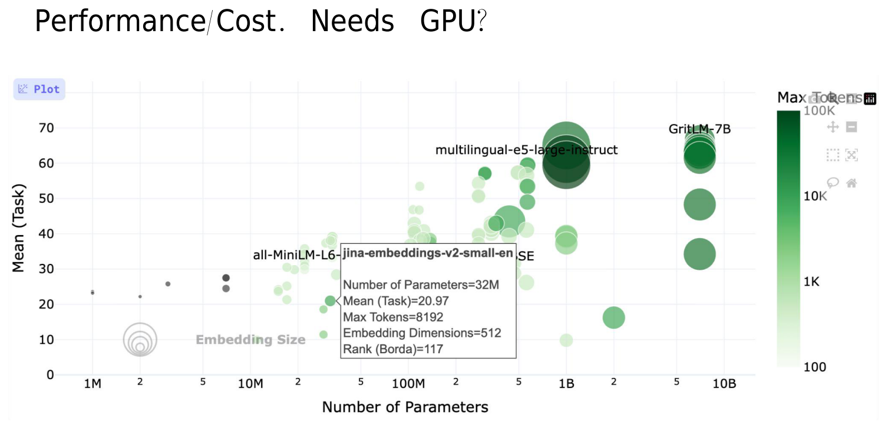

**What you're seeing:** This diagram illustrates the **performance trade-offs** of semantic search compared to lexical search. Understanding these costs helps you design efficient search systems.

**Key Concepts:**
- **Indexing Cost**: Generating embeddings during document ingestion
- **Storage Cost**: Storing embedding vectors (384 floats per field per document)
- **Query Cost**: Embedding query + ANN search
- **Memory Usage**: HNSW graph structure + embedding vectors

**Notes:** Cost breakdown:

**Indexing Time:**
```
Lexical (BM25):
  1000 docs/sec (very fast)

Semantic (Embeddings):
  10-100 docs/sec (depends on model and hardware)

Bottleneck: Embedding generation
Solution: Use GPU for faster embedding (10x+ speedup)
```

**Storage:**
```
Lexical: ~1KB per document (inverted index)
Semantic: ~1.5KB per embedding field (384 floats × 4 bytes)

Example: 1M products with 2 embedding fields
  = 2 × 384 × 4 bytes × 1M
  = ~3GB just for embeddings
```

**Query Latency:**
```
Lexical (BM25):
  5-20ms typical

Semantic (ANN):
  20-50ms typical (includes embedding generation + ANN search)

Breakdown:
  - Query embedding: 10-30ms
  - ANN search: 10-20ms
```

**Memory:**
```
HNSW graph memory:
  ~16 bytes per document per indexed embedding field

Example: 1M products, 2 embedding fields
  = 2 × 16 bytes × 1M
  = ~32MB for HNSW graphs
```

**Optimization Strategies:**

1. **Use GPU for embeddings** (10x faster indexing)
2. **Reduce embedding dimensions** (smaller models)
3. **Index only important fields** (not every text field)
4. **Two-phase ranking** (fast first-phase, semantic second-phase)
5. **Hybrid search** (combine lexical + semantic)

**When semantic search is worth it:**
- ✅ Query understanding is critical
- ✅ Synonyms and paraphrases matter
- ✅ Can handle 20-50ms latency
- ✅ Have GPU resources or can tolerate slower indexing

**When to stick with lexical:**
- ✅ Need <10ms query latency
- ✅ Exact keyword matching is sufficient
- ✅ Very high indexing throughput needed
- ✅ Limited memory/compute resources

**Learn More:**
- Official Docs: [Performance](https://docs.vespa.ai/en/performance/)

### Measuring Results Overview

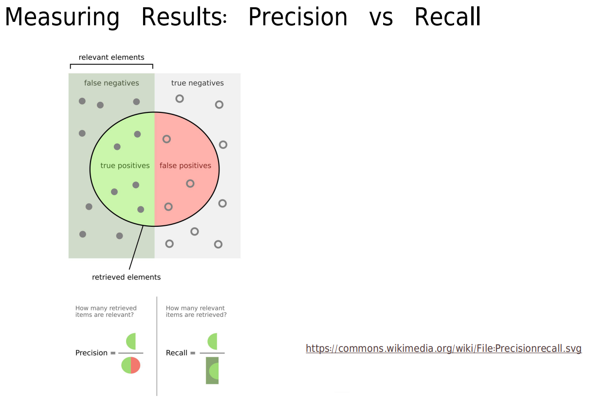

**What you're seeing:** This diagram introduces **search quality metrics** - how to measure if your semantic search is actually working well. You can't improve what you don't measure!

**Key Concepts:**
- **Ground Truth**: Known relevant documents for test queries (relevance judgements)
- **Metrics**: Quantitative measures of search quality (NDCG, MRR, Recall, Precision)
- **Evaluation Set**: Collection of test queries with judgements
- **A/B Testing**: Comparing two search strategies quantitatively

**Notes:** Common metrics:

**1. Precision@K**
- **What**: % of top K results that are relevant
- **Formula**: `Precision@K = (# relevant in top K) / K`
- **Example**:
  ```
  Top 10 results: 7 relevant, 3 not relevant
  Precision@10 = 7/10 = 70%
  ```

**2. Recall@K**
- **What**: % of all relevant documents found in top K
- **Formula**: `Recall@K = (# relevant in top K) / (total # relevant)`
- **Example**:
  ```
  Top 10 results: 7 relevant documents found
  Total relevant in corpus: 20 documents
  Recall@10 = 7/20 = 35%
  ```

**3. Mean Reciprocal Rank (MRR)**
- **What**: Average of reciprocal rank of first relevant result
- **Formula**: `MRR = average(1 / rank_of_first_relevant)`
- **Example**:
  ```
  Query 1: First relevant at position 1 → 1/1 = 1.0
  Query 2: First relevant at position 3 → 1/3 = 0.33
  Query 3: First relevant at position 2 → 1/2 = 0.5

  MRR = (1.0 + 0.33 + 0.5) / 3 = 0.61
  ```

**4. NDCG@K (Normalized Discounted Cumulative Gain)**
- **What**: Measures ranking quality with graded relevance
- **Why**: Considers position and degree of relevance
- **See next section for detailed explanation**

**Evaluation Workflow:**
```
1. Create test queries (queries.csv)
2. Generate relevance judgements (create_judgements.py)
3. Run evaluation (evaluate.py)
4. Compare metrics across ranking strategies
5. Iterate and improve
```

**This Tutorial's Evaluation:**
```bash
cd evaluation
python create_judgements.py  # Generate judgements using LLM
python evaluate.py            # Compute NDCG, MRR, Recall
```

**Learn More:**
- Official Docs: [Evaluation](https://docs.vespa.ai/en/performance/practical-search-performance-guide.html#evaluation)

### Normalized Discounted Cumulative Gain (NDCG) Overview

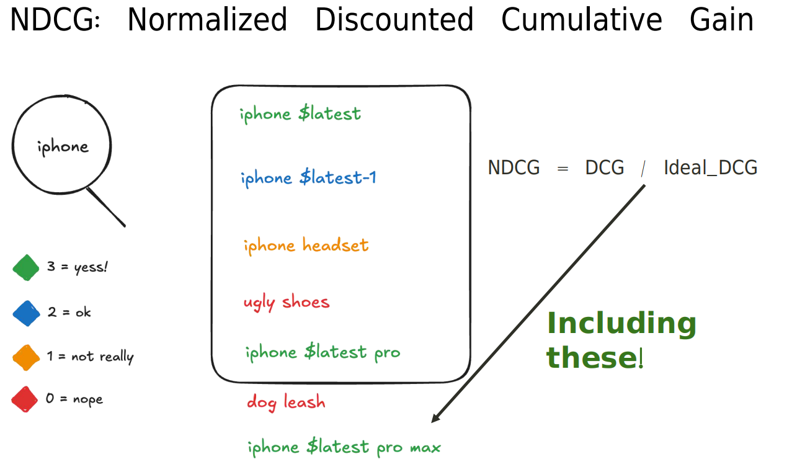

**What you're seeing:** This diagram explains **NDCG (Normalized Discounted Cumulative Gain)**, the gold standard metric for evaluating ranked search results. NDCG is better than simple precision/recall because it considers **both position and degree of relevance**.

**Key Concepts:**
- **Graded Relevance**: Documents can be highly relevant (3), somewhat relevant (2), marginally relevant (1), or not relevant (0)
- **Position Matters**: Relevant documents at top positions are weighted higher
- **Normalization**: Scores are normalized to 0-1 range for easy comparison
- **DCG**: Cumulative Gain with position discount
- **IDCG**: Ideal DCG (best possible ranking)
- **NDCG**: DCG / IDCG (actual performance vs. ideal performance)

**Notes:** NDCG formula breakdown:

**Step 1: Cumulative Gain (CG)**
```
CG = sum of relevance scores

Example top 5 results: [3, 2, 0, 1, 2]
CG = 3 + 2 + 0 + 1 + 2 = 8
```

**Step 2: Discounted Cumulative Gain (DCG)**
```
DCG = sum(relevance_i / log2(position_i + 1))

Example:
Position 1: 3 / log2(2) = 3 / 1.0 = 3.0
Position 2: 2 / log2(3) = 2 / 1.58 = 1.26
Position 3: 0 / log2(4) = 0 / 2.0 = 0
Position 4: 1 / log2(5) = 1 / 2.32 = 0.43
Position 5: 2 / log2(6) = 2 / 2.58 = 0.77

DCG@5 = 3.0 + 1.26 + 0 + 0.43 + 0.77 = 5.46
```

**Step 3: Ideal DCG (IDCG)**
```
IDCG = DCG of perfect ranking (most relevant documents first)

Ideal ranking: [3, 2, 2, 1, 0]
IDCG@5 = 3.0 + 1.26 + 1.29 + 0.43 + 0 = 5.98
```

**Step 4: Normalized DCG (NDCG)**
```
NDCG = DCG / IDCG

NDCG@5 = 5.46 / 5.98 = 0.91 (91%)
```

**Interpretation:**
- **NDCG = 1.0**: Perfect ranking (ideal)
- **NDCG = 0.9**: Excellent ranking (90% of ideal)
- **NDCG = 0.7**: Good ranking (70% of ideal)
- **NDCG = 0.5**: Mediocre ranking (50% of ideal)
- **NDCG = 0.0**: Worst possible ranking

**Why NDCG is better than Precision/Recall:**

| Metric | Position Matters? | Graded Relevance? | Use Case |
|--------|-------------------|-------------------|----------|
| **Precision@K** | ❌ No | ❌ No (binary) | Simple relevance |
| **Recall@K** | ❌ No | ❌ No (binary) | Coverage check |
| **MRR** | ✅ Yes (first result) | ❌ No (binary) | Quick answer finding |
| **NDCG@K** | ✅ Yes (all positions) | ✅ Yes (0-3 scale) | Ranking quality |

**Example comparison:**
```
Ranking A: [3, 2, 1, 0, 0]  NDCG@5 = 0.95
Ranking B: [1, 0, 3, 2, 0]  NDCG@5 = 0.72

Both have same relevant docs, but A ranks them better!
Precision@5 would give same score for both (60%)
NDCG correctly shows A is better
```

**This Tutorial:**
```bash
cd evaluation
python evaluate.py  # Computes NDCG@10 for lexical vs semantic search
```

**Learn More:**
- Wikipedia: [NDCG](https://en.wikipedia.org/wiki/Discounted_cumulative_gain)

### LLM as A Judge Overview

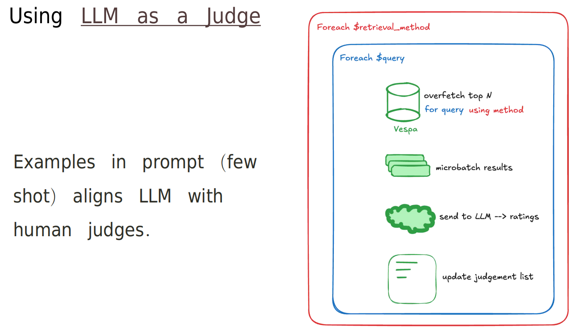

**What you're seeing:** This diagram illustrates **LLM-as-a-Judge**, a modern technique for generating relevance judgements automatically using Large Language Models. Instead of manually labeling query-document pairs (expensive and slow), use an LLM to generate judgements at scale.

**Key Concepts:**
- **Manual Labeling**: Humans judge query-document relevance (expensive, slow, gold standard)
- **LLM-as-a-Judge**: LLM judges query-document relevance (fast, scalable, good enough)
- **Prompt Engineering**: Carefully designed prompts ensure consistent judgements
- **Graded Relevance**: LLM assigns scores (0-3) for fine-grained evaluation
- **Validation**: Compare LLM judgements against human judgements for quality check

**Notes:** The LLM-as-a-Judge process:

**1. Input:**
```
Query: "comfortable running shoes"
Document: "Nike Air Max - Premium running sneakers with cushioned sole"
```

**2. Prompt to LLM:**
```
Rate the relevance of this product to the query on a scale of 0-3:
0 = Not relevant
1 = Marginally relevant
2 = Relevant
3 = Highly relevant

Query: "comfortable running shoes"
Product: "Nike Air Max - Premium running sneakers with cushioned sole"

Think step by step:
1. Does the product match the query intent?
2. Does it satisfy the user's need?
3. Rate: [Your answer: 0, 1, 2, or 3]
```

**3. LLM Output:**
```
Reasoning: The product is running sneakers (matches "running shoes")
and explicitly mentions "cushioned sole" (matches "comfortable").

Rating: 3 (Highly relevant)
```

**Workflow in This Tutorial:**
```bash
cd evaluation

# 1. Prepare test queries (queries.csv)
# 2. Run LLM-as-a-judge to generate judgements
python create_judgements.py  # Uses OpenAI API

# 3. Output: judgements.csv
# query_id,doc_id,relevance
# q1,doc_123,3
# q1,doc_456,1
# q2,doc_789,2
# ...

# 4. Use judgements for evaluation
python evaluate.py  # Computes NDCG, MRR using judgements
```

**Benefits:**
- ✅ **Fast**: Generate 1000s of judgements in minutes
- ✅ **Scalable**: No manual labeling bottleneck
- ✅ **Consistent**: LLM applies same criteria to all judgements
- ✅ **Cost-effective**: ~$0.001-0.01 per judgement vs. $1-5 for human

**Limitations:**
- ⚠️ **Not perfect**: LLM can make mistakes
- ⚠️ **Bias**: LLM inherits biases from training data
- ⚠️ **Domain-specific**: May need domain context in prompt
- ⚠️ **Validation needed**: Compare against human judgements for critical applications

**Best Practices:**
1. **Clear prompts**: Explicit criteria, examples, and format
2. **Few-shot examples**: Include example judgements in prompt
3. **Chain-of-thought**: Ask LLM to explain reasoning
4. **Validation set**: Compare against human judgements on subset
5. **Multiple models**: Use different LLMs and ensemble results

**This Tutorial Configuration:**
```python
# create_judgements.py
model = "gpt-4"  # or "gpt-3.5-turbo" for faster/cheaper
temperature = 0.0  # Deterministic output
```

**When to use LLM-as-a-Judge:**
- ✅ Building evaluation set for search tuning
- ✅ A/B testing different ranking strategies
- ✅ Rapid prototyping and iteration
- ✅ Complementing limited human judgements

**When to use human judgements:**
- ✅ Final production quality validation
- ✅ High-stakes applications (medical, legal)
- ✅ Establishing ground truth for LLM validation
- ✅ Domain requires deep expertise

**Learn More:**
- Blog: [LLM-as-a-Judge Blog Post](https://blog.vespa.ai/improving-retrieval-with-llm-as-a-judge/)
- Paper: [Large Language Models as Evaluators](https://arxiv.org/abs/2306.05685)

## Steps Overview

This tutorial progresses through understanding and implementing semantic search:

### Step 1: Understanding Embeddings
**Goal**: Learn how embeddings enable semantic search

- Understand what embeddings are and how they work
- See how similar texts produce similar vectors
- Learn the difference between lexical and semantic search

**Key Learning**: Embeddings capture semantic meaning, enabling search beyond keywords

### Step 2: Configure Embedder Component
**Goal**: Set up the embedder in services.xml

- Add Hugging Face embedder component
- Configure the Arctic model
- Understand embedder configuration options

**Key Learning**: How to configure embedders in Vespa services

### Step 3: Create Embedding Fields
**Goal**: Define embedding fields in the schema

- Create `ProductName_embedding` field
- Create `Description_embedding` field
- Understand distance metrics and indexing options

**Key Learning**: How embedding fields automatically generate vectors

### Step 4: Vector Ranking with closeness()
**Goal**: Rank results by vector similarity

- Use `closeness()` function in rank profiles
- Combine similarity scores from multiple fields
- Understand distance metrics and similarity scores

**Key Learning**: How to rank by vector similarity

### Step 5: Vector Search Queries
**Goal**: Write nearestNeighbor queries

- Use `nearestNeighbor` operator in YQL
- Embed query text using `embed()` function
- Combine multiple embedding fields in queries

**Key Learning**: How to perform vector similarity search

### Step 6: Evaluation Framework
**Goal**: Measure and compare search quality

- Generate relevance judgements
- Evaluate search metrics
- Compare lexical vs. semantic search

**Key Learning**: How to measure search quality objectively

---

## Step 1 – Understanding Embeddings

### What are Embeddings?

**Embeddings** are numerical representations of text that capture semantic meaning. They're dense vectors (arrays of numbers) where similar texts have similar vectors.

**Key Properties:**
- **Semantic similarity**: Similar meanings → Similar vectors
- **Dense representation**: Every dimension carries information
- **Fixed size**: All embeddings have the same dimensions (e.g., 384)

**Example:**
```
Query: "comfortable running shoes"
Document 1: "athletic footwear for jogging" → High similarity (semantically similar)
Document 2: "blue jeans" → Low similarity (different topic)
```

### Why Use Embeddings?

**Lexical search limitations:**
- Requires exact keyword matches
- Misses synonyms ("shoes" vs "footwear")
- Can't handle semantic relationships ("running" vs "jogging")

**Semantic search benefits:**
- Finds documents by meaning, not keywords
- Handles synonyms and related terms
- Better for natural language queries

### How Embeddings Work

1. **Training**: Model learns from large text corpora
2. **Encoding**: Text → Vector (e.g., 384 numbers)
3. **Similarity**: Compare vectors using distance metrics (cosine, dot product)
4. **Search**: Find nearest vectors = most similar documents


---

## Step 2 – Configure Embedder Component

**File**: `app/services.xml`

### Task

Add the embedder component to your services configuration:

```xml
<component id="arctic" type="hugging-face-embedder">
    <transformer-model url="https://huggingface.co/Snowflake/snowflake-arctic-embed-xs/resolve/main/onnx/model.onnx"/>
    <tokenizer-model url="https://huggingface.co/Snowflake/snowflake-arctic-embed-xs/raw/main/tokenizer.json"/>
    <normalize>true</normalize>
    <pooling-strategy>cls</pooling-strategy>
</component>
```

**What to do:**
1. Add the `<component>` section inside `<container>`
2. Ensure the component ID is `arctic` (matches schema reference)
3. Deploy the app: `vespa deploy --wait 900`

**Configuration Details:**
- **`id="arctic"`**: Component identifier (referenced in schema)
- **`type="hugging-face-embedder"`**: Uses Hugging Face models
- **`transformer-model`**: ONNX model for embeddings
- **`tokenizer-model`**: Tokenizer for text preprocessing
- **`<normalize>true</normalize>`**: Normalize embeddings (enables cosine similarity)
- **`<pooling-strategy>cls</pooling-strategy>`**: Use CLS token pooling

**Notes:**
- The model will be downloaded on first use
- Model size: ~50MB (Arctic Embed XS)
- Embedding dimension: 384

**For detailed embedder documentation**, the model card on Hugging Face: [Snowflake/snowflake-arctic-embed-xs](https://huggingface.co/Snowflake/snowflake-arctic-embed-xs)

---

## Step 3 – Create Embedding Fields

**File**: `app/schemas/product.sd`

### Task

Add embedding fields to your schema:

```vespa
field ProductName_embedding type tensor<float>(x[384]) {
    indexing: input ProductName | embed arctic | attribute | index
    attribute {
        distance-metric: prenormalized-angular
    }
}

field Description_embedding type tensor<float>(x[384]) {
    indexing: input Description | embed arctic | attribute | index
    attribute {
        distance-metric: prenormalized-angular
    }
}
```

**What to do:**
1. Add both embedding fields to the schema
2. Ensure `embed arctic` references the component ID from services.xml
3. Deploy the app: `vespa deploy --wait 900`

**Field Structure:**
- **`type tensor<float>(x[384])`**: 384-dimensional float vector
- **`input ProductName`**: Source field for embedding
- **`embed arctic`**: Use "arctic" embedder component
- **`attribute | index`**: Store as attribute and index for ANN search
- **`distance-metric: prenormalized-angular`**: Cosine similarity (for normalized embeddings)

**How it works:**
1. When a document is indexed, `ProductName` text is sent to embedder
2. Embedder generates 384-dimensional vector
3. Vector is stored in `ProductName_embedding` field
4. Field is indexed for fast ANN search

---

## Step 4 – Vector Ranking with closeness()

**File**: `app/schemas/product/closeness_productname_description.profile`

### Task

Create a rank profile that uses `closeness()` for vector similarity:

```vespa
rank-profile closeness_productname_description {
    inputs {
        query(q_embedding) tensor<float>(x[384])
    }

    function closeness_productname() {
        expression: closeness(field, ProductName_embedding)
    }
    
    function closeness_description() {
        expression: closeness(field, Description_embedding)
    }

    first-phase {
        expression: closeness_productname() + closeness_description()
    }

    summary-features: closeness_productname closeness_description
}
```

**What to do:**
1. Define query input `q_embedding` (matches query parameter)
2. Create functions for each embedding field
3. Combine similarity scores in first-phase
4. Add to `summary-features` for debugging
5. Deploy the app: `vespa deploy --wait 900`

**Notes:**
- For detailed deployment instructions and setup, see the [Deploying and Testing](#deploying-and-testing) section below
- If you're new to Vespa deployment, refer to [`simple_ecommerce_app/README.md`](https://github.com/vespauniversity/vespaworkshop101/blob/main/simple_ecommerce_app/README.md#lab-prerequisites-add-basic-query) for prerequisites and initial setup
- You can test queries using the HTTP REST client (VS Code REST Client extension) with `queries.http` - see [`ecommerce_app/README.md`](https://github.com/vespauniversity/vespaworkshop101/blob/main/ecommerce_app/README.md#53-using-the-http-rest-api-examplehttp-or-python-java-client) section "5.3 Using the HTTP REST API" for setup instructions


**Rank Profile Components:**
- **`inputs`**: Define query tensor input
- **`closeness(field, ProductName_embedding)`**: Compute similarity between query and document embeddings
- **`closeness_productname() + closeness_description()`**: Combine similarities from both fields
- **`summary-features`**: Expose individual scores for debugging

**How it works:**
1. Query vector `q_embedding` is compared to `ProductName_embedding`
2. `closeness()` returns similarity score (higher = more similar)
3. Same for `Description_embedding`
4. Scores are summed for final ranking

---

## Step 5 – Vector Search Queries

**File**: `queries.http`

### Task

Use the query from REST client `queries.http` using `nearestNeighbor` operator:

```http
### ANN - Approximate Nearest Neighbor search
POST https://<mTLS_ENDPOINT_DNS_GOES_HERE>/search/
Content-Type: application/json

{
    "yql": "select * from product where ({targetHits:100}nearestNeighbor(ProductName_embedding,q_embedding)) OR ({targetHits:100}nearestNeighbor(Description_embedding,q_embedding))",
    "ranking.profile": "closeness_productname_description",
    "approximate_query_string": "blue t-shirt",
    "input.query(q_embedding)": "embed(@approximate_query_string)"
}
```
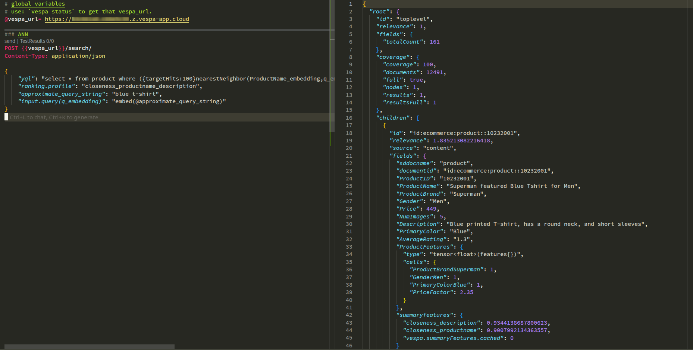

Use the query from Vespa cli using `nearestNeighbor` operator:

```bash
vespa query \
  'yql=select * from product where ({targetHits:100}nearestNeighbor(ProductName_embedding,q_embedding)) OR ({targetHits:100}nearestNeighbor(Description_embedding,q_embedding))' \
  'approximate_query_string=blue t-shirt' \
  'input.query(q_embedding)=embed(@approximate_query_string)' \
  'ranking.profile=closeness_productname_description'
```

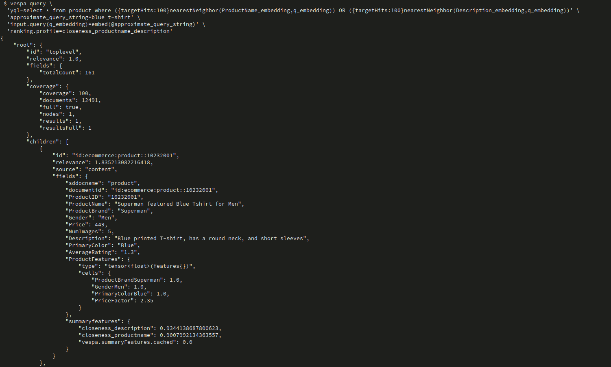

**What to do:**
1. Use `nearestNeighbor` operator in YQL
2. Embed query text using `embed(@approximate_query_string)`
3. Set `targetHits` higher than desired results (for accuracy)
4. Test with different queries

**Query Components:**
- **`nearestNeighbor(ProductName_embedding, q_embedding)`**: ANN search on ProductName embeddings
- **`targetHits:100`**: Retrieve 100 candidates (more than final results)
- **`approximate_query_string`**: Query text to embed
- **`input.query(q_embedding)`**: `embed(@approximate_query_string)` - Embed query text
- **`ranking.profile`**: Use vector similarity ranking

**How it works:**
1. Query text "blue t-shirt" is embedded → query vector
2. `nearestNeighbor` finds documents with nearest vectors
3. Results are ranked by `closeness()` function
4. Top N results returned

---

## Step 6 – Evaluation Framework

**Directory**: `evaluation/`

### Overview

The evaluation framework helps you measure and compare search quality objectively.

**Components:**
- **`queries.csv`**: Test queries
- **`create_judgements.py`**: Generate relevance judgements using LLM-as-a-judge
- **`evaluate.py`**: Compute metrics (NDCG, MRR, etc.)
- **`judgements.csv`**: Generated relevance judgements

### Step 6a: Generate Judgements

**File**: `evaluation/create_judgements.py`

**Goal**: Create relevance judgements for your queries.

**What to do:**
1. Set up environment variables (see `env.example`):
   ```bash
   export VESPA_ENDPOINT=https://your-endpoint.vespa-app.cloud
   export VESPA_CERT_PATH=/path/to/cert.pem
   export VESPA_KEY_PATH=/path/to/key.pem
   export OPENAI_API_KEY=your-key
   ```
2. Install dependencies:
   ```bash
   cd semantic_ecommerce_ranking_app/evaluation

   python3 -m venv judgements_venv
   source judgements_venv/bin/activate

   pip install -r requirements.txt
   ```
3. Run the script:
   ```bash
   python create_judgements.py
   ```

**How it works:**
1. Executes queries against Vespa (vector + lexical search)
2. Gets top results for each query
3. Uses OpenAI to judge relevance (0-3 scale)
4. Saves judgements to `judgements.csv`


### Step 6b: Evaluate Search Quality

**File**: `evaluation/evaluate.py`

**Goal**: Compute metrics to compare search strategies.

**What to do:**
1. Configure query function in `evaluate.py`:
   ```python
   QUERY_FUNCTION = vector_search  # or lexical_search, hybrid_search
   ```
2. Run evaluation:
   ```bash
   python evaluate.py
   ```

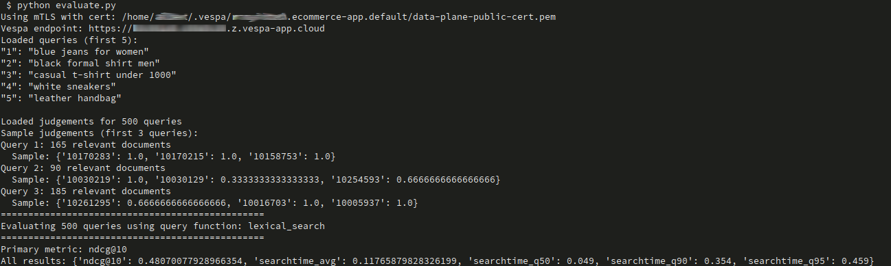

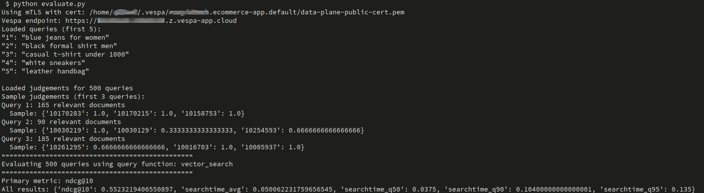


**Metrics computed:**
- **NDCG@10**: Normalized Discounted Cumulative Gain (primary metric)
- **MRR**: Mean Reciprocal Rank
- **Recall@10**: Recall at 10 results

**Understanding the Metrics:**

**NDCG@10 (Normalized Discounted Cumulative Gain):**
- **What it measures**: Ranking quality by rewarding relevant results near the top of results
- **How it works**: 
  - Uses graded relevance (0-3 scale from judgements)
  - Applies logarithmic discounting (results at position 1 get full weight, position 10 gets less)
  - Normalized against ideal ranking (perfect ordering = 1.0)
- **Range**: 0.0 to 1.0 (higher is better)
- **Example**: If highly relevant products (rating 3) appear at positions 1, 2, 3, NDCG@10 will be high. If they appear at positions 8, 9, 10, NDCG@10 will be lower.
- **Why it's important**: Captures both relevance and ranking position - placing good results first matters more than finding them at all
- **Official References**: 
  - [Wikipedia: Discounted Cumulative Gain](https://en.wikipedia.org/wiki/Discounted_cumulative_gain)
  - [Information Retrieval Evaluation](https://en.wikipedia.org/wiki/Evaluation_measures_(information_retrieval))

**MRR (Mean Reciprocal Rank):**
- **What it measures**: How early the first relevant result appears in the ranking
- **How it works**:
  - For each query, finds position of first relevant document (rating > 0)
  - Calculates reciprocal: 1/position (e.g., position 1 → 1.0, position 3 → 0.33)
  - Averages across all queries
- **Range**: 0.0 to 1.0 (higher is better)
- **Example**: 
  - Query 1: First relevant at position 1 → reciprocal = 1.0
  - Query 2: First relevant at position 3 → reciprocal = 0.33
  - Query 3: First relevant at position 2 → reciprocal = 0.5
  - MRR = (1.0 + 0.33 + 0.5) / 3 = 0.61
- **Why it's important**: Focuses on user experience - users often click the first relevant result they see
- **Official References**:
  - [TensorFlow Ranking Metrics](https://www.tensorflow.org/ranking/api_docs/python/tfr/keras/metrics/RankingMetricKey)
  - [Information Retrieval Evaluation](https://en.wikipedia.org/wiki/Evaluation_measures_(information_retrieval))

**Recall@10:**
- **What it measures**: Fraction of all relevant documents found in top 10 results
- **How it works**: (Number of relevant docs in top 10) / (Total relevant docs)
- **Range**: 0.0 to 1.0 (higher is better)
- **Example**: If there are 50 relevant documents total, and 30 appear in top 10, Recall@10 = 0.6
- **Why it's important**: Measures coverage - how many relevant results are retrieved

**Compare strategies:**
- Run with `vector_search` → Semantic search metrics
- Run with `lexical_search` → Lexical search metrics
- Compare to see which performs better

**For more on evaluation metrics**, see: [Vespa Evaluation Framework](https://vespa-engine.github.io/pyvespa/api/vespa/evaluation.html) and [Information Retrieval Evaluation](https://en.wikipedia.org/wiki/Evaluation_measures_(information_retrieval))

---

## Deploying and Testing

### Prerequisites

> **Assumption**: You already configured **target** and **application name**  
> (for example `vespa config set target local` or `cloud`, and `vespa config set application <tenant>.<app>[.<instance>]`).

If you **haven't set up Vespa yet**, do that first using `ecommerce_app/README.md` (Prerequisites + Setup).

### Step 1: Deploy the Application

```bash
cd semantic_ecommerce_ranking_app/app

# Verify configuration
vespa config get target        # Should show: cloud or local
vespa config get application   # Should show: tenant.app.instance
vespa auth show                # Should show: Success

# Deploy
vespa deploy --wait 900

# Check status
vespa status
```

**Note**: First deployment will download the embedder model (~50MB), which may take a few minutes.

### Step 2: Feed Data

```bash
# From app directory
# Use the same products.jsonl from ecommerce_ranking_app
vespa feed --progress 3 ../dataset/products.jsonl
```

**Note**: Embeddings are generated automatically during indexing. This may take longer than lexical indexing.

### Step 3: Test Queries

Use `queries.http` or the Vespa CLI:

```bash
# Vector search
vespa query \
  'yql=select * from product where ({targetHits:100}nearestNeighbor(ProductName_embedding,q_embedding))' \
  'approximate_query_string=blue t-shirt' \
  'input.query(q_embedding)=embed(@approximate_query_string)' \
  'ranking.profile=closeness_productname_description'

# Lexical search (for comparison)
vespa query \
  'yql=select * from product where userQuery()' \
  'query=blue t-shirt' \
  'ranking.profile=default'
```

---

## Exercises

Here are additional practice tasks:

### Exercise 1: Compare Lexical vs. Semantic Search

1. Run the same query with lexical search (`userQuery()`) and vector search (`nearestNeighbor`)
2. Compare the top 10 results from each
3. Note which approach finds more relevant results for natural language queries

### Exercise 2: Tune targetHits

1. Try different `targetHits` values (10, 50, 100, 200)
2. Compare result quality and query performance
3. Find the optimal balance between accuracy and speed

### Exercise 3: Weight Embedding Fields

1. Modify `closeness_productname_description.profile` to weight fields differently:
   ```vespa
   first-phase {
       expression: closeness_productname() * 2.0 + closeness_description()
   }
   ```
2. Compare results with equal weights vs. weighted
3. See how field importance affects ranking

### Exercise 4: Combine Multiple Embedding Fields

1. If you have more text fields, create embeddings for them
2. Add them to the rank profile
3. Experiment with different combinations

### Exercise 5: Evaluation Metrics

1. Generate judgements for your queries
2. Evaluate both lexical and semantic search
3. Compare metrics to see which performs better
4. Analyze which query types benefit from semantic search

---

## Destroy The Deployment

**Note:** Destroy the application if needed:
   ```bash
   vespa destroy
   ```

## Troubleshooting

### Embedder Not Found

**Error**: `Unknown embedder: arctic`

**Solution**:
- Ensure embedder component is defined in `services.xml`
- Check component ID matches schema reference (`embed arctic`)
- Redeploy: `vespa deploy --wait 900`

### Embedding Field Not Generated

**Issue**: Embedding fields are empty or null

**Solution**:
- Verify `embed arctic` references correct component ID
- Check embedder component is deployed correctly
- Ensure source field (e.g., `ProductName`) has data
- Re-feed documents after fixing schema

### nearestNeighbor Query Fails

**Error**: `nearestNeighbor` operator not recognized

**Solution**:
- Ensure embedding field has `index` mode: `indexing: ... | index`
- Check field type is `tensor<float>(x[384])` (or appropriate dimensions)
- Verify `distance-metric` is set in attribute configuration

### Low Similarity Scores

**Issue**: All `closeness()` scores are very low

**Solution**:
- Check embeddings are normalized (if using cosine similarity)
- Verify `distance-metric` matches embedder normalization
- Ensure query embedding is generated correctly
- Check that document embeddings were generated during indexing

### Evaluation Script Errors

**Error**: OpenAI API errors or connection issues

**Solution**:
- Verify `OPENAI_API_KEY` is set correctly
- Check Vespa endpoint and certificates are configured
- Ensure `queries.csv` and `judgements.csv` exist
- Check Python dependencies are installed: `pip install -r requirements.txt`

---

## What You've Learned

By completing this tutorial, you have:

- ✅ **Understood embeddings** and how they enable semantic search
- ✅ **Configured embedder components** in Vespa services
- ✅ **Created embedding fields** with automatic vector generation
- ✅ **Written nearestNeighbor queries** for vector similarity search
- ✅ **Implemented closeness() ranking** for vector similarity
- ✅ **Set up evaluation frameworks** to measure search quality

**Key Takeaways:**
- Embeddings capture semantic meaning, enabling search beyond keywords
- Embedders automatically generate vectors during indexing
- `nearestNeighbor` enables fast approximate nearest neighbor search
- `closeness()` ranks results by vector similarity
- Evaluation frameworks help measure and improve search quality

---

## Next Steps

From here, you're ready for:

- **Chapter 3**: Hybrid search (lexical + semantic) + learned reranking
- **Chapter 4**: Chunked document ranking (RAG scenarios)
- **Chapter 5**: Recommender Systems

**Related Tutorials:**
- `ecommerce_app` - Basic schema and queries
- `ecommerce_ranking_app` - Lexical ranking (Chapter 1)
- `hybrid_ecommerce_app` - Combining lexical and semantic search

---

## Additional Resources

- [Vespa Embedding Documentation](https://docs.vespa.ai/en/embedding.html)
- [nearestNeighbor Reference](https://docs.vespa.ai/en/reference/querying/yql.html#nearestneighbor)
- [closeness() Reference](https://docs.vespa.ai/en/reference/ranking/rank-features.html#closeness(dimension,name))
- [Hugging Face Embedder](https://docs.vespa.ai/en/rag/embedding.html#huggingface-embedder)
- [Distance Metrics](https://docs.vespa.ai/en/content/attributes.html#distance-metric)

**Evaluation Resources:**
- [LLM-as-a-Judge Blog Post](https://blog.vespa.ai/improving-retrieval-with-llm-as-a-judge/)
- [Vespa Evaluation Framework](https://vespa-engine.github.io/pyvespa/evaluating-vespa-application-cloud.html)
