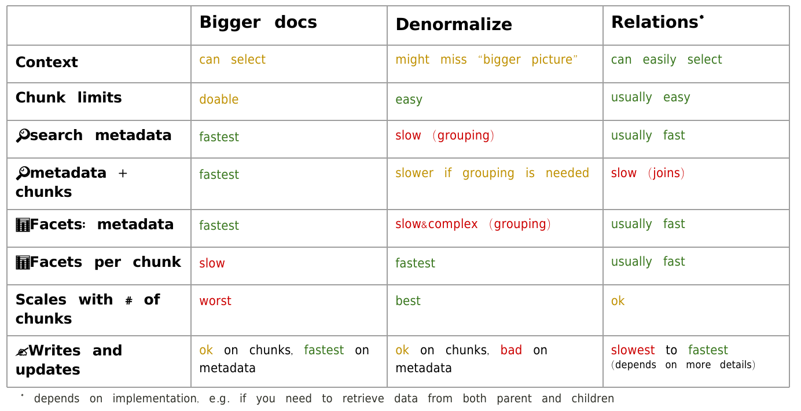
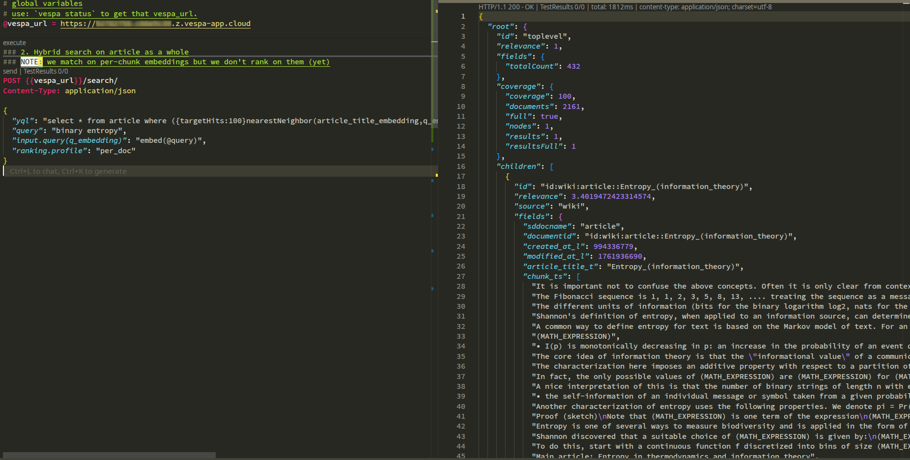
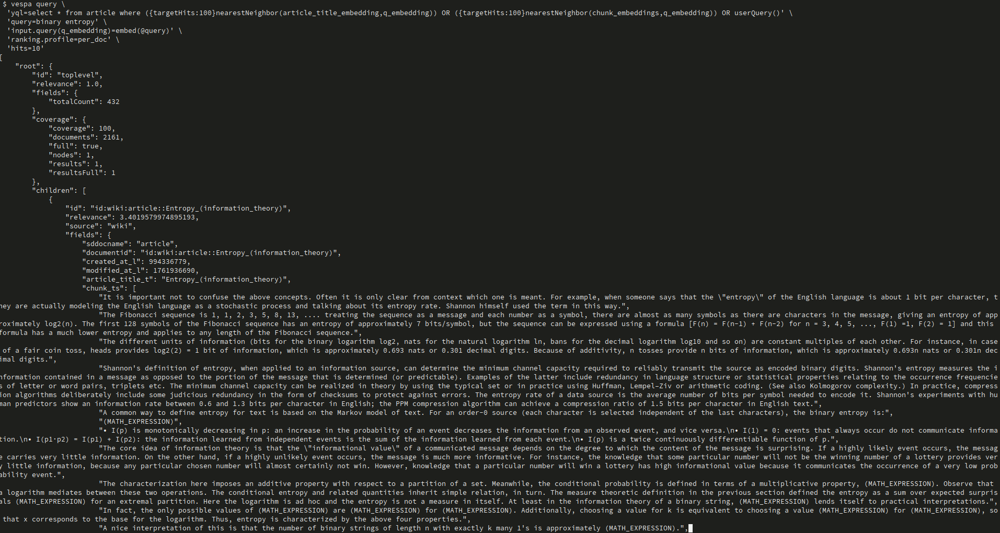
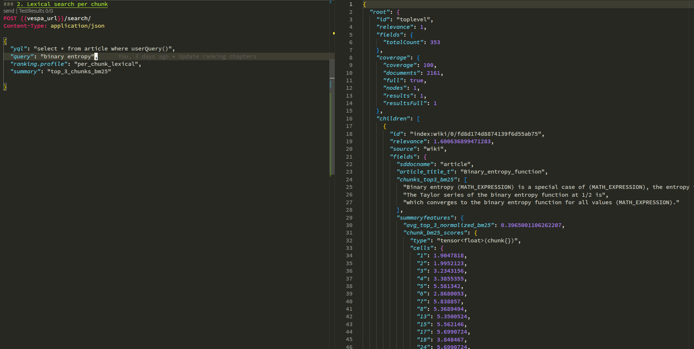
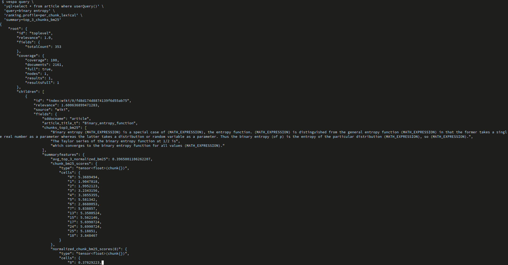
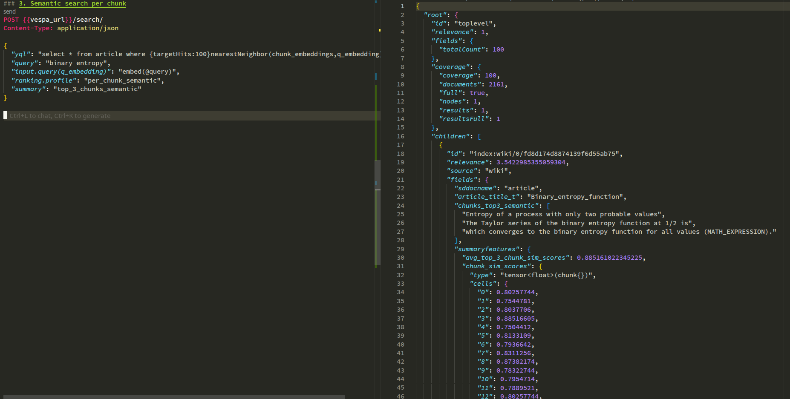
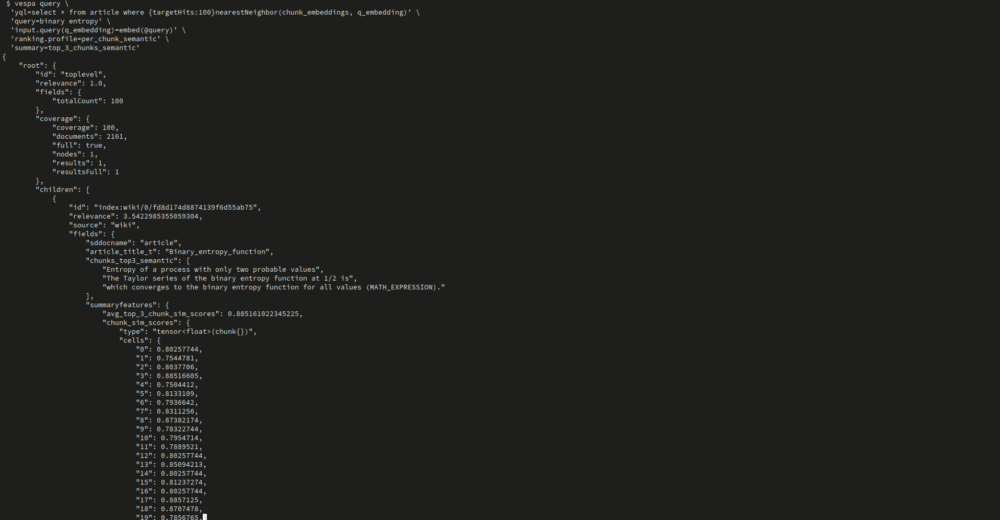
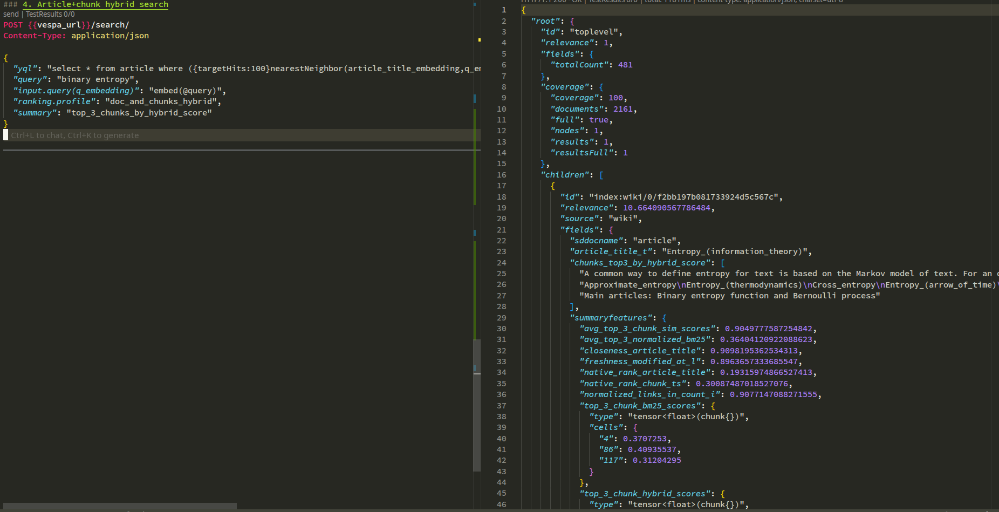
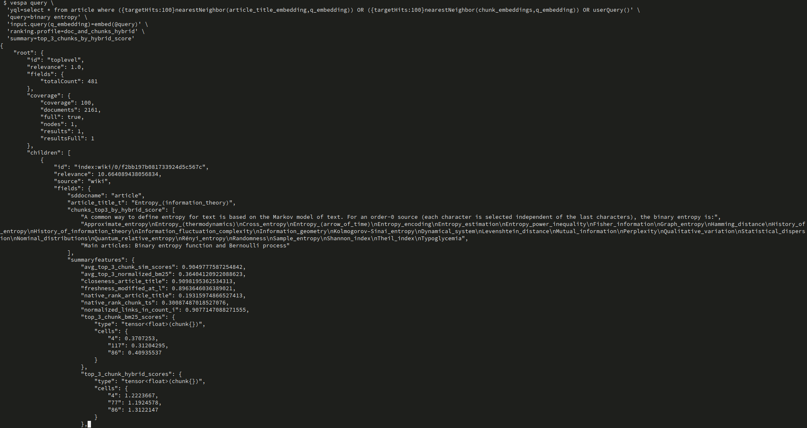
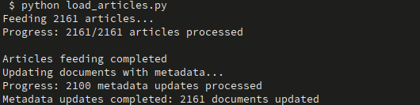

# Wiki Ranking App – Vespa Ranking Chapter 4: Chunked Document Ranking for RAG

This project is **Chapter 4** in the Vespa 101 ranking series.
This chapter introduces **chunked document ranking** for Retrieval Augmented Generation (RAG) scenarios, focusing on how to work with documents split into chunks, rank at both document and chunk levels, and combine signals from multiple granularities.

The goal here is to learn how to:
- Work with **array fields** for storing document chunks
- Create **chunk embeddings** using mapped tensors
- Implement **per-document ranking** (treating all chunks as one text)
- Implement **per-chunk lexical ranking** with BM25 on individual chunks
- Implement **per-chunk semantic ranking** with embeddings on individual chunks
- Build **hybrid ranking** that combines document-level and chunk-level signals
- Use **Wikipedia metadata** (links, freshness, revisions) for ranking

---

## Learning Objectives

After completing this chapter you should be able to:

- **Understand chunked documents** and why they're essential for RAG
- **Work with array fields** for storing variable-length chunks
- **Create chunk embeddings** using mapped tensors `tensor<float>(chunk{}, x[384])`
- **Implement per-document ranking** that treats all chunks as a single text
- **Implement per-chunk lexical ranking** using BM25 on individual chunks
- **Implement per-chunk semantic ranking** using embeddings on individual chunks
- **Combine document and chunk signals** in hybrid ranking profiles
- **Use tensor operations** for aggregating chunk scores (max, avg, top-k)
- **Leverage metadata signals** (links, freshness) for ranking

**Prerequisites:**
- Understanding of lexical ranking from Chapter 1 (`ecommerce_ranking_app`)
- Understanding of semantic/vector search from Chapter 2 (`semantic_ecommerce_ranking_app`)
- Understanding of hybrid search from Chapter 3 (`hybrid_ecommerce_ranking_app`)
- Familiarity with rank profiles, YQL queries, embeddings, and tensor operations

---

## Project Structure

From the `wiki_ranking_app` root:

```text
wiki_ranking_app/
├── wiki_app/
│   ├── schemas/
│   │   ├── article.sd                                   # Article schema with chunks and metadata
│   │   └── article/
│   │       └── bm25chunk.profile                        # Example baseline profile
│   └── services.xml                                     # Vespa services config with Arctic embedder
├── assignments/                                         # Your implementation tasks (with TODOs)
│   ├── per_doc.profile                                  # Assignment 1: Document-level ranking
│   ├── per_chunk_lexical.profile                        # Assignment 2: Per-chunk BM25 ranking
│   ├── per_chunk_semantic.profile                       # Assignment 3: Per-chunk semantic ranking
│   └── doc_and_chunks_hybrid.profile                    # Assignment 4: Hybrid doc+chunk ranking
├── solutions/                                           # Solution files (reference only)
│   ├── per_doc.profile                                  # Solution for Assignment 1
│   ├── per_chunk_lexical.profile                        # Solution for Assignment 2
│   ├── per_chunk_semantic.profile                       # Solution for Assignment 3
│   └── doc_and_chunks_hybrid.profile                    # Solution for Assignment 4
├── dataset/
│   ├── articles.json                                    # Wikipedia articles dataset (~29MB)
│   ├── metadata.ndjson                                  # Wikipedia metadata (links, watchers, etc.)
│   ├── load_articles.py                                 # Script to feed articles to Vespa
│   ├── add_metadata.ipynb                               # Notebook to enrich articles with metadata
│   ├── env.example                                      # Environment configuration template
│   ├── prepare_env.sh                                   # Helper script to set up env variables
│   └── requirements.txt                                 # Python dependencies
├── queries.http                                         # Example HTTP queries for all assignments
└── README.md                                            # This file
```

You will mainly work with:
- `assignments/*.profile` files (your implementations with TODOs)
- `wiki_app/schemas/article.sd` (understanding the schema)
- `queries.http` (testing your implementations)
- `solutions/*.profile` (reference solutions when stuck)

---

## Key Concepts

### What is Chunked Document Ranking?

**Chunked document ranking** is essential for Retrieval Augmented Generation (RAG) because:

- **Long documents** (Wikipedia articles, research papers, documentation) don't fit in LLM context windows
- **Relevant information** may be buried in a small section of a large document
- **Chunk-level ranking** finds the most relevant passages within documents
- **Document-level ranking** considers the document as a whole

**Example:**
```
Query: "How does binary entropy work?"

Document: Wikipedia article on "Binary entropy function" (10,000 words split into 20 chunks)

Challenge:
- Document-level ranking: Is the whole article relevant?
- Chunk-level ranking: Which specific chunks answer the query?
- Hybrid ranking: Combine both signals for best results
```

### Array Fields for Chunks

**Array fields** store variable-length sequences of values (e.g., text chunks):

```vespa
field chunk_ts type array<string> {
    indexing: summary | index
    index: enable-bm25
}
```

**How it works:**
- Each document contains multiple chunks (e.g., 5-20 chunks per article)
- Chunks are stored as an array of strings
- Vespa can search and rank on individual array elements
- `enable-bm25` allows BM25 scoring on each chunk

### Mapped Tensors for Chunk Embeddings

**Mapped tensors** store embeddings for each chunk using chunk IDs as keys:

```vespa
field chunk_embeddings type tensor<float>(chunk{}, x[384]) {
    indexing: input chunk_ts | embed arctic | attribute | index
    attribute {
        distance-metric: prenormalized-angular
    }
}
```

**Tensor structure:**
```json
{
    "type": "tensor<float>(chunk{}, x[384])",
    "cells": {
        "0": [0.1, 0.3, 0.7, ...],  // 384-dim embedding for chunk 0
        "1": [0.2, 0.4, 0.6, ...],  // 384-dim embedding for chunk 1
        "2": [0.15, 0.35, 0.65, ...] // 384-dim embedding for chunk 2
    }
}
```

**Key benefits:**
- Automatically embeds each chunk during indexing
- Supports `nearestNeighbor` search on chunk embeddings
- Enables per-chunk semantic ranking

### Per-Document vs. Per-Chunk Ranking

**Per-Document Ranking:**
- Treats all chunks as a single text
- Scores the document as a whole
- Good for document retrieval (which article is relevant?)
- Example: `nativeRank(chunk_ts)` treats all chunks as one field

**Per-Chunk Ranking:**
- Scores each chunk individually
- Aggregates chunk scores (max, avg, top-k)
- Good for passage retrieval (which part of the article is relevant?)
- Example: `max(elementwise(bm25(chunk_ts), chunk, float))` finds best chunk

**Hybrid Ranking:**
- Combines document-level and chunk-level signals
- Best of both worlds: finds relevant documents AND relevant passages
- Example: `doc_score + chunk_score`

### Tensor Operations for Chunk Aggregation

**Common operations** for aggregating chunk scores:

1. **elementwise()**: Apply function to each array element
   ```vespa
   elementwise(bm25(chunk_ts), chunk, float)
   # Returns tensor<float>(chunk{}) with BM25 score for each chunk
   ```

2. **reduce()**: Aggregate tensor values
   ```vespa
   reduce(chunk_sim_scores, max)  # Maximum similarity across all chunks
   reduce(chunk_sim_scores, avg)  # Average similarity across all chunks
   ```

3. **top-k selection**: Get top-k chunks by score
   ```vespa
   reduce(chunk_sim_scores, max, 3)  # Top 3 chunks by similarity
   ```

4. **merge()**: Combine tensors (for hybrid scoring)
   ```vespa
   merge(tensor1, tensor2, f(x,y)(x+y))  # Element-wise addition
   ```

### Wikipedia Metadata Signals

This tutorial uses **Wikipedia metadata** for ranking:

- **links_in_count_i**: Number of incoming links (popularity signal)
- **watchers_i**: Number of users watching the article (engagement signal)
- **revisions_i**: Number of edits (activity signal)
- **modified_at_l**: Last modification timestamp (freshness signal)
- **characters_i, words_i**: Article length (completeness signal)

**Example usage:**
```vespa
function normalized_links_in_count_i() {
    expression: log10(1 + attribute(links_in_count_i)) / log10(1 + 100)
}

function freshness_modified_at_l() {
    expression: freshness(modified_at_l).logscale
}
```

---

## Overview

This section introduces the fundamental concepts of chunked document ranking for Retrieval Augmented Generation (RAG). If you're new to chunking and RAG, we recommend reading the detailed explanations in [Working with chunking](https://docs.vespa.ai/en/rag/working-with-chunks.html) and [Chunking reference](https://docs.vespa.ai/en/reference/rag/chunking.html) for a deeper understanding.

### Chunking for RAG Overview



**What you're seeing:** This diagram illustrates **document chunking** - the process of splitting long documents into smaller, manageable pieces (chunks) for Retrieval Augmented Generation (RAG) systems. Chunking is essential because LLMs have limited context windows and users need precise answers from specific parts of documents.

**Key Concepts:**
- **Chunking**: Splitting documents into smaller segments (typically 512-1024 tokens each)
- **Chunk Granularity**: Size of each chunk (fixed-length, sentence-based, paragraph-based)
- **Chunk Overlap**: Shared text between consecutive chunks (prevents information loss at boundaries)
- **Array Fields**: Vespa stores chunks as array of strings
- **Chunk Embeddings**: Each chunk gets its own vector representation
- **Per-Chunk Ranking**: Score and rank individual chunks, not just whole documents

**Notes:** Why chunking matters for RAG:

**The RAG Problem:**
```
Scenario: 100-page Wikipedia article on "Binary Entropy Function"

User Question: "What is the formula for binary entropy?"

Problem without chunking:
  ❌ Article is too long for LLM context (100 pages > 4K tokens)
  ❌ Sending entire article is expensive ($$$)
  ❌ Irrelevant sections dilute the answer
  ❌ LLM struggles to find the needle in haystack

Solution with chunking:
  ✅ Split article into 50 chunks (~500 words each)
  ✅ Rank chunks by relevance to question
  ✅ Send only top 3 most relevant chunks to LLM
  ✅ LLM gets precise context (2000 tokens vs 50K tokens)
  ✅ Better answer, lower cost, faster response
```

**Chunking Strategies:**

### **1. Fixed-Length Chunking**
**Approach:** Split text every N characters/tokens
```
Document: "The binary entropy function is defined as..."

Chunk 1 (1024 chars): "The binary entropy function is..."
Chunk 2 (1024 chars): "...properties include convexity..."
Chunk 3 (1024 chars): "...applications in information theory..."
```

**Pros:**
- ✅ Simple to implement
- ✅ Predictable chunk sizes
- ✅ Works for any document

**Cons:**
- ❌ May split mid-sentence or mid-thought
- ❌ No semantic boundaries

**Vespa Implementation:**
```vespa
field chunk_ts type array<string> {
    indexing: summary | index
    index: enable-bm25
}
```

### **2. Sentence-Based Chunking**
**Approach:** Split at sentence boundaries, accumulate until size limit
```
Document: "Binary entropy has many uses. It is convex. Applications include..."

Chunk 1: "Binary entropy has many uses. It is convex."
Chunk 2: "Applications include compression. Another use is..."
```

**Pros:**
- ✅ Preserves sentence integrity
- ✅ More semantic coherence

**Cons:**
- ❌ Variable chunk sizes
- ❌ Requires sentence detection

### **3. Paragraph-Based Chunking**
**Approach:** Split at paragraph boundaries
```
Chunk 1: [Paragraph 1: Definition]
Chunk 2: [Paragraph 2: Properties]
Chunk 3: [Paragraph 3: Applications]
```

**Pros:**
- ✅ Natural semantic units
- ✅ Good for well-structured documents

**Cons:**
- ❌ Paragraphs can be too long or too short
- ❌ Depends on document structure

### **4. Hierarchical Chunking**
**Approach:** Multiple chunk sizes (e.g., sentences + paragraphs + sections)
```
Document Level: "Binary Entropy Article"
  Section Level: "Definition", "Properties", "Applications"
    Paragraph Level: Individual paragraphs
      Sentence Level: Individual sentences
```

**Pros:**
- ✅ Multi-granularity retrieval
- ✅ Context preservation

**Cons:**
- ❌ Complex implementation
- ❌ Higher storage cost

**This Tutorial Uses:**
- **Strategy**: Fixed-length chunks (1024 characters)
- **Implementation**: Vespa's `chunk fixed-length 1024` directive
- **Storage**: `array<string>` field in schema
- **Why**: Simple, predictable, works for Wikipedia articles

**Chunk Overlap:**
```
Without overlap:
  Chunk 1: "The binary entropy..."
  Chunk 2: "...function is defined..."
  Problem: Information at boundary is split!

With overlap (20% = 200 chars):
  Chunk 1: "The binary entropy function..."
  Chunk 2: "...entropy function is defined..."
  Benefit: Context preserved at boundaries
```

**Vespa's Chunking:**
```vespa
schema article {
    document article {
        # Original text stored in array
        field chunk_ts type array<string> {
            indexing: summary | index
            index: enable-bm25
        }
    }

    # Each chunk automatically gets an embedding
    field chunk_embeddings type tensor<float>(chunk{}, x[384]) {
        indexing: input chunk_ts | embed arctic | attribute | index
        attribute {
            distance-metric: prenormalized-angular
        }
    }
}
```

**How Vespa Handles Chunks:**

**1. Indexing Time:**
```
Input: Wikipedia article
  ↓
Split into chunks: ["chunk 1", "chunk 2", "chunk 3", ...]
  ↓
Store in array field: chunk_ts
  ↓
Generate embeddings: chunk_embeddings[0], chunk_embeddings[1], ...
  ↓
Build indices: BM25 index + HNSW index for vectors
```

**2. Query Time:**
```
Query: "binary entropy formula"
  ↓
Match Phase:
  - Lexical: Find documents with matching chunks (BM25)
  - Semantic: Find documents with similar chunk embeddings (ANN)
  ↓
Ranking Phase:
  - Per-Document: Score document as whole (all chunks together)
  - Per-Chunk: Score each chunk individually, aggregate
  - Hybrid: Combine document-level + chunk-level signals
  ↓
Return: Top documents with top chunks highlighted
```

**Per-Document vs Per-Chunk Ranking:**

### **Per-Document Ranking:**
```vespa
rank-profile per_doc {
    # Treat all chunks as single text
    rank chunk_ts {
        element-gap: 0  # No gap between chunks
    }

    first-phase {
        expression: nativeRank(chunk_ts) + closeness(field, article_title_embedding)
    }
}
```

**What it does:**
- Scores document holistically
- Question: "Is this article relevant?"
- Use case: Document retrieval

### **Per-Chunk Ranking:**
```vespa
rank-profile per_chunk_lexical {
    # Score each chunk individually
    function chunk_bm25_scores() {
        expression: elementwise(bm25(chunk_ts), chunk, float)
    }

    # Aggregate: max + average of top 3
    first-phase {
        expression: max(chunk_bm25_scores()) + avg_top_3(chunk_bm25_scores())
    }
}
```

**What it does:**
- Scores each chunk separately
- Question: "Which part of the article answers the query?"
- Use case: Passage retrieval for RAG

**Comparison:**

| Aspect | Per-Document | Per-Chunk |
|--------|--------------|-----------|
| **Granularity** | Whole article | Individual passages |
| **Question** | "Is article relevant?" | "Which passage answers query?" |
| **Scoring** | Single score per doc | Score per chunk, then aggregate |
| **Use Case** | Document discovery | RAG context retrieval |
| **Example** | Find articles about "entropy" | Find passage with entropy formula |

**RAG Pipeline with Chunking:**

```
1. User Query:
   "What is the binary entropy formula?"

2. Retrieval (Vespa):
   a. Find relevant documents (per-document ranking)
   b. Find relevant chunks within docs (per-chunk ranking)
   c. Return: Top 3 chunks from top 5 documents

3. Context Construction:
   Chunk 1: "The binary entropy function H(p) = -p*log(p)..."
   Chunk 2: "For binary variables, the formula simplifies..."
   Chunk 3: "Applications include information theory..."

4. LLM Generation:
   Input: User query + Retrieved chunks
   Output: "The binary entropy formula is H(p) = -p*log(p) - (1-p)*log(1-p)..."
```

**Benefits of Chunking in RAG:**

1. **Precision**: Find exact passages that answer the question
2. **Cost**: Send only relevant chunks to LLM (not entire documents)
3. **Context Window**: Fit within LLM limits (4K, 8K, 32K tokens)
4. **Quality**: Better answers from focused context
5. **Attribution**: Return source chunks for verification

**Challenges of Chunking:**

1. **Chunk Size**: Too small = loss of context, Too large = noise
2. **Boundaries**: Splitting mid-sentence can break meaning
3. **Overlap**: Needs tuning (too little = info loss, too much = redundancy)
4. **Ranking**: Must aggregate chunk scores appropriately
5. **Context**: Chunks lose surrounding context

**This Tutorial Addresses:**
- ✅ Chunk storage (array fields)
- ✅ Chunk embeddings (mapped tensors)
- ✅ Per-chunk ranking (elementwise operations)
- ✅ Aggregation strategies (max, avg, top-k)
- ✅ Hybrid document+chunk ranking

**Real-World Applications:**

- **Customer Support**: Find relevant KB article passages
- **Legal Search**: Locate specific clauses in contracts
- **Medical Research**: Extract relevant findings from papers
- **Code Search**: Find relevant code snippets in repositories
- **Question Answering**: Retrieve precise answers from documentation

**Learn More:**
- Official Docs: [Working with chunking](https://docs.vespa.ai/en/rag/working-with-chunks.html) 
- Official Reference: [Chunking reference](https://docs.vespa.ai/en/reference/rag/chunking.html)

---

## Steps Overview

This tutorial progresses through 4 assignments, each building on previous concepts:

### Assignment 1: Per-Document Ranking
**Goal**: Rank documents as a whole (all chunks treated as one text)

**File**: `assignments/per_doc.profile`

**What you'll implement:**
- Document-level lexical ranking: `nativeRank(chunk_ts)`, `nativeRank(article_title_t)`
- Semantic ranking on title: `closeness(field, article_title_embedding)`
- Metadata signals: `freshness(modified_at_l)`, `normalized_links_in_count_i()`
- Combined ranking: lexical + semantic + metadata

**Key Learning**: How to rank documents holistically using multiple signals

### Assignment 2: Per-Chunk Lexical Ranking
**Goal**: Rank individual chunks using BM25, aggregate chunk scores

**File**: `assignments/per_chunk_lexical.profile`

**What you'll implement:**
- Per-chunk BM25 scores: `elementwise(bm25(chunk_ts), chunk, float)`
- Normalize chunk scores: sigmoid normalization
- Top-k chunk selection: `reduce(..., max, 3)` for top 3 chunks
- Aggregation: `avg_top_3_normalized_bm25()`, `max_normalized_bm25()`

**Key Learning**: How to score and aggregate individual chunk scores

### Assignment 3: Per-Chunk Semantic Ranking
**Goal**: Rank individual chunks using embeddings, aggregate similarity scores

**File**: `assignments/per_chunk_semantic.profile`

**What you'll implement:**
- Per-chunk similarity scores: dot product of query embedding with chunk embeddings
- Top-k chunk selection: top 3 chunks by similarity
- Aggregation: `avg_top_3_chunk_sim_scores()`, `max_chunk_sim_score()`

**Key Learning**: How to work with chunk embeddings and semantic similarity

### Assignment 4: Hybrid Document+Chunk Ranking
**Goal**: Combine document-level and chunk-level signals for optimal ranking

**File**: `assignments/doc_and_chunks_hybrid.profile`

**What you'll implement:**
- Inherit from all previous profiles: `inherits per_doc, per_chunk_lexical, per_chunk_semantic`
- Merge chunk lexical and semantic scores: `merge()` operation
- Top-k hybrid chunks: best chunks by combined score
- Final ranking: document signals + chunk signals

**Key Learning**: How to build sophisticated hybrid ranking combining multiple granularities

---

## Assignment 1 – Per-Document Ranking

**File**: `assignments/per_doc.profile`

### Task Overview

Implement a rank profile that treats the entire document (all chunks) as a single text and combines:
- Lexical signals (nativeRank on chunks and title)
- Semantic signals (closeness on title embedding)
- Metadata signals (freshness, incoming links)

### TODOs to Complete

**TODO 1: Normalize incoming links**

```vespa
function normalized_links_in_count_i() {
    expression {
        # TODO expression that normalizes links_in_count_i
    }
}
```

**Hint**: Use logarithmic normalization: `log10(1 + attribute(links_in_count_i)) / log10(1 + max_expected_links)`

**Example solution approach:**
```vespa
expression: log10(1 + attribute(links_in_count_i)) / log10(1 + 100)
# Normalizes to 0-1 range, where 100 incoming links = 1.0
```

### Understanding the Profile

**Lexical features:**
- `nativeRank(chunk_ts)`: Scores all chunks as a single text (element-gap: 0 enables cross-chunk phrases)
- `nativeRank(article_title_t)`: Scores the article title

**Semantic features:**
- `closeness(field, article_title_embedding)`: Similarity between query and title embedding

**Metadata features:**
- `freshness(modified_at_l).logscale`: Logarithmic decay based on article age
- `normalized_links_in_count_i()`: Normalized popularity signal

**First-phase ranking:**
```vespa
first-phase {
    expression {
        native_rank_chunk_ts() +
        2*native_rank_article_title() +
        freshness_modified_at_l() +
        normalized_links_in_count_i() +
        closeness_article_title()
    }
}
```

**What to do:**
1. Review the profile structure
2. Deploy the app: `vespa deploy --wait 900`

**Notes:**
- For detailed deployment instructions and setup, see the [Deploying and Testing](#deploying-and-testing) section below
- If you're new to Vespa deployment, refer to [`simple_ecommerce_app/README.md`](https://github.com/vespauniversity/vespaworkshop101/blob/main/simple_ecommerce_app/README.md#lab-prerequisites-add-basic-query) for prerequisites and initial setup
- You can test queries using the HTTP REST client (VS Code REST Client extension) with `queries.http` - see [`ecommerce_app/README.md`](https://github.com/vespauniversity/vespaworkshop101/blob/main/ecommerce_app/README.md#53-using-the-http-rest-api-examplehttp-or-python-java-client) section "5.3 Using the HTTP REST API" for setup instructions


### Testing

Use the query from `queries.http`:

```http
### 1. Hybrid search on article as a whole
POST https://<mTLS_ENDPOINT_DNS_GOES_HERE>/search/
Content-Type: application/json

{
  "yql": "select * from article where ({targetHits:100}nearestNeighbor(article_title_embedding,q_embedding)) OR ({targetHits:100}nearestNeighbor(chunk_embeddings,q_embedding)) OR userQuery()",
  "query": "binary entropy",
  "input.query(q_embedding)": "embed(@query)",
  "ranking.profile": "per_doc",
  "hits": 10
}
```


```bash
# Assignment 1: Per-document ranking
vespa query \
  'yql=select * from article where ({targetHits:100}nearestNeighbor(article_title_embedding,q_embedding)) OR ({targetHits:100}nearestNeighbor(chunk_embeddings,q_embedding)) OR userQuery()' \
  'query=binary entropy' \
  'input.query(q_embedding)=embed(@query)' \
  'ranking.profile=per_doc' \
  'hits=10'
```


**Expected Result:**
- Documents ranked by combined document-level signals
- Popular articles (high incoming links) rank higher
- Fresh articles (recently modified) rank higher
- Articles with relevant titles rank higher

### What You're Learning

- How to rank documents holistically (all chunks as one)
- How to combine lexical, semantic, and metadata signals
- How to normalize metadata features for ranking
- How to use `freshness()` function for time-based ranking

---

## Assignment 2 – Per-Chunk Lexical Ranking

**File**: `assignments/per_chunk_lexical.profile`

### Task Overview

Implement per-chunk BM25 ranking that:
1. Scores each chunk individually using BM25
2. Normalizes chunk scores to 0-1 range
3. Selects top-k chunks
4. Aggregates chunk scores (max, average of top-3)

### TODOs to Complete

**TODO 1: Normalize chunk BM25 scores**

```vespa
function normalized_chunk_bm25_scores(bm25_scale) {
    expression {
        # TODO expression that normalizes the chunk BM25 scores
    }
}
```

**Hint**: Use sigmoid normalization: `1 / (1 + exp(-(chunk_bm25_scores - bm25_scale) / spread))`

**Example solution approach:**
```vespa
expression: map(chunk_bm25_scores(), f(score)(1 / (1 + exp(-(score - bm25_scale) / 2))))
# Sigmoid normalization: scores around bm25_scale → 0.5, higher → 1, lower → 0
```

**TODO 2: Get top 3 chunks by BM25 score**

```vespa
function top_3_chunk_bm25_scores() {
    expression: # TODO
}
```

**Hint**: Use `reduce()` with max and count: `reduce(normalized_chunk_bm25_scores(8), max, 3)`

**TODO 3: Average of top 3 normalized BM25 scores**

```vespa
function avg_top_3_normalized_bm25() {
    expression: # TODO
}
```

**Hint**: Reduce top-3 tensor with `avg`: `reduce(top_3_chunk_bm25_scores(), avg)`

**TODO 4: Maximum normalized BM25 score**

```vespa
function max_normalized_bm25() {
    expression: # TODO
}
```

**Hint**: Reduce all scores with `max`: `reduce(normalized_chunk_bm25_scores(8), max)`

### Understanding Chunk BM25 Scores

**chunk_bm25_scores()** returns a mapped tensor:
```json
{
    "type": "tensor(chunk{})",
    "cells": {
        "0": 1.5,   // BM25 score for chunk 0
        "1": 3.8,   // BM25 score for chunk 1
        "2": 0.5    // BM25 score for chunk 2
    }
}
```

**normalized_chunk_bm25_scores(8)** applies sigmoid normalization:
- `bm25_scale = 8` is the midpoint (score of 8 → 0.5 after normalization)
- Scores are mapped to 0-1 range
- Prevents very high BM25 scores from dominating

**top_3_chunk_bm25_scores()** selects top 3:
```json
{
    "chunk": {
        "1": 0.95,  // Highest BM25 chunk
        "0": 0.62,  // Second highest
        "2": 0.31   // Third highest
    }
}
```

**What to do:**
1. Review the profile structure
2. Deploy the app: `vespa deploy --wait 900`

### Testing

Use the query from `queries.http`:

```http
### 2. Lexical search per chunk
POST https://<mTLS_ENDPOINT_DNS_GOES_HERE>/search/
Content-Type: application/json

{
  "yql": "select * from article where userQuery()",
  "query": "binary entropy",
  "ranking.profile": "per_chunk_lexical",
  "summary": "top_3_chunks_bm25"
}
```


```bash
# Assignment 2: Per-chunk lexical ranking
vespa query \
  'yql=select * from article where userQuery()' \
  'query=binary entropy' \
  'ranking.profile=per_chunk_lexical' \
  'summary=top_3_chunks_bm25'
```


**Expected Result:**
- Documents ranked by per-chunk BM25 scores
- `summary-features` shows individual chunk scores
- Documents with highly relevant chunks rank higher
- Optional: `summary: top_3_chunks_bm25` returns top 3 chunks (if enabled)

### What You're Learning

- How to score individual chunks with BM25
- How to normalize scores using sigmoid function
- How to select top-k elements from tensors
- How to aggregate chunk scores (max, avg)
- Trade-offs between max (best chunk) vs. avg (overall quality)

---

## Assignment 3 – Per-Chunk Semantic Ranking

**File**: `assignments/per_chunk_semantic.profile`

### Task Overview

Implement per-chunk semantic ranking that:
1. Computes similarity between query embedding and each chunk embedding
2. Selects top-k chunks by similarity
3. Aggregates chunk similarities (max, average of top-3)

### TODOs to Complete

**TODO 1: Compute chunk similarity scores**

```vespa
function chunk_sim_scores() {
    expression: # TODO expression that computes the cosine similarity between the query embedding and the chunk embeddings
}
```

**Hint**: Dot product of query embedding with chunk embeddings: `sum(query(q_embedding) * attribute(chunk_embeddings), x)`

**Example solution approach:**
```vespa
expression: sum(query(q_embedding) * attribute(chunk_embeddings), x)
# Since embeddings are normalized (services.xml), dot product = cosine similarity
# Returns tensor<float>(chunk{}) with similarity score for each chunk
```

**TODO 2: Get top 3 chunks by similarity**

```vespa
function top_3_chunk_sim_scores() {
    expression: # TODO
}
```

**Hint**: Use `reduce()` with max and count: `reduce(chunk_sim_scores(), max, 3)`

**TODO 3: Average of top 3 chunk similarities**

```vespa
function avg_top_3_chunk_sim_scores() {
    expression: # TODO
}
```

**Hint**: Reduce top-3 tensor with `avg`: `reduce(top_3_chunk_sim_scores(), avg)`

**TODO 4: Maximum chunk similarity**

```vespa
function max_chunk_sim_score() {
    expression: # TODO
}
```

**Hint**: Reduce all similarities with `max`: `reduce(chunk_sim_scores(), max)`

### Understanding Chunk Similarity Scores

**chunk_sim_scores()** returns a mapped tensor:
```json
{
    "type": "tensor(chunk{})",
    "cells": {
        "0": 0.75,   // Similarity between query and chunk 0
        "1": 0.92,   // Similarity between query and chunk 1
        "2": 0.43    // Similarity between query and chunk 2
    }
}
```

**top_3_chunk_sim_scores()** selects top 3:
```json
{
    "chunk": {
        "1": 0.92,  // Highest similarity chunk
        "0": 0.75,  // Second highest
        "2": 0.43   // Third highest
    }
}
```

**Aggregation strategies:**
- **max_chunk_sim_score()**: Best single chunk (good for finding specific answers)
- **avg_top_3_chunk_sim_scores()**: Average of top 3 (balances precision and coverage)

**What to do:**
1. Review the profile structure
2. Deploy the app: `vespa deploy --wait 900`

### Testing

Use the query from `queries.http`:

```http
### 3. Semantic search per chunk
POST https://<mTLS_ENDPOINT_DNS_GOES_HERE>/search/
Content-Type: application/json

{
  "yql": "select * from article where {targetHits:100}nearestNeighbor(chunk_embeddings,q_embedding)",
  "query": "binary entropy",
  "input.query(q_embedding)": "embed(@query)",
  "ranking.profile": "per_chunk_semantic",
  "summary": "top_3_chunks_semantic"
}
```


```bash
# Assignment 3: Per-chunk semantic ranking
vespa query \
  'yql=select * from article where {targetHits:100}nearestNeighbor(chunk_embeddings, q_embedding)' \
  'query=binary entropy' \
  'input.query(q_embedding)=embed(@query)' \
  'ranking.profile=per_chunk_semantic' \
  'summary=top_3_chunks_semantic'
```


**Expected Result:**
- Documents ranked by per-chunk semantic similarity
- `summary-features` shows individual chunk similarities
- Documents with semantically similar chunks rank higher
- Optional: `summary: top_3_chunks_semantic` returns top 3 chunks (if enabled)

### What You're Learning

- How to compute similarity between query and chunk embeddings
- How to work with mapped tensors for chunk embeddings
- How to select top-k chunks by similarity
- How to aggregate semantic signals from multiple chunks
- Dot product on normalized embeddings = cosine similarity

---

## Assignment 4 – Hybrid Document+Chunk Ranking

**File**: `assignments/doc_and_chunks_hybrid.profile`

### Task Overview

Implement the most sophisticated ranking profile that combines:
- Document-level signals (from Assignment 1)
- Per-chunk lexical signals (from Assignment 2)
- Per-chunk semantic signals (from Assignment 3)

This profile **inherits** from all three previous profiles and adds hybrid chunk scoring.

### TODOs to Complete

**TODO 1: Merge lexical and semantic chunk scores**

```vespa
function chunk_hybrid_scores() {
    expression {
        # TODO expression that adds up lexical and semantic scores for each chunk
        # making sure to consider chunks without a text score as having a score of 0.
    }
}
```

**Hint**: Use `merge()` to combine tensors with different sparsity patterns:
```vespa
expression: merge(
    normalized_chunk_bm25_scores(8),
    chunk_sim_scores(),
    f(lex, sem)(lex + sem)
)
# Merge handles chunks that only have lexical OR semantic scores
```

**Why merge?** Some chunks may:
- Have BM25 score but no text match (→ score = 0)
- Have semantic similarity but no lexical match (→ score = 0)
- Have both scores (→ add them)

`merge()` handles these cases correctly, while `+` would use `join` semantics (only chunks with both scores).

**TODO 2: Get top 3 chunks by hybrid score**

```vespa
function top_3_chunk_hybrid_scores() {
    expression: # TODO
}
```

**Hint**: Use `reduce()` on hybrid scores: `reduce(chunk_hybrid_scores(), max, 3)`

### Understanding Hybrid Chunk Scores

**Tensor merge example:**

Lexical scores:
```json
{"chunk": {"0": 0.8, "2": 0.5}}
```

Semantic scores:
```json
{"chunk": {"1": 0.9, "2": 0.3}}
```

**Merged hybrid scores:**
```json
{
    "chunk": {
        "0": 0.8,   // Only lexical (0.8 + 0)
        "1": 0.9,   // Only semantic (0 + 0.9)
        "2": 0.8    // Both (0.5 + 0.3)
    }
}
```

### Understanding the First-Phase Expression

The final ranking combines ALL signals:

```vespa
first-phase {
    expression {
        native_rank_chunk_ts() +               // Doc-level lexical (chunks)
        3*native_rank_article_title() +        // Doc-level lexical (title, higher weight)
        freshness_modified_at_l() +            // Freshness signal
        normalized_links_in_count_i() +        // Popularity signal
        3* closeness_article_title() +         // Doc-level semantic (title, higher weight)
        avg_top_3_normalized_bm25() +          // Chunk-level lexical (average)
        3*max_normalized_bm25() +              // Chunk-level lexical (best chunk, higher weight)
        avg_top_3_chunk_sim_scores() +         // Chunk-level semantic (average)
        3*max_chunk_sim_score()                // Chunk-level semantic (best chunk, higher weight)
    }
}
```

**Signal categories:**
1. **Document-level** (4 signals): Whole-document relevance + metadata
2. **Chunk-level lexical** (2 signals): BM25 on individual chunks
3. **Chunk-level semantic** (2 signals): Embeddings on individual chunks

**Weighting strategy:**
- Title signals: 3x weight (titles are strong relevance indicators)
- Max chunk scores: 3x weight (best chunk matters most)
- Average scores: 1x weight (overall quality)
- Metadata: 1x weight (tiebreakers)

**What to do:**
1. Review the profile structure
2. Deploy the app: `vespa deploy --wait 900`

### Testing

Use the query from `queries.http`:

```http
### 4. Article+chunk hybrid search
POST https://<mTLS_ENDPOINT_DNS_GOES_HERE>/search/
Content-Type: application/json

{
  "yql": "select * from article where ({targetHits:100}nearestNeighbor(article_title_embedding,q_embedding)) OR ({targetHits:100}nearestNeighbor(chunk_embeddings,q_embedding)) OR userQuery()",
  "query": "binary entropy",
  "input.query(q_embedding)": "embed(@query)",
  "ranking.profile": "doc_and_chunks_hybrid",
  "summary": "top_3_chunks_by_hybrid_score"
}
```


```bash
# Assignment 4: Hybrid document+chunk ranking
vespa query \
  'yql=select * from article where ({targetHits:100}nearestNeighbor(article_title_embedding,q_embedding)) OR ({targetHits:100}nearestNeighbor(chunk_embeddings,q_embedding)) OR userQuery()' \
  'query=binary entropy' \
  'input.query(q_embedding)=embed(@query)' \
  'ranking.profile=doc_and_chunks_hybrid' \
  'summary=top_3_chunks_by_hybrid_score'
```


**Expected Result:**
- Best overall ranking combining all signals
- `summary-features` shows all intermediate scores
- Documents with good overall relevance AND good specific chunks rank highest
- Optional: `summary: top_3_chunks_by_hybrid_score` returns top 3 chunks by hybrid score

### What You're Learning

- How to inherit from multiple rank profiles
- How to merge tensors with different sparsity patterns
- How to build sophisticated multi-signal ranking functions
- How to weight different signal types appropriately
- Real-world RAG ranking: document + chunk + metadata

---

## Deploying and Testing

### Prerequisites

> **Assumption**: You already configured **target** and **application name**
> (for example `vespa config set target cloud`, and `vespa config set application <tenant>.<app>[.<instance>]`).

If you **haven't set up Vespa yet**, do that first using the basic setup from Chapter 1.

**Important**: This tutorial requires **GPU resources** for efficient embedding generation. The `services.xml` is configured to request GPU nodes. If deploying to Vespa Cloud, ensure your application has GPU quota.

### Step 1: Deploy the Application

```bash
cd wiki_ranking_app/app

# Verify configuration
vespa config get target        # Should show: cloud
vespa config get application   # Should show: tenant.app.instance
vespa auth show                # Should show: Success

# Deploy (will download Arctic embedder model ~50MB + request GPU node)
vespa deploy --wait 900

# Check status
vespa status
```

**Note**: First deployment may take longer due to:
- Downloading the Arctic embedder model (~50MB)
- Provisioning GPU node (Vespa Cloud only)

### Step 2: Prepare and Feed Data

The dataset contains Wikipedia articles that need to be fed to Vespa.

**Option 1: Feed directly (if articles.json is ready)**

```bash
cd wiki_ranking_app/dataset

# Create a .env file from env.example
cp env.example .env

# Replace the placeholders in the .env file
# <mTLS_ENDPOINT_DNS_GOES_HERE> value from `vespa status`
# <YOUR_TENANT>.<YOUR_APPLICATION> values from `vespa config get application`

# Install dependencies
python3 -m venv wiki_dataset_venv
source wiki_dataset_venv/bin/activate
pip install -r requirements.txt

# Or set up environment variables
#source prepare_env.sh

# Feed articles (this will take some time due to embedding generation)
python load_articles.py
```


**Option 2: Prepare data first (if needed)**

```bash
cd wiki_ranking_app/dataset

# Create a .env file from env.example
cp env.example .env

# Replace the placeholders in the .env file
# <mTLS_ENDPOINT_DNS_GOES_HERE> value from `vespa status`
# <YOUR_TENANT>.<YOUR_APPLICATION> values from `vespa config get application`

# Install dependencies
python3 -m venv wiki_dataset_venv
source wiki_dataset_venv/bin/activate
pip install -r requirements.txt

# Enrich articles with metadata (optional, if metadata.ndjson not present)
jupyter notebook add_metadata.ipynb

# Or set up environment variables
#source prepare_env.sh

# Feed articles
python load_articles.py --progress 100
```

**Note**: Feeding may take 15-30 minutes due to:
- Generating embeddings for article titles
- Generating embeddings for all chunks (multiple per document)
- GPU acceleration helps significantly

### Step 3: Copy Assignment Profiles to Schema Directory

To test your implementations, copy them to the schema directory:

```bash
# Copy your completed profile to test it
cp assignments/per_doc.profile wiki_app/schemas/article/
cp assignments/per_chunk_lexical.profile wiki_app/schemas/article/
cp assignments/per_chunk_semantic.profile wiki_app/schemas/article/
cp assignments/doc_and_chunks_hybrid.profile wiki_app/schemas/article/

# Redeploy to activate profiles
cd wiki_rating_app/app
vespa deploy --wait 300
```

### Step 4: Test Queries

Use `queries.http` or the Vespa CLI:

```bash
# Assignment 1: Per-document ranking
vespa query \
  'yql=select * from article where userQuery() or ({targetHits:100}nearestNeighbor(article_title_embedding, q_embedding))' \
  'query=binary entropy' \
  'input.query(q_embedding)=embed(@query)' \
  'ranking.profile=per_doc' \
  'hits=10'

# Assignment 2: Per-chunk lexical ranking
vespa query \
  'yql=select * from article where userQuery()' \
  'query=binary entropy' \
  'ranking.profile=per_chunk_lexical' \
  'hits=10'

# Assignment 3: Per-chunk semantic ranking
vespa query \
  'yql=select * from article where {targetHits:100}nearestNeighbor(chunk_embeddings, q_embedding)' \
  'query=binary entropy' \
  'input.query(q_embedding)=embed(@query)' \
  'ranking.profile=per_chunk_semantic' \
  'hits=10'

# Assignment 4: Hybrid document+chunk ranking
vespa query \
  'yql=select * from article where ({targetHits:100}nearestNeighbor(article_title_embedding,q_embedding)) OR ({targetHits:100}nearestNeighbor(chunk_embeddings,q_embedding)) OR userQuery()' \
  'query=binary entropy' \
  'input.query(q_embedding)=embed(@query)' \
  'ranking.profile=doc_and_chunks_hybrid' \
  'hits=10'
```

### Step 5: Verify Results

**Check summary-features** to debug ranking:

```bash
vespa query \
  'yql=select * from article where userQuery()' \
  'query=binary entropy' \
  'ranking.profile=per_chunk_lexical' \
  'hits=1' \
  'presentation.format=json'
```

Look for `summaryfeatures` in the output to see intermediate ranking scores.

---

## Exercises

Here are additional practice tasks:

### Exercise 1: Compare Ranking Strategies

1. Run the same query with all 4 profiles: `per_doc`, `per_chunk_lexical`, `per_chunk_semantic`, `doc_and_chunks_hybrid`
2. Compare the top 10 results from each
3. Note which strategy works best for different query types:
   - Broad topic queries (e.g., "machine learning") → per_doc
   - Specific factual queries (e.g., "binary entropy formula") → per_chunk
   - Natural language queries (e.g., "how does entropy work") → semantic

### Exercise 2: Tune Aggregation Strategies

1. In `per_chunk_lexical.profile`, try different aggregations:
   ```vespa
   # Option 1: Only max (best chunk)
   expression: max_normalized_bm25()

   # Option 2: Only average (overall quality)
   expression: avg_top_3_normalized_bm25()

   # Option 3: Weighted combination (current)
   expression: avg_top_3_normalized_bm25() + 3*max_normalized_bm25()
   ```
2. Compare results to see impact of aggregation strategy

### Exercise 3: Adjust Chunk Normalization

1. In `per_chunk_lexical.profile`, experiment with different `bm25_scale` values:
   ```vespa
   normalized_chunk_bm25_scores(4)   # Lower midpoint → more aggressive normalization
   normalized_chunk_bm25_scores(12)  # Higher midpoint → gentler normalization
   ```
2. Check `summary-features` to see how scores change
3. Find the optimal scale for your dataset

### Exercise 4: Add More Metadata Signals

1. In `per_doc.profile`, add new metadata functions:
   ```vespa
   function normalized_watchers() {
       expression: log10(1 + attribute(watchers_i)) / log10(1 + 50)
   }

   function normalized_revisions() {
       expression: log10(1 + attribute(revisions_i)) / log10(1 + 100)
   }
   ```
2. Add them to first-phase expression
3. See how they affect ranking

### Exercise 5: Experiment with Top-K Selection

1. In `per_chunk_semantic.profile`, try different k values:
   ```vespa
   function top_5_chunk_sim_scores() {
       expression: reduce(chunk_sim_scores(), max, 5)
   }

   function avg_top_5_chunk_sim_scores() {
       expression: reduce(top_5_chunk_sim_scores(), avg)
   }
   ```
2. Compare top-3 vs. top-5 vs. top-10 aggregation
3. Find the optimal k for your use case

### Exercise 6: Build a Second-Phase Reranker

1. Create a new profile with second-phase ranking:
   ```vespa
   rank-profile hybrid_with_rerank inherits doc_and_chunks_hybrid {
       second-phase {
           rerank-count: 20
           expression: first-phase * (1 + normalized_links_in_count_i())
       }
   }
   ```
2. Use second-phase for expensive computations on top-20 documents
3. Compare performance and quality

---

## Destroy The Deployment

**Note:** Destroy the application if needed:
   ```bash
   vespa destroy
   ```

## Troubleshooting

### Embeddings Not Generated

**Issue**: Chunk embeddings are empty or null

**Solution**:
- Verify embedder component is deployed in `services.xml`
- Check embedder ID matches schema reference: `embed arctic`
- Ensure GPU node is provisioned (Vespa Cloud only)
- Re-feed documents after fixing schema/services
- Check Vespa logs for embedding errors: `vespa log`

### Tensor Operation Errors

**Error**: `Type mismatch in tensor expression`

**Solution**:
- Verify tensor types match in operations
- `chunk_embeddings` is `tensor<float>(chunk{}, x[384])`
- `query(q_embedding)` is `tensor<float>(x[384])`
- Use `sum(..., x)` to reduce over `x` dimension
- Check parentheses and function signatures

### Per-Chunk Ranking Not Working

**Issue**: All documents get same score

**Solution**:
- Ensure `chunk_ts` field has data (check with `select * from article where true`)
- Verify BM25 is enabled: `index: enable-bm25` in schema
- Check that chunks actually match query (try simpler queries)
- Verify normalization functions don't produce NaN or infinity
- Use `summary-features` to debug intermediate scores

### Merge Operation Fails

**Error**: `merge() function not working as expected`

**Solution**:
- Check tensor types are compatible (both should be `tensor(chunk{})`)
- Verify merge function syntax: `merge(tensor1, tensor2, f(a,b)(a+b))`
- Ensure input tensors exist (use summary-features to check)
- Try simpler expressions first, then combine

### Slow Query Performance

**Issue**: Queries take >1 second

**Solution**:
- Reduce `targetHits` in nearestNeighbor (try 50 instead of 100)
- Use two-phase ranking for expensive expressions
- Check if you're using expensive operations in first-phase
- Consider adding filters to reduce candidate set
- Monitor with `&trace.level=5` to see where time is spent

### Freshness Function Errors

**Error**: `freshness() function not working`

**Solution**:
- Ensure timestamp field is `long` type (UNIX timestamp)
- Verify `rank-properties` section defines freshness parameters
- Check timestamp conversion: `to_epoch_second` in schema
- Use `summary-features` to see freshness output
- Ensure timestamps are valid (not 0 or negative)

---

## What You've Learned

By completing this tutorial, you have:

- ✅ **Understood chunked documents** and their importance for RAG
- ✅ **Worked with array fields** for storing variable-length chunks
- ✅ **Created chunk embeddings** using mapped tensors
- ✅ **Implemented per-document ranking** treating all chunks as one
- ✅ **Implemented per-chunk lexical ranking** with BM25
- ✅ **Implemented per-chunk semantic ranking** with embeddings
- ✅ **Built hybrid ranking** combining document and chunk signals
- ✅ **Used tensor operations** for aggregation (max, avg, top-k, merge)
- ✅ **Leveraged metadata signals** for ranking (links, freshness)

**Key Takeaways:**
- Chunked document ranking is essential for RAG scenarios
- Per-document ranking finds relevant documents
- Per-chunk ranking finds relevant passages
- Hybrid ranking combines both for best results
- Tensor operations enable sophisticated chunk aggregation
- Metadata signals improve ranking quality

---

## Next Steps

From here, you're ready for:

- **Chapter 5**: Recommender Systems
- **Advanced RAG topics**:
  - Cross-encoder reranking for better passage selection
  - Query-dependent chunking strategies
  - Multi-hop reasoning over multiple chunks
  - Chunk context preservation (surrounding chunks)
- **Production deployment**:
  - Learned reranking models for chunk selection
  - Online evaluation and A/B testing
  - Performance optimization for large-scale RAG
  - Monitoring and debugging RAG systems

**Related Tutorials:**
- `ecommerce_app` - Basic schema and queries
- `ecommerce_ranking_app` - Lexical ranking (Chapter 1)
- `semantic_ecommerce_ranking_app` - Semantic search (Chapter 2)
- `hybrid_ecommerce_ranking_app` - Hybrid search + learned reranking (Chapter 3)

---

## Additional Resources

**Vespa Documentation:**
- [Array Fields](https://docs.vespa.ai/en/reference/schema-reference.html#array)
- [Mapped Tensors](https://docs.vespa.ai/en/tensor-user-guide.html#mapped-dimensions)
- [Tensor Expressions](https://docs.vespa.ai/en/reference/ranking-expressions.html#tensor-functions)
- [elementwise() Function](https://docs.vespa.ai/en/reference/rank-features.html#elementwise)
- [reduce() Function](https://docs.vespa.ai/en/reference/ranking-expressions.html#reduce)
- [merge() Function](https://docs.vespa.ai/en/reference/ranking-expressions.html#merge)
- [freshness() Function](https://docs.vespa.ai/en/reference/rank-features.html#freshness)

---

## Solution Files

If you get stuck, reference solutions are available in the `solutions/` directory:

- `solutions/per_doc.profile` - Complete Assignment 1 solution
- `solutions/per_chunk_lexical.profile` - Complete Assignment 2 solution
- `solutions/per_chunk_semantic.profile` - Complete Assignment 3 solution
- `solutions/doc_and_chunks_hybrid.profile` - Complete Assignment 4 solution

**How to use solutions:**
1. Try to implement yourself first (learning happens through struggle!)
2. If stuck on a TODO, peek at the solution for hints
3. Compare your implementation with the solution
4. Understand *why* the solution works that way

**Remember**: The goal is learning, not just completing the assignments. Take time to understand each concept before moving forward.
